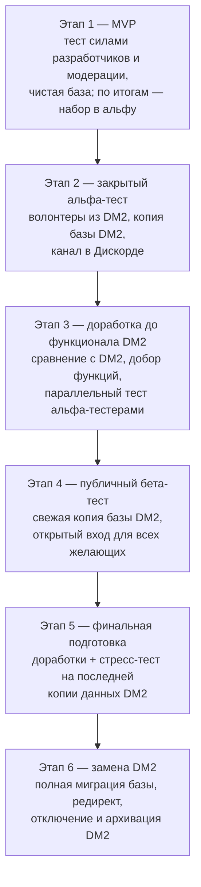
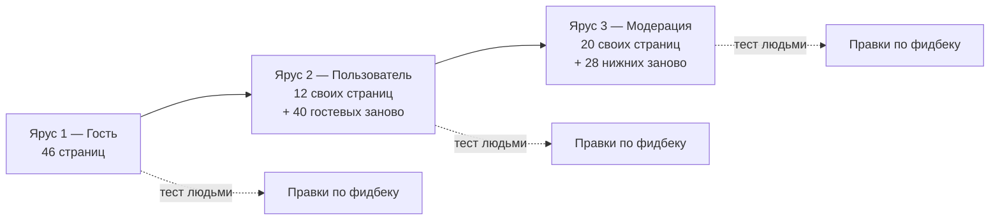

# DM3 — Прогресс реализации

Спутник к [Документация_по_разработке_DM3.docx](Документация_по_разработке_DM3.docx)
(полный план). Здесь — функциональная полнота и инвентарь страниц, разложенные по
ярусам доступа: в этом порядке функционал открывается тестировщикам.

**Легенда:** ✅ построено и в тестах | 🔎 требует живого осмотра владельцем |
🟡 частично (бэкенд-зазор) | ⬜ не начато.

---

## Порядок запуска

Полный план перехода — раздел 7 docx, шесть этапов. Ярусы ниже — внутренняя
структура только первого из них: базовое тестирование силами разработчиков и
модерации на чистой сидовой базе. Альфа и бета тестируют сайт целиком, уже на
копии базы DM2.

Перед каждым тестовым этапом база DM3 очищается и заменяется актуальной копией
DM2 — тестовые данные не накапливаются. Ни один этап не начинается, пока не
закрыты критические ошибки предыдущего.

### Этап 1 изнутри: ярусы доступа

Внутреннее тестирование идет ярусами: сначала все, что видит гость, затем то,
что открывает вход, затем модерация и администрирование. Ярус не считается
сданным, пока по нему не прошли живые люди.

Ярус — это набор проверок, а не набор страниц. Проверка — пара "страница плюс
роль": одна и та же комната для гостя это текст, для игрока — форма письма,
броски и оценки чужих постов, для модератора — правка любого поста. Поэтому
ярус состоит из двух частей: страницы, которые на нем открываются впервые, и
повторный осмотр страниц нижних ярусов, чей опыт на этом ярусе меняется.
Инвентарь ниже перечисляет первую часть, разделы "Повторный осмотр" — вторую.

Впервые страница открывается там, где ее пускает гейт маршрута: ярус 2 — это
`requiresAuth` в `app/providers/router.ts`, ярус 3 — `requiresAuth` плюс
поддерево `/moderation` (флаг `moderationZone` включает сайдбарную панель,
маршрут он не закрывает).

Часть страниц открыта маршрутом, но закрыта внутри компонента: гость, открывший
настройки игры, видит отказ, а не форму. Такие помечены в инвентаре, и на первом
ярусе у них осматривается ровно один экран — сам отказ: внятен ли он, не торчит
ли под ним часть формы, предлагает ли войти. Содержимое этих страниц смотрится
на том ярусе, где роль зрителя его открывает.

---

## Функциональные зоны

### Ярус 1 — доступно гостю

Назначен проход владельца с нуля по всему ярусу: чек-лист со страницами и
проверками — артефакт "Проход первого яруса". До прохода каждая зона яруса
стоит в 🔎; по мере осмотра зоны возвращаются в ✅.

| Зона | Статус | Заметки |
|------|--------|---------|
| Главная, О проекте, Правила, Правовые | ✅ / 🔎 | |
| Отзывы о сайте | ✅ / 🔎 | |
| Опросы | ✅ / 🔎 | |
| Статистика сайта | ✅ / 🔎 | 8 топ-десяток (игроки/игры/блоги × оценки/активность/объем), период в URL, пикер месяца/года с 2007, серверные positive-only ранги с делеными местами, кэш закрытых периодов |
| Сообщество | ✅ / 🔎 | |
| Пульс | ✅ / 🔎 | лента оцененных постов с фильтром и сортировками |
| Профиль + подстраницы | ✅ / 🔎 | вкладки about/games/blogs/topics/achievements внутри страницы; рецензии, рекомендации, оцененные, загруженное — отдельные страницы |
| Награды и достижения | ✅ / 🔎 | награды timeless + серии; достижения — цепочки по метрикам |
| Форум | ✅ / 🔎 | индекс, раздел, топик; навигация полос " \| " унифицирована с профилем |
| Каталоги игр и блогов | ✅ / 🔎 | |
| Игровая зона на чтение | ✅ / 🔎 | инфо, комнаты, чат-комнаты, персонажи, обсуждение, рецензии, оценки постов, заметки |
| Блог-зона на чтение | ✅ / 🔎 | зеркало игровой: инфо, лента, обсуждение, заметки |
| Глобальный чат на чтение | ✅ / 🔎 | эвент-баннер на осмотр владельцу |
| Обращения без входа | ✅ / 🔎 | поддержка, жалобы, отслеживание по токену; гостевой email обязателен |
| Лог предупреждений | ✅ / 🔎 | публичный, как на старом сайте |
| Страницы ошибок | ✅ / 🔎 | по указанию владельца не трогались, кроме дефолтной картинки |
| Мобильная версия | ✅ / 🔎 | бургер + левый off-canvas drawer, правый сайдбар под контентом; проверено на 375px, финальный осмотр за владельцем |

### Ярус 2 — открывает вход

Осмотра владельцем не было; проход организуется после закрытия яруса 1, тем же
форматом (чек-лист страниц с проверками). До прохода зоны стоят в 🔎.

| Зона | Статус | Заметки |
|------|--------|---------|
| Аутентификация | ✅ / 🔎 | вход, регистрация, восстановление, сброс, подтверждение; honeypot + тайминг антибот |
| Настройки аккаунта | ✅ / 🔎 | смена имени через модерацию |
| Личные сообщения | ✅ / 🔎 | |
| Уведомления, подписки | ✅ / 🔎 | |
| Личный блокнот | ✅ / 🔎 | |
| Мои обращения | ✅ / 🔎 | серверные фильтры status и subtype |
| Создание блога и публикаций | ✅ / 🔎 | |
| Создание и правка персонажей | ✅ / 🔎 | схема 6 типов атрибутов, персонаж 4 статуса + 3 флага |
| Письмо в игру, оценка постов, рецензии | ✅ / 🔎 | |

### Ярус 3 — модерация и администрирование

Осмотра владельцем не было; проход организуется после яруса 2, тем же форматом.
До прохода зоны стоят в 🔎.

| Зона | Статус | Заметки |
|------|--------|---------|
| Панель модерации | ✅ / 🔎 | контекстный сайдбар; 6 диалогов на общем примитиве, вид изменился — на осмотр |
| Предупреждения и баны | ✅ / 🔎 | варны 0-6 + автобан; баны SeniorMod+ и история |
| Премодерация игр и блогов | ✅ / 🔎 | Mentor+ |
| Обращения и жалобы | ✅ / 🔎 | единая модель Ticket: 7 подтипов, 4 статуса, тред, гостевой |
| Наставничество | ✅ / 🔎 | панель наставника |
| Награды, достижения, теги, сбор средств | ✅ / 🔎 | |
| Смена имен, загруженное, нарушители | ✅ / 🔎 | |
| Боты и вебхуки | ✅ / 🔎 | единый путь `/v1/webhooks/{type}`: Telegram по секрету в заголовке, Discord по официальному контракту Interactions (подпись Ed25519, ответ на `/connect` из интеракции) |

---

## Инвентарь страниц

Адреса даны шаблонами маршрутов и открываются на дев-стенде
`http://localhost:5173`; инвентарь и есть маршрут живого прохода, открывается
по порядку после `reset` и `seed`. Результат конкретного
прохода тут не хранится: он устаревает к следующей волне, а найденное живет в
аудите и в истории коммитов.

Seed-примеры: игра `aaaaa`, профиль `SolohinLex`, раздел форума `general`, топик
`general/4`.

### Ярус 1 — гость (46)

| Страница | Адрес |
|----------|-------|
| Главная | `/` |
| О проекте | `/about` |
| Правила | `/rules` |
| Отзывы о сайте | `/testimonials` |
| Опросы | `/polls` |
| Статистика сайта | `/statistics` |
| Сообщество | `/community` |
| Пульс | `/pulse` |
| Глобальный чат | `/global-chat` |
| Лог предупреждений | `/warnings` |
| Политика конфиденциальности | `/privacy` |
| Пользовательское соглашение | `/agreement` |
| Обращение в поддержку | `/support` |
| Жалоба или предложение | `/complaint` |
| Отслеживание обращения | `/support/track/:token` |
| Помочь проекту | `/donate` |
| Профиль | `/users/:username` |
| Полученные оценки постов | `/users/:username/received-reviews` |
| Поставленные оценки постов | `/users/:username/given-reviews` |
| Полученные рекомендации | `/users/:username/received-endorsements` |
| Написанные рекомендации | `/users/:username/given-endorsements` |
| Полученные рецензии на игры | `/users/:username/received-game-reviews` |
| Написанные рецензии на игры | `/users/:username/given-game-reviews` |
| Загруженное пользователем | `/users/:username/uploads` — содержимое закрыто в компоненте |
| Форум | `/forum` |
| Раздел форума | `/forum/:alias` |
| Топик | `/forum/:alias/:num` |
| Каталог игр | `/games` |
| Создание игры | `/games/create` — форма закрыта в компоненте |
| Информация игры | `/game/:id` |
| Игровая комната | `/game/:id/rooms/:num` |
| Чат-комната | `/game/:id/chat-rooms/:num` |
| Персонажи игры | `/game/:id/characters` |
| Персонаж | `/game/:id/characters/:characterId` |
| Обсуждение игры | `/game/:id/comments` |
| Рецензии на игру | `/game/:id/reviews` |
| Оцененные посты игры | `/game/:id/post-reviews` |
| Заметки игры | `/game/:id/notes` — содержимое закрыто в компоненте |
| Настройки игры | `/game/:id/settings` — содержимое закрыто в компоненте |
| Каталог блогов | `/blogs` |
| Создание блога | `/blogs/create` — форма закрыта в компоненте |
| Информация блога | `/blogs/:id` |
| Лента публикаций | `/blogs/:id/feed` |
| Обсуждение блога | `/blogs/:id/comments` |
| Заметки блога | `/blogs/:id/notes` — содержимое закрыто в компоненте |
| Настройки блога | `/blogs/:id/settings` — содержимое закрыто в компоненте |

Служебные маршруты того же яруса: `/users/:username/:tab` (легаси-редирект на
профиль, вкладка теряется), `/activate`, `/confirm-email`,
`/reset-password`, `/auth/callback`, `/error/:code?`, переходы к непрочитанному
(`/forum/:alias/:num/unread`, `/game/:id/posts/unread`,
`/game/:id/comments/unread`), редирект `/forum-topic/:topicId`, и мокапы, живущие
только в дев-сборке: `/dev/style-variants`, `/dev/chat-events`.

### Ярус 2 — пользователь (12)

| Страница | Адрес |
|----------|-------|
| Настройки аккаунта | `/account` |
| Личные сообщения | `/messenger` |
| Переписка | `/messenger/c/:id` |
| Переписка с пользователем | `/messenger/user/:username` |
| Уведомления | `/notifications` |
| Подписки | `/subscriptions` |
| Личный блокнот | `/notepad` |
| Мои обращения | `/my-tickets` |
| Создание публикации | `/blogs/:id/feed/create` |
| Редактирование публикации | `/blogs/:id/feed/:pubId/edit` |
| Создание персонажа | `/game/:id/characters/create` |
| Редактирование персонажа | `/game/:id/characters/:characterId/edit` |

#### Повторный осмотр яруса 1 глазами пользователя

Сорок гостевых страниц меняются от одного факта входа — это и есть основной
объем яруса. Проверять на каждой: появившееся действие работает, его результат
виден без перезагрузки, отказ по чужому объекту остается отказом.

| Где | Что появляется у вошедшего |
|-----|----------------------------|
| Комната игры | форма письма, выбор персонажа, броски, `[private]`, правка своего поста 15 минут, оценка чужого поста (новичку только нейтральная), метка прочитанного; мастеру — ожидание хода и письмо от NPC |
| Чат-комната, обсуждения игры и блога, топик форума | поле ответа, лайк чужого сообщения, правка и удаление своего в течение 15 минут, снятие счетчика непрочитанного |
| Персонажи и анкета | своя заявка в списке на рассмотрении, скрытые атрибуты владельцу; мастеру — рассмотрение заявок |
| Рецензии и оценки постов игры | форма рецензии и оценки вместо приглашения войти |
| Каталоги игр и блогов, главная, пульс | фильтры "мои", счетчики непрочитанного, вступление в набор |
| Глобальный чат | ввод сообщения, упоминания, лайк |
| Опросы | голосование вместо одних результатов |
| Профиль | свой профиль в режиме владельца: правка, ссылки на личные разделы |
| Заглушки яруса 1 | содержимое вместо отказа там, где роль зрителя его открывает: создание игры и блога, заметки и настройки своей игры и блога |
| Каркас | счетчики сообщений и уведомлений в шапке, личные блоки сайдбаров |

### Ярус 3 — модерация (20)

| Страница | Адрес |
|----------|-------|
| Обзор модерации | `/moderation` |
| Модераторы | `/moderation/moderators` |
| Премодерируемые игры | `/moderation/games` |
| Премодерируемые блоги | `/moderation/blogs` |
| Баны | `/moderation/bans` |
| Последние предупреждения | `/moderation/warnings` |
| Последние оцененные посты | `/moderation/rated-posts` |
| Новые пользователи | `/moderation/new-users` |
| Нарушители | `/moderation/violators` |
| Поддержка | `/moderation/support` |
| Жалобы и предложения | `/moderation/complaints` |
| Обращение | `/moderation/tickets/:ticketId` |
| Все загруженное | `/moderation/uploads` |
| Запросы на смену имени | `/moderation/username-changes` |
| Теги игр | `/moderation/tags` |
| Награды | `/moderation/awards` |
| Серия наград | `/moderation/awards/series/:id` |
| Типы наград | `/moderation/award-types` |
| Достижения | `/moderation/achievements` |
| Сбор средств | `/moderation/fundraising` |

#### Повторный осмотр нижних ярусов глазами модерации

Двадцать восемь страниц нижних ярусов дают модератору то, чего не видит
обычный пользователь. Проверять на каждой: инструмент делает обещанное,
привилегированная разметка рендерится читателям по правилам, обычному
пользователю ничего из этого не видно.

| Где | Что добавляет роль модерации |
|-----|------------------------------|
| Посты, комментарии, топики, отзывы | правка и удаление любых записей без окна в 15 минут, кнопка предупреждения автору |
| Редакторы тех же мест | кнопки `[mod]` и `[warning]`, разметка публична на чтение |
| Глобальный чат | удаление и восстановление сообщений, показ удаленных, модераторские метки |
| Профиль | предупреждения, бан, история нарушений, скрытые от прочих сведения |
| Каталоги игр и блогов, разделы форума | записи на премодерации и скрытые от публики |
| Загруженное, отзывы, опросы | удаление чужого, создание опроса |
| Каркас | пункт "Модерация" в меню, контекстная панель модерации в сайдбаре |

Приватные вставки `[private]` в игровых постах модерации не раскрываются: их
видят автор, ведущие игры и владелец адресованного персонажа. Это правило, а не
пробел, и на осмотре подтверждается отдельно.

---

## Гейты

Числа тестов и объемы сида здесь не хранятся: они меняются каждой волной и
устаревают быстрее документа. Что гонять до пуша и в каком порядке, знает
`scripts/hooks/pre-push`, там же сказано, какие джобы воркфлоу оставлены за CI.
Текстовые правила (буква "е", кавычки, разделители) держат тесты фронта, а не
строка в этом документе.

## Остаточные зазоры

- Три сид-блога с placeholder-publicId (`t...`) из внешнего сид-пути: работают,
  но неканонично, лечится реседом.
