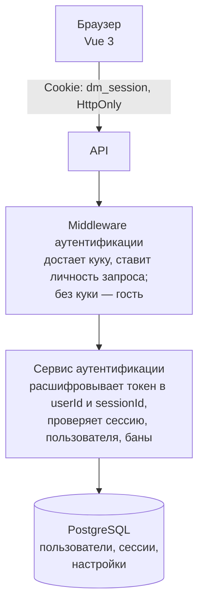

# Аутентификация DM3

> **User Story:** "Как работает вход? Какой flow регистрации? Какие параметры безопасности?"

> **Код:** `src/DM.Domain.Account/Features/`, `src/DM.Web.API/Shared/Authentication/`

---

## Обзор

| Компонент | Реализация |
|-----------|------------|
| **Pattern** | BFF (Backend-For-Frontend) |
| **Токен** | HttpOnly cookie `dm_session` |
| **Область куки** | Настройка развертывания: пусто — хост, выдавший куку; регистрируемый домен — общий вход на всех его хостах ([POINT_OF_PRESENCE.md](../guides/POINT_OF_PRESENCE.md)) |
| **Шифрование** | AES-256-GCM |
| **Хеширование** | Argon2id (см. [SECURITY.md](../conventions/SECURITY.md)) |
| **CSRF защита** | SameSite=Lax + CSRF middleware |
| **Сессии** | PostgreSQL, таблица UserSessions (строка на сессию) |

---

## Архитектура

---

## Регистрация

Порядок шагов: почта, письмо со ссылкой, выбор имени, автоматический вход.
Имя выбирается последним намеренно, и на этом стоит защита от захвата имен.

### Защита от захвата имен

- Имя выбирается ПОСЛЕ подтверждения почты: занять имя, не подтвердив адрес,
  нельзя.
- Заявка на регистрацию хранит хеш секрета активации и не ссылается на таблицу
  токенов.
- Незавершенная заявка убирается через 7 дней.

---

## Параметры безопасности

### Пароли

Параметры хеширования (алгоритм, memory cost, итерации, salt) — единый источник [SECURITY.md](../conventions/SECURITY.md#требования-к-хешированию-паролей).

### Токены

Параметры шифрования, правило хранения одноразовых ссылок и их передачи во
фрагменте — единый источник [SECURITY.md](../conventions/SECURITY.md#требования-к-токенам).

### Сессии

| Параметр | Значение |
|----------|----------|
| Длительность (Remember me ✓) | 365 дней |
| Длительность (Remember me ✗) | 8760 часов, то есть тот же год |
| Автообновление | каждые 7 дней (10080 минут) |
| Отслеживание активности | каждую 1 минуту |

По умолчанию checkbox "Запомнить меня" включен.

> **Осознанное следствие.** Поставляемая конфигурация задает
> `SessionExpirationHours = 8760`, поэтому сессия без "запомнить меня" живет
> столько же, сколько с ним, и снятая галочка сегодня ничего не меняет. Значение
> 24 часа — это дефолт в коде, который конфигурация перекрывает; в хосте API он не
> действует никогда. Если короткая сессия нужна как поведение, менять надо
> конфигурацию, а не эту таблицу.

### Политика паролей

Длина и composition rules — единый источник [SECURITY.md](../conventions/SECURITY.md#требования-к-паролям).

---

## Второй фактор

Конвенция второго фактора: то, что обязан знать любой, кто трогает вход, роли
или сессии.

### Вход в два шага

Фактор встает после доказанного пароля и до создания сессии.

**Между факторами сессии не существует.** Строка сессии не создается, кука сессии
не выдается, отметка активности не обновляется, запись об успешном входе в журнал
не пишется. Это не оптимизация, а способ обойтись без пометки "половинная
сессия": такая пометка обязывает каждую поверхность авторизации про нее помнить,
и в день, когда одна забудет, пароля станет достаточно. Испытание переносится
короткоживущей кукой с атрибутами сессионной и сессией не является ни в каком
приближении.

Первый шаг отвечает успехом с признаком стадии, а не отказом: учетные данные
верны, поток продолжается, а машиночитаемого кода ошибки в контракте нет по
[решению](../conventions/API_DESIGN.md) — тип ошибки несет статус.

**Отказ второго фактора один на все причины.** Неверный код, истекшее испытание,
неизвестное испытание, погашенный резервный код и исчерпанные попытки отвечают
одинаково, и число оставшихся попыток не сообщается — по той же причине, по
которой его не сообщает парольный путь.

**Сессия без пароля не создается для аккаунта с подтвержденным фактором.**
Правило пишется в сам путь создания сессии, а не в его вызывающих: безусловное
создание сессии по идентификатору пользователя живет ради автоматического входа
после активации регистрации, где фактора быть не может, но в сигнатуре про
активацию ничего не сказано, и второй вызывающий появится молча. Сброс пароля по
ссылке из письма сессии не выдает и фактор не снимает.

### Что нельзя предъявить дважды

Принятый шаг времени и погашенный резервный код записываются условным
обновлением, затрагивающим одну строку. Ноль строк — отказ. Отсюда два свойства,
которые нельзя потерять при правках: код действителен ровно один раз на аккаунт
поперек всех сессий и всех испытаний, и два параллельных запроса с одним
значением дают ровно один успех.

Смена пароля любым путем, включая сброс по ссылке из письма, гасит незавершенные
испытания владельца: смена пароля есть заявка "меня скомпрометировали", и вход,
начатый со старым паролем, переживать ее не должен.

### Включение и отключение

Выдача секрета требует действующей сессии и повторного ввода текущего пароля:
сессия живет год, и без этого требования укравший ее привязал бы к чужому
аккаунту свой собственный фактор. Повторная выдача до подтверждения заменяет
секрет, а не отдает прежний: живой неподтвержденный секрет всегда ровно один и
всегда последний.

Включенным фактор делает только успешная проверка кода против выданного секрета,
и никакой другой путь метку подтверждения не пишет; отдельного булева "включен"
не существует, включенность читается по метке. Выдать замок, не проверив, что
ключ к нему подходит, значит обнаружить сбитые часы или несохраненную запись в
тот день, когда единственный путь внутрь уже восстановление.

Подтверждение завершает все прочие сессии владельца и делает это до включения, а
не после: включать фактор, оставляя внутри чужую годовую сессию, значит запереть
дверь, за которой уже сидят, а отказ после включения повторить нечем — второе
подтверждение отвергается как "включено уже". Метка подтверждения и набор
резервных кодов пишутся одной транзакцией: метка без набора дает владельца,
привязанного к единственному устройству и не видевшего ни одного кода.

Отключение и перевыпуск кодов требуют пароля и пройденного второго фактора:
выключить — изменение того же веса, что включить. Резервный код считается
пройденным фактором, иначе потерявший устройство не отключит фактор вовсе.
Перевыпуск гасит весь предыдущий набор разом: набор из половины старых и
половины новых означает, что вычеркнутый на бумаге код все еще работает.
Погашенный код не удаляется, а получает метку: удаление стерло бы и след в
журнале, и честный ответ на вопрос, сколько кодов осталось.

### Код и окно допуска

Параметры кода — HMAC-SHA1, шаг 30 секунд, шесть цифр — заданы совместимостью с
приложениями-аутентификаторами, а не выбором в пользу слабого хеша. Большинство
из них игнорирует объявленный в otpauth-URI алгоритм и считает по SHA-1, поэтому
URI с SHA-256 у части пользователей молча дает коды, которые никогда не
совпадут; стойкость к коллизиям в этой конструкции не задействована.

Окно допуска — текущий шаг плюс-минус один. Подстройки под дрейф часов
конкретного пользователя не заводится: это механизм, тихо расширяющий окно со
временем, а ушедшие часы честнее лечатся сообщением про часы.

### Счет попыток и рейт-лимит

Попытки считаются на испытание, а не на аккаунт: аккаунтный счетчик позволил бы
всякому, кто знает пароль, заблокировать чужой второй фактор. Исчерпание попыток
уничтожает испытание, и продолжать приходится с ввода пароля. Неудачная проверка
кода учитывается и в существующем счете попыток входа по паре "аккаунт и адрес",
там же, где неудачный пароль: без этого владелец пароля берет сколько угодно
испытаний подряд. Резервный код расходует те же счетчики.

Бюджеты рейт-лимита разводит не функция, а то, чем удостоверен запрос. Шаг
фактора при входе и почтовое снятие удостоверены только адресом и остаются на
адресном бюджете аутентификации: сессии между факторами не существует, а счет по
аккаунту дал бы способ запереть любого модератора с любого адреса. Настройки
фактора удостоверены сессией и считаются по аккаунту: включение за один присест
стоит нескольких запросов после входа, съевшего свои, а адрес за общим шлюзом
провайдера — не человек, а район.

### Где живет секрет

Секрет шифруется, а не хешится: проверка кода требует самого секрета. Отсюда
следствие, которое надо называть вслух — пароль в базе не восстановим ничем, а
секрет второго фактора восстановим тем, у кого есть ключ приложения. Ключ живет
вне базы, требования к нему — общие для всех токенов
([SECURITY.md](../conventions/SECURITY.md#требования-к-токенам)).

Секрет и резервные коды существуют в открытом виде ровно в одном ответе каждый и
больше нигде: ни в логах, ни в журнале безопасности, ни в проекциях пользователя.
Строка пользователя намеренно не расширяется — она читается на каждом запросе с
сессией.

Резервный код гасится знанием значения, то есть он credential, и строка держит
только его хеш ([SECURITY.md](../conventions/SECURITY.md#требования-к-токенам)).
Хеш здесь быстрый, поэтому стойкость дает энтропия самого кода: медленный хеш
означал бы до десятка прогонов на каждую попытку входа, то есть рычаг отказа в
обслуживании на пути аутентификации.

QR рисуется своими средствами. Обращение к внешнему сервису генерации запрещено:
изображение содержит otpauth-URI целиком, то есть сам секрет. Метка в URI —
логин, а не почта: приложение-аутентификатор пишет метку в свой список, а список
у многих уезжает в облачную резервную копию.

### Обязательность и понижение ранга

Отсутствие фактора у роли, которая его обязана иметь, снимает привилегию, но
никогда не закрывает вход. Гейт "нет фактора — нет доступа" на аутентификации
запирает последнего администратора снаружи, поэтому гейт стоит не там.

Признак вычисляется в одном месте — там же, где в личность складываются
действующие баны, — и складывается в ту роль, по которой сравниваются
полномочия. Это единственный способ не заставлять поверхности помнить о нем:
и резолверы намерений, и доменные сервисы модерации со сравнением роли напрямую
читают уже пониженную роль. Настоящая роль при этом сохраняется рядом и
используется для отображения и для журналов: модератор, записанный как обычный
пользователь, — запись, по которой ничего не восстановить.

Путь настройки фактора обязан оставаться открытым пониженной учетке: лекарство у
владельца в руках, и ни один путь не ведет к состоянию "войти нельзя".

### Восстановление

Письмо само по себе фактор не снимает. Ящик — это канал сброса пароля, и фактор,
снимаемый оттуда же, добавляет шаг, а не фактор. Почтовый путь назначает снятие с
отсрочкой, завершает сессии и отменяется как ссылкой из письма, так и любым
успешным входом со вторым фактором.

Для ролей, обязанных иметь фактор, почтовый путь закрыт совсем: их фактор снимает
второй администратор отдельным действием, которое не выдает ему ни сессии, ни
прав снимаемого и журналируется на обеих учетках. Если устройства потеряны обеими
привилегированными учетками, продуктового пути нет и не будет — механизм, снимающий
фактор администратора без второго администратора, есть ровно тот черный ход, ради
закрытия которого фактор и вводится.

---

## Защита от атак

Чеклист — в [SECURITY.md](../conventions/SECURITY.md#защита-от-атак-чеклист).

---

## Security Headers

Требования — в [SECURITY.md](../conventions/SECURITY.md#security-headers-требования).

---

## Ссылки

- [AUTHORIZATION.md](./AUTHORIZATION.md) — роли и права
- [SYSTEM.md](./SYSTEM.md) — архитектура системы
- [SECURITY.md](../conventions/SECURITY.md) — требования безопасности
