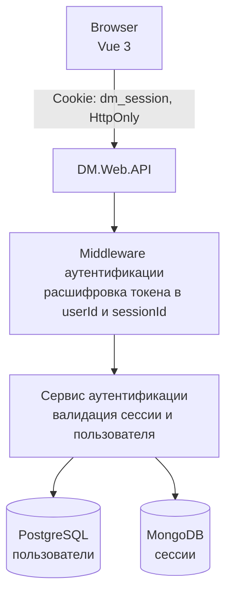
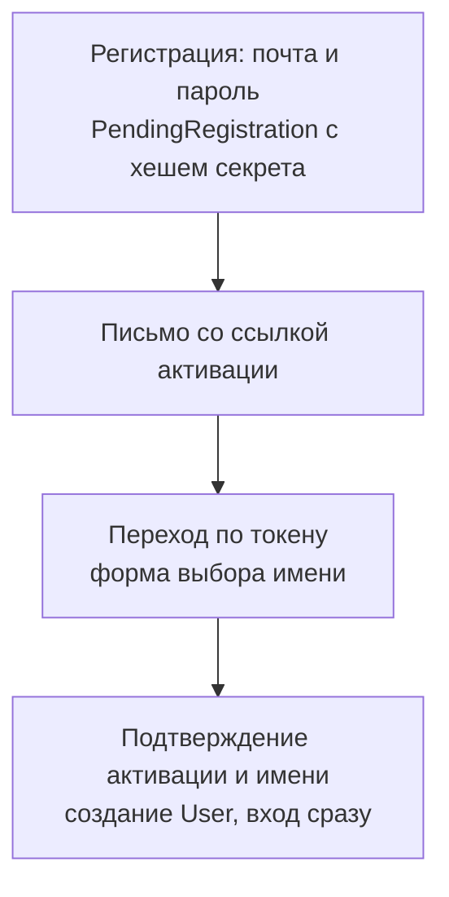

# Аутентификация DM3

> **User Story:** "Как работает вход? Какой flow регистрации? Какие параметры безопасности?"

> **Код:** `src/DM.Domain.Account/Features/`, `src/DM.Web.API/Shared/Authentication/`

---

## Обзор

| Компонент | Реализация |
|-----------|------------|
| **Pattern** | BFF (Backend-For-Frontend) |
| **Токен** | HttpOnly cookie `dm_session` |
| **Область куки** | Настройка развертывания: пусто — хост, выдавший куку; регистрируемый домен — общий вход на всех его хостах ([POINT_OF_PRESENCE.md](../guides/POINT_OF_PRESENCE.md)) |
| **Шифрование** | AES-256-GCM |
| **Хеширование** | Argon2id (см. [SECURITY.md](../conventions/SECURITY.md)) |
| **CSRF защита** | SameSite=Lax + CSRF middleware |
| **Сессии** | MongoDB |

---

## Архитектура

---

## Регистрация

### Flow: Email → Имя пользователя

### Защита от сквоттинга

- Имя пользователя (Login) выбирается ПОСЛЕ верификации email
- Нельзя занять логин без подтвержденного email
- PendingRegistration хранит хеш секрета активации (без FK на Tokens)
- Cleanup: 7 дней для PendingRegistration

---

## Параметры безопасности

### Пароли

Параметры хеширования (алгоритм, memory cost, итерации, salt) — единый источник [SECURITY.md](../conventions/SECURITY.md#требования-к-хешированию-паролей).

### Токены

Параметры шифрования, правило хранения одноразовых ссылок и их передачи во
фрагменте — единый источник [SECURITY.md](../conventions/SECURITY.md#требования-к-токенам).

### Сессии

| Параметр | Значение |
|----------|----------|
| Длительность (Remember me ✓) | 365 дней |
| Длительность (Remember me ✗) | 8760 часов, то есть тот же год |
| Автообновление | каждые 7 дней (10080 минут) |
| Отслеживание активности | каждую 1 минуту |

По умолчанию checkbox "Запомнить меня" включен.

> **Осознанное следствие.** Поставляемая конфигурация задает
> `SessionExpirationHours = 8760`, поэтому сессия без "запомнить меня" живет
> столько же, сколько с ним, и снятая галочка сегодня ничего не меняет. Значение
> 24 часа — это дефолт в коде, который конфигурация перекрывает; в хосте API он не
> действует никогда. Если короткая сессия нужна как поведение, менять надо
> конфигурацию, а не эту таблицу.

### Политика паролей

Длина и composition rules — единый источник [SECURITY.md](../conventions/SECURITY.md#требования-к-паролям).

---

## Защита от атак

Чеклист — в [SECURITY.md](../conventions/SECURITY.md#защита-от-атак-чеклист).

---

## Security Headers

Требования — в [SECURITY.md](../conventions/SECURITY.md#security-headers-требования).

---

## Ссылки

- [AUTHORIZATION.md](./AUTHORIZATION.md) — роли и права
- [SYSTEM.md](./SYSTEM.md) — архитектура системы
- [SECURITY.md](../conventions/SECURITY.md) — требования безопасности
