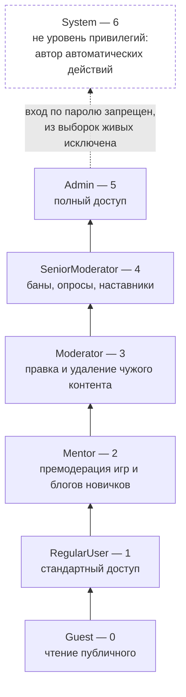
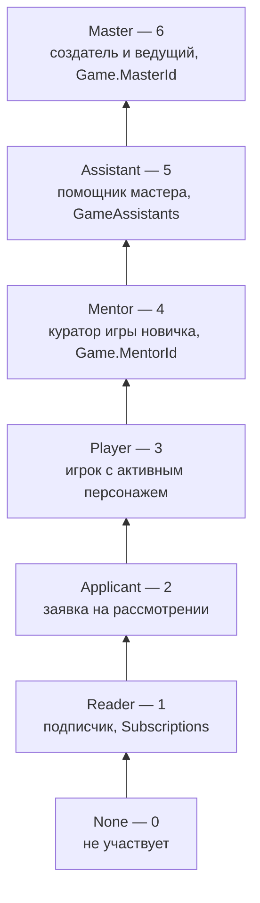
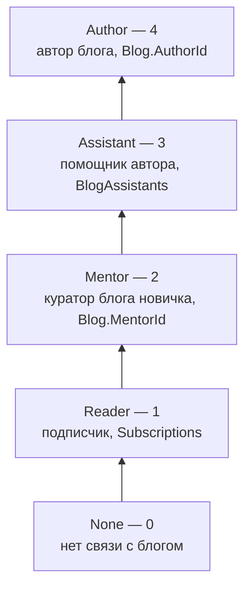
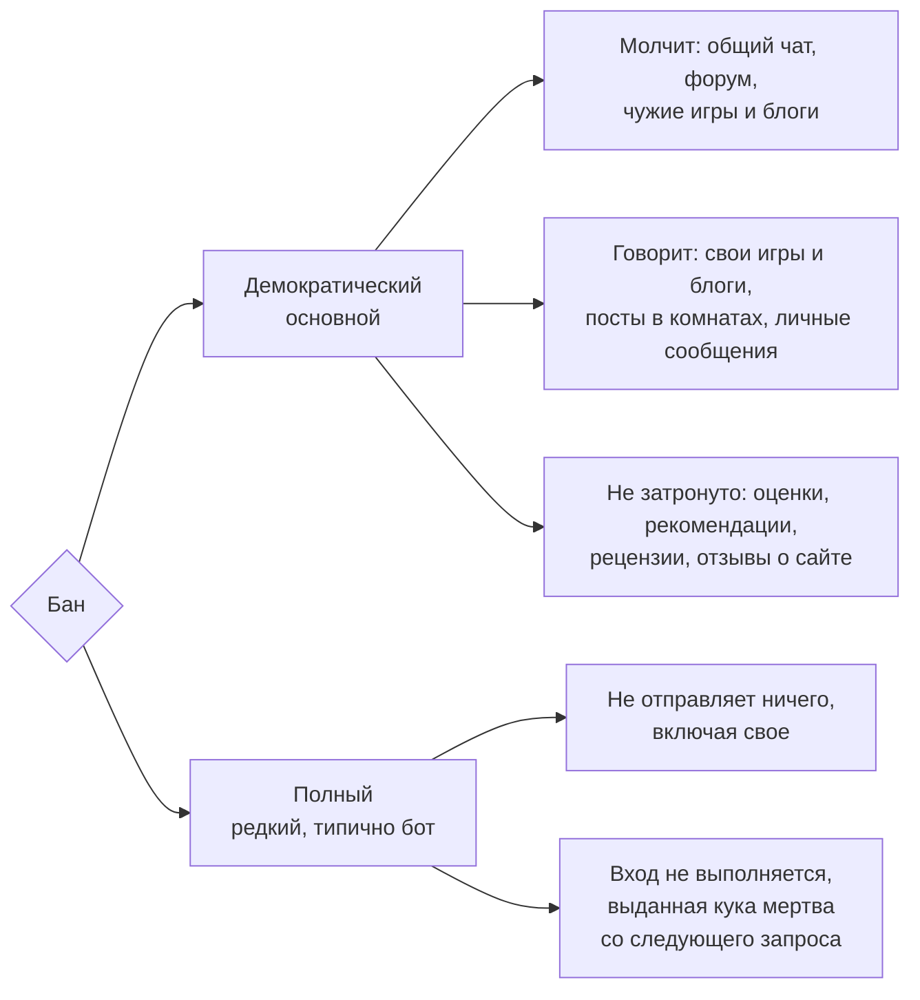

# Авторизация DM3 (RBAC)

> **User Story:** "Какие роли? Кто что может? Как работают права?"

> **Код:** `src/DM.Domain.*/Authorization/`

---

## Роли на сайте (UserRole)

Глобальная иерархия ролей пользователя на сайте:



**Правило:** `user.Role >= UserRole.Mentor` означает Mentor и все выше.

Над Admin в перечислении стоит служебная роль System. Это не уровень привилегий, а
автор автоматических действий: системные письма, служебные обращения, записи о том,
что сделано без человека. Отсюда два требования, которые из описанной выше механики
сравнений не следуют. Вход по паролю такой роли запрещен, и отказ выносится по роли
до сравнения пароля. Выборки живых пользователей отсекают ее явным условием, иначе
она попадает в рейтинги, рассылки и адресаты уведомлений.

---

## Специальные статусы

### Newbie (Новичок)

| Условие | `QuantityRating < 100` (менее 100 постов) |
|---------|-------------------------------------------|
| **Ограничения** | Премодерация игр/блогов, ограничения на ревью |

---

## Роли в модулях

### GameRole — Роль в игре



### BlogRole — Роль в блоге



---

## Матрицы прав

### Администрирование

| Действие | User | Mentor | Mod | SeniorMod | Admin |
|----------|------|--------|-----|-----------|-------|
| Администрирование форумов | - | - | - | - | ✓ |
| Удаление игр/блогов (не своих) | - | - | - | ✓ | ✓ |

Матрица описывает глобальные роли. Права на форуме выдаются еще и точечно:
назначенный модератор раздела получает администрирование тем этого раздела и правку
чужих тем в нем, не имея глобальной роли. Это единственное место, где право на
модерацию приходит не из глобальной иерархии, а из привязки к объекту, и матрицей
оно не описывается принципиально.

### Модерация контента

| Действие | User | Mentor | Mod | SeniorMod | Admin |
|----------|------|--------|-----|-----------|-------|
| Редактирование/удаление тем форума | - | - | ✓ | ✓ | ✓ |
| Редактирование/удаление комментариев | - | - | ✓ | ✓ | ✓ |
| Модерация профилей | - | - | - | ✓ | ✓ |
| Удаление ревью | - | - | - | ✓ | ✓ |
| Создание опросов | - | - | - | ✓ | ✓ |
| Назначение наставников | - | - | - | ✓ | ✓ |

### Наставничество

| Действие | User | Mentor | Mod | SeniorMod | Admin |
|----------|------|--------|-----|-----------|-------|
| Взять игру/блог на премодерацию | - | ✓ | ✓ | ✓ | ✓ |
| Выпустить из премодерации | - | ✓ | ✓ | ✓ | ✓ |

---

## Права в играх

| Действие | Reader | Player | Mentor | Assistant | Master |
|----------|--------|--------|--------|-----------|--------|
| Просмотр открытого контента | ✓ | ✓ | ✓ | ✓ | ✓ |
| Создание персонажа | - | ✓ | - | - | ✓ |
| Настройки: информация игры | - | - | ✓ | ✓ | ✓ |
| Настройки: чтение списка приглашений | - | - | ✓ | ✓ | ✓ |
| Создание/удаление комнат | - | - | - | ✓ | ✓ |
| Черный список игры | - | - | - | ✓ | ✓ |
| Принятие персонажей | - | - | - | ✓ | ✓ |
| Приглашение игроков | - | - | - | ✓ | ✓ |
| Отзыв приглашения | - | - | - | ✓ | ✓ |
| Приглашение ассистентов | - | - | - | - | ✓ |
| Удаление ассистентов | - | - | - | - | ✓ |
| Удаление игры | - | - | - | - | ✓ |
| Мастерский блокнот: чтение и создание записей | - | - | - | ✓ | ✓ |
| Блокнот персонажа: чтение и создание записей | - | ✓ | - | ✓ | ✓ |
| Правка чужой записи в блокноте | - | - | - | - | - |
| Удаление чужой записи в блокноте | - | - | - | - | ✓ |

**Записи блокнота.** Доступ в блокнот дает роль, право на отдельную запись — авторство. Правит запись только тот, кто ее написал: переписанная чужой рукой, она осталась бы стоять под его именем. Удаляют автор и мастер игры, который отвечает за содержимое блокнотов своей игры. Отсюда единственное расхождение мастера и ассистента не в пользу второго: мастерский блокнот открыт ассистенту целиком, но чужую запись из него убирает только мастер, свою — каждый. Строка про блокнот персонажа у игрока — про блокнот его собственного персонажа.

**Страница настроек шире правки игры.** Две первые строки таблицы отвечают отдельной интенции `GameIntention.EditSettings`, куда добавлен приставленный к игре наставник: он помогает новичку собрать игру, поэтому форма информации и список приглашений ему открыты. Все остальное в таблице держится на `GameIntention.Edit` и на собственных интенциях приглашений, и туда наставник не входит: комнаты, черный список, состав игры и отзыв приглашений остаются за ведущими. Чтение списка приглашений и право приглашать расходятся намеренно.

**Схема атрибутов принадлежит автору, а не игре.** Редактор схемы стоит на странице настроек, но правами игры не управляется: схема — самостоятельный ресурс со своим автором, публичную схему может использовать любое число игр, и наставник одной из них не получает права переписать ее всем остальным. Правит схему автор (`AttributeSchemaIntention.Edit`).

**Ведущие игры = Master + Assistant.** Наставник (`GameRole.Mentor`) **не** является ведущим: он курирует игру новичка, но не ведет ее. Допуск к форме настроек ведущим его не делает. Это правило используется в render-контракте `[private]`: только master и assistants видят все приватные блоки в игре автоматически (lead-override), наставник нет.

---

## Видимость privacy-тегов BBCode

`[private]` — privacy-sensitive BBCode-тег, видимость которого определяется правами зрителя и контекстом контента. Фильтрация происходит на сервере **до сериализации JSON**: отфильтрованный контент никогда не попадает на клиент к неавторизованному зрителю.

**`[mod]`** — **публичный на чтение**: рендерится одинаково для всех зрителей, включая гостей. Ограничение у него на запись — неавторизованная разметка разворачивается при сохранении. Читательской фильтрации по роли у `[mod]` нет, и это намеренно: речь модерации адресована всем. SSOT — [BBCODE_RENDERING.md](BBCODE_RENDERING.md).

**`[private]`** — валиден только в GamePost. Виден если выполнено ЛЮБОЕ из:
- зритель = автор поста (author-forever, snapshot);
- зритель — владелец одного из персонажей-адресатов (addressee-forever, per-block snapshot);
- зритель — ведущий игры (master или assistant; наставник исключен);
- у поста включен `SharePrivateWithAll` (per-post override, внутри множества читателей комнаты);
- у комнаты включен `ViewPrivateText` (per-room override, внутри множества читателей комнаты).

Moderator+ **не** видит `[private]` — нет backdoor'а для аудита. Полный контракт — в [BBCODE_RENDERING.md](BBCODE_RENDERING.md).

---

## Баны

Существует ровно два вида бана, и они различаются охватом. Третьего нет: любое иное значение при выдаче сводится к полному бану, чтобы искаженный запрос не выдал бан слабее безопасного.



### Демократический бан — основной

Глушит **публичную речь**, оставляя открытым все свое. Пользователь продолжает читать сайт целиком.

| Поверхность | Под демократическим баном |
|-------------|---------------------------|
| Глобальный чат | Запрещено |
| Создание топика на форуме | Запрещено |
| Комментарии в топиках форума | Запрещено |
| Обсуждение **чужой** игры | Запрещено |
| Обсуждение **своей** игры (мастер, ассистент, наставник или принятый игрок) | Разрешено |
| Обсуждение **чужого** блога и публикаций чужого блога | Запрещено |
| Обсуждение **своего** блога (автор, ассистент или наставник) | Разрешено |
| Посты и сообщения в игровых комнатах | Не затронуто, работает по доступу к комнате |
| Публикации блога | Не затронуто |
| Личные сообщения | Не затронуто |

**Что значит "свое".** Игра — участие в ней или кураторство над ней: мастер, ассистент, наставник или игрок с **принятым** персонажем. Поданная заявка участником не делает: пока персонаж на рассмотрении, в обсуждении писать нельзя. Блог — авторство, ассистентство или кураторство. Подписка своим модуль не делает — ни игру, ни блог: читать не то же самое, что принадлежать. Наставник считается: его приставляют к модулю новичка ровно для того, чтобы он в нем говорил, и молчащий наставник бесполезен. Роли перечисляются поименно, а не как "все, кроме читателя", иначе новая роль расширяет исключение из бана сама собой.

**Что демократический бан не трогает намеренно.** Оценки постов, рекомендации на профилях, рецензии на игры и отзывы о сайте под него не попадают. Это осознанное решение: бан снимает голос в общих обсуждениях, а не право оценивать.

### Полный бан — редкий

Запрещает отправлять что угодно. Владение поверхностью его не ослабляет: своя игра под полным баном тоже закрыта. Помимо этого полный бан отвергает саму аутентификацию — вход не выполняется, а выданная ранее кука перестает действовать на следующем же запросе, не дожидаясь истечения сессии. Типичный адресат — бот, а не живой нарушитель: для человека применяется демократический.

### Где проверяется

Правило вычисляется в одном месте (`Domain.Core/Authorization`) и вызывается из резолверов намерений тех поверхностей, которых оно касается. Проверка переезжает в сервис там, где ответ зависит от владельца поверхности, а резолверу владельца не передают: так устроены обсуждение публикаций и правка комментариев, где цель резолвера — сам комментарий, а не игра или блог под ним. Само правило при этом не дублируется. Это первое из двух исключений из порядка, по которому проверка живет в резолвере. Второе, модерационное, описано в разделе про паттерн Intention.

Правка подчиняется тому же правилу, что и создание: переписать свой комментарий или свой топик значит выпустить тот же публичный текст. Спрашивают при этом только автора. Модераторская правка чужого текста под правило не попадает: бан не снимает модераторских полномочий, поэтому закрытие, прикрепление и перенос топика забаненному модератору раздела остаются.

---

## Черные списки

Черный список игры или блога это про поведение, а не про секретность. Одно правило на весь сайт: **черный список закрывает запись и не закрывает чтение**.

Игра и блог остаются публичными для всех остальных, поэтому прятать их от одного человека значит обещать приватность, которой нет: адрес известен, и у любого другого читателя страница откроется.

| Поверхность | Пользователь в черном списке игры или блога |
|-------------|---------------------------------------------|
| Чтение страницы, комнат, постов, публикаций | Разрешено |
| Комментарий к игре, блогу, публикации | Запрещено |
| Лайк комментария | Запрещено |
| Заявка персонажем в игру | Запрещено |
| Рецензия на игру, оценка поста | Запрещено |
| Подписка на игру или блог читателем | Запрещено |
| Приглашение в игру или блог | Запрещено, внесенного в список пригласить нельзя |

Внести в список участника нельзя: сначала владелец удаляет его из игры или из ассистентов блога. Поэтому в списке никогда не оказывается тот, кто пишет посты в комнатах, и отдельной проверки для постов не требуется. Исключение одно, читатель блога: команды на его удаление у владельца нет, поэтому подписку снимает само внесение в черный список, а подписаться заново список не дает.

Личный черный список пользователя устроен иначе: он прячет чужие тексты от того, кто его ведет, а не наоборот.

---

## Права в блогах

| Действие | Reader | Mentor | Assistant | Author |
|----------|--------|--------|-----------|--------|
| Просмотр открытого контента | ✓ | ✓ | ✓ | ✓ |
| Комментирование | ✓ | ✓ | ✓ | ✓ |
| Создание публикаций | - | - | ✓ | ✓ |
| Редактирование публикаций | - | - | ✓ | ✓ |
| Создание рубрик | - | - | - | ✓ |
| Настройки: информация блога | - | - | ✓ | ✓ |
| Настройки: чтение списка приглашений | - | - | ✓ | ✓ |
| Приглашение читателей | - | - | ✓ | ✓ |
| Отзыв приглашения | - | - | - | ✓ |
| Приглашение ассистентов | - | - | - | ✓ |
| Удаление ассистентов | - | - | - | ✓ |
| Управление черным списком | - | - | - | ✓ |
| Удаление блога | - | - | - | ✓ |
| Одобрение публикаций (премодерация) | - | ✓ | - | - |
| Блокнот блога: чтение и создание записей | - | ✓ | ✓ | ✓ |
| Правка чужой записи в блокноте | - | - | - | - |
| Удаление чужой записи в блокноте | - | - | - | ✓ |

**Страница настроек шире правки блога.** Две строки "Настройки" отвечают отдельной интенции `BlogIntention.EditSettings`: это форма информации и список приглашений, которые страница показывает. Ассистент входит в нее наравне с владельцем, и она же решает, пускать ли на страницу вообще. Остальное держится на `BlogIntention.Edit` и на собственных интенциях приглашений и рубрик, а туда ассистент не входит. Чтение списка приглашений и право приглашать расходятся так же, как в играх, и по той же причине: список показывает страница настроек, а отзывает приглашение владелец.

**Наставник блога в настройки не входит, в отличие от наставника игры.** Куратор игры помогает новичку собрать саму игру, поэтому форма информации ему открыта. Наставник блога занят только одобрением публикаций, и расширять его до настроек нечем.

**Старшая модерация получает настройки блога, но не черный список.** `BlogIntention.EditSettings` содержит ранговое плечо `>= SeniorModerator`, а `BlogIntention.Edit`, на котором держатся черный список (включая чтение) и удаление ассистентов, требует `>= Admin`. Расхождение намеренное. В играх иначе: там старшая модерация держит и настройки, и черный список. Интерфейс повторяет за сервером: страница настроек блога открывается, секции черного списка на ней нет. В отказах страницы ранги при этом не упоминаются — полномочия персонала не являются текстом интерфейса.

Записи блокнота блога живут по тому же правилу, что и в играх: правит автор записи, удаляют автор и владелец блога. Наставник допущен в блокнот наравне с ассистентом, но это про доступ, а не про право на чужую запись.

---

## Права на форуме

### BoardAccessPolicy (битовая маска)

Форумные разделы используют битовую маску для контроля доступа:

```csharp
None            = 0       // Нет доступа
Administrator   = 1 << 0  // 1
SeniorModerator = 1 << 1  // 2
Moderator       = 1 << 2  // 4
Mentor          = 1 << 3  // 8
RegularUser     = 1 << 5  // 32
Guest           = 1 << 6  // 64
```

**Применение:**
- `Board.ViewPolicy` — кто может просматривать раздел
- `Board.CreateTopicPolicy` — кто может создавать топики

---

## Intention Pattern

Авторизация по умолчанию реализована через паттерн Intention — декларативная проверка прав:

```csharp
// Проверка намерения без контекста
_intentionManager.ThrowIfForbidden(GameIntention.Create);

// Проверка намерения с контекстом
_intentionManager.ThrowIfForbidden(BlogIntention.Edit, blog);
```

Каждый модуль определяет свои Intention'ы и Resolver'ы в папке `Authorization/`.

### Где живет проверка

По умолчанию проверка живет в резолвере намерения. Исключений из этого два, и оба перечислены здесь.

**Владелец поверхности.** Ответ зависит от того, чья это игра и чей блог, а владельца резолверу не передают. Случай разобран выше, в разделе про баны: основание там про доступность данных, резолвер не знает того, о чем его спрашивают.

**Модерация.** Основание другое, и оно про текст отказа.

Отказ по намерению приходит читателю одной фразой на весь сайт, и так сделано намеренно: собственное сообщение исключения называет пользователя, намерение и цель, наружу его не отдают, иначе отказ рассказывает спрашивающему про объекты, которых он не видит. Персональные тексты у намерений вернули бы ту же утечку по частям.

Модерации нужен адресный отказ. Ее поверхности собраны из соседних действий с разными порогами роли: вынести предупреждение, выдать бан, снять постоянный бан, выдать бан прямо из обращения, взять новичка под кураторство, посмотреть чужие кураторства. Модератор упирается в порог по несколько раз за смену, и общая фраза не говорит ему ни какой роли не хватило, ни почему соседнее действие в том же разделе ему при этом открыто. Поэтому на таких поверхностях роль сравнивается прямо в доменном сервисе, где отказ пишется на месте и называет недостающую роль.

Проверки одной поверхности при этом не делятся: в сервисе остаются и те, что просто отделяют модератора от всех прочих. Иначе на одном экране часть отказов называет роль, часть отвечает общей фразой, и модератор не отличает нехватку уровня от поломки.

Границы исключения:

- **Оно модульное.** Действует в модерации и только в ней. Тот же прием в другом модуле требует отдельного решения, записанного здесь: одного желания назвать роль в тексте отказа мало.
- **Обратного хода оно не дает.** Где проверка уже идет через намерение, она там и остается.
- **Двух копий правила быть не должно.** Намерение, объявленное и резолвящееся для действия, роль на которое сервис сравнивает сам, это вторая копия того же правила, и работает из двух только одна. Тесты на резолвер при этом зеленые, поэтому поднятый в нем порог молча разойдется с настоящей проверкой. Либо действие идет через намерение, либо намерения для него нет.
- **Сравнение двух ролей остается в сервисе всегда.** Правило вида "забанить можно только того, чья роль ниже вашей" зависит сразу от двух пользователей. Намерение с целью его выражает, но ценой того же общего отказа, а такой отказ обязан сказать, чем именно цель не подошла.

---

## Ограничения

### Для новичков (< 100 постов)

| Ограничение | Описание |
|-------------|----------|
| Премодерация игр | Игры требуют одобрения наставника |
| Премодерация блогов | Публикации требуют одобрения наставника |
| Ревью на пользователей | Запрещено |
| Ревью на игры | Запрещено |
| Ревью на посты | Только нейтральные |

### Временные лимиты

| Ограничение | Значение |
|-------------|----------|
| Редактирование ревью | 24 часа с создания |
| Кулдаун ревью постов | 3 дня на игру |
| Редактирование сообщений | 15 минут |

---

## Ссылки

- [AUTHENTICATION.md](./AUTHENTICATION.md) — как работает вход
- [SYSTEM.md](./SYSTEM.md) — архитектура системы
- [SECURITY.md](../conventions/SECURITY.md) — требования безопасности
- [GLOSSARY.md](../references/GLOSSARY.md) — термины (GameRole, BlogRole)
