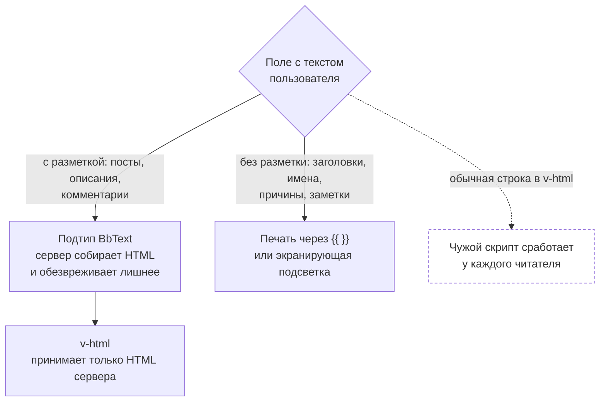

# Рендеринг BBCode

SSOT конвенций рендеринга пользовательского контента BBCode. Описывает **правила**, по которым работает система, а не текущую имплементацию.

## Принцип: сервер — единственный render authority

Пользовательский контент в BBCode рендерится **исключительно на сервере**. Клиент никогда не вызывает renderer для display-путей: он биндит HTML, уже отрендеренный сервером (`v-html` на строковом поле, пришедшем в ответе API).

**Почему:** конфиденциальность. Приватный тег `[private]` должен фильтроваться **до сериализации JSON**, иначе скрытый контент попадает на клиент к неавторизованному зрителю. Клиентский rendering не может обеспечить этот инвариант — любой пользователь открыл бы DevTools и прочитал raw payload. (`[mod]` публичен на чтение и в этой фильтрации не участвует; его ограничение — на запись, см. раздел ниже.)

**Исключение — редактор.** Редактор BBCode поддерживает два режима: WYSIWYG (default, визуальное превью) и raw BBCode (source of truth, именно он отправляется на сохранение). Переключение между режимами — внутренняя задача редактора, не display-путь. Клиентский BBCode↔HTML конвертер существует **только** для редактора и используется только в модуле редактора.

## Разбор и место политики

Пользовательская разметка разбирается на сервере ровно один раз: из сохраненного текста в дерево. Между разбором и выводом разметка не существует в виде строки, и никакой проход по строке — ни нормализация, ни вырезание, ни кодирование — не стоит ни до разбора, ни после него. Правило проверяется глазами: если правка добавляет обработку пользовательского текста регулярным выражением где-либо, кроме объявленного фильтра значения одного атрибута, она нарушает конвенцию. Исключений три, все объявлены ниже и все с рамками: клиентский конвертер редактора, санитайзер привилегированной разметки на путях сохранения и второй замок над уже очищенным производным представлением.

Слоев четыре, и обязанности между ними не смешиваются.

1. **Грамматика** отвечает на вопрос "что здесь написано". Она объявлена декларативно: тег, его атрибуты, форма каждого значения. Зависит только от текста и ни от чего больше.
2. **Политика** отвечает на вопрос "можно ли показать это этому читателю здесь". Применяется проходом по построенному дереву и зависит от узла, зрителя, поверхности и намерения рендера. Все, для чего надо знать зрителя, поверхность, аудиторию или адресата, — политика, и ничего из этого не живет в грамматике.
3. **Вывод** собирает результат и кодирует каждое значение в момент записи, по той позиции, куда оно пишется: текст, значение атрибута, адрес, сегмент пути, значение атрибута в BBCode-выводе (там экранируются обратный слеш и кавычка). Вывод не принимает решений: он получает дерево, к которому политика уже применена, и не обращается ни к данным, ни к правам.
4. **Запись** проверяет структурную допустимость и полномочия автора. Это единственное место, где пользовательский текст меняется.

Порядок "разбор, политика, вывод" исключений не имеет. Изменение разметки после применения политики запрещено: два прохода с одной грамматикой над разными строками — класс уязвимости, а не неудобство.

**Грамматика сервера объявлена в одном месте и в одном экземпляре.** Всякий серверный потребитель — разбор, вывод, валидатор сохранения, поиск — читает ее оттуда. Грамматика не встраивается вторым описанием ни в схему базы, ни в выражение запроса, ни вторым проходом по тексту. Клиентский конвертер редактора — признанное исключение: имена и форму эмиссии он берет из общего каталога, на пути отображения не выходит, а его расхождение с сервером не может стать дефектом безопасности, потому что сохраненный текст сервер разбирает заново.

Признанных исключений на сервере два, и оба названы поименно. Санитайзер привилегированной разметки живет на слое записи, ничего не рисует, стирает надмножество того, что разбор читает этим тегом, и только удаляет маркеры объявленного имени; надмножество обязано закрываться свойством, а не разбором случаев. Второй замок над производным представлением допустим только поверх представления, из которого разметка уже убрана проходом по дереву, и только на удаление — над сырым текстом он не замок, а вторая грамматика.

**Хранится исходный текст автора.** Дерево, HTML, текстовое представление, источник цитаты и поисковая проекция производны и обязаны быть перестраиваемыми из исходника. Рендер к данным не обращается.

**Все старые теги обязаны работать; новое делается поверх них.** Ни одно написание, работавшее раньше, не вправе перестать работать или начать значить другое. Всякий новый атрибут — надстройка: тег без него остается законным навсегда и рисуется как рисовался. Правило обязано закрываться тестом на каждый тег старого набора, а не общим утверждением.

**Цитирование есть переиздание.** Источник цитаты производит сервер тем же проходом политики, что и отображение, и приватная разметка в него не попадает никогда и ни для кого: снимок ее адресатов с цитатой не едет, а в новом тексте она была бы видна другому кругу лиц. Отличаться от отображения источник цитаты вправе только в сторону "показать меньше".

## Правило безопасного отказа

Узел, не прошедший грамматику или политику, не выводит разметку: он выводит литералы собственного открывающего и закрывающего тегов, экранированные по позиции вывода, а его дети проходят политику обычным порядком — и в режиме эмиссии родителя, потому что режимы, которые узел навязывал бы детям как разметка, отвергнутый узел не навязывает. Исходник узла целиком не выводится никогда: отказ на предке напечатал бы приватные блоки внутри него. Единственное исключение — приватная разметка: она стирается вместе с поддеревом и без следа, потому что показать ее исходник значит показать секрет.

Отказ соразмерен: неизвестный или не прошедший проверку атрибут отбрасывается поодиночке и тег не отменяет, отсутствие обязательного значения отменяет тег целиком, а значение, которое не терминировалось, отменяет разметку тега независимо от того, обязателен ли атрибут. Незакрытый парный тег разметкой не является — кроме скрывающей разметки, где незакрытость отказ только усиливает: такой узел остается узлом, стирается политикой и отвергается на сохранении структурной проверкой по дереву, а не подсчетом тегов в тексте. Проверка покрывает четыре написания: незакрытый узел, закрывающий токен, не закрывший ни одного узла, скрывающий узел внутри скрывающего и скрывающий узел на поверхности, которая его имени не объявляет. Первое и третье — вопросы к дереву, второе разбор отдает отдельной диагностикой, потому что закрывающий токен, которому нечего закрывать, узла не оставляет, четвертое — вопрос к каталогу. Стоит она на всяком пути, принимающем пользовательскую разметку на сохранение, правилом, а не перечнем поверхностей: перечень отстает от кода молча. Закрытым узел делает только собственный закрывающий тег того же имени; закрытие чужим и конец текста признака не выставляют.

**Отказ обязан быть понятен автору, иначе он неотличим от поломки.** Всякий отказ по скрывающей разметке называет написание и его место в тексте, а не только факт; на поверхности, которая такой разметки не объявляет, он называет еще и то, где она работает, и способ показать ее примером. Молча стирать текст автора вместо отказа нельзя: скрытие защищает от читателя, а не от автора собственного черновика, и человек, увидевший пустоту на месте своего абзаца, ищет пропажу вместо того, чтобы переписать. Стирание при этом с показа не снимается: оно остается вторым замком для текста, который путь сохранения не проходил.

**Границы значения атрибута — часть правила отказа, а не деталь разбора.** Ни один класс значения не переходит через `[`: скобка начинает следующий тег, и значение, дотянувшееся до нее, — это значение, которое не закрыли. У тега, чье значение не терминировалось, литерал открывающего тега равен `[имя`, а разбор возобновляется сразу за именем. Иначе отказ печатает не написанный тег, а весь остаток текста, вместе со скрывающей разметкой внутри, которую тогда некому стереть.

**Отказ обязан иметь узел, которому он адресован.** Узел создается по имени тега, а не по успеху чтения его атрибутов: узел создается и тогда, когда разметка дальше имени не состоялась, а непрочитанное значение равно отсутствующему. Для имен класса стирания это безусловно: имя порождает узел даже при незакрытой скобке, потому что тег, который разбор не собрал, отдает свое содержимое родителю, и для приватного блока это показ секрета всей комнате. Имя тега читается как токен: `[имя` есть тег только тогда, когда за именем идет `]`, `=`, пробельный символ или конец ввода, иначе тегом становится слово в прозе.

**Исключение из этой безусловности ровно одно, и оно же есть способ написать такую разметку буквально.** Открывающий токен, прочитанный внутри открытого блока "показать как набрано", узла сразу не создает: он становится кандидатом. Собственный закрывающий тег этого блока снимает кандидатов, и содержимое остается примером; конец текста повышает их в узлы, и повышенный узел становится контейнером всего, что написано после токена. Третьей точки разрешения нет: внутри такого блока не разбирается ничего, поэтому закрыть его не может ни чужой закрывающий тег, ни подъем по предкам, и решение зависит ровно от одного признака. Закрытый блок есть письменное заявление автора "показать буквально"; незакрытый заявления собой не несет и решается как всякое сомнение — в сторону большего стирания. Пока такой блок открыт, ни один узел внутри него не открывается, и на этом свойстве держится обещание "показать как набрано" на всем остатке блока.

Закрывающий токен читается тем же правилом токена, но для скрывающей разметки признак закрытости он выставляет только вне блока, показывающего содержимое как набрано, и решается это окончательно: отложенности, которая есть у открывающего токена, у закрывающего нет. Принцип один на оба — сомнение о границе стирания решается в сторону большего стирания, — а ответы разные, потому что разные направления ошибки: непрочитанный открывающий публикует, прочитанный закрывающий сокращает стирание. Имена приводятся к нижнему регистру инвариантно и сравниваются ординарно. Класс стирания объявлен одним списком там же, где грамматика; политика и проверки читают имена оттуда и своих перечней не держат.

## Surface — семантическая поверхность контента

Каждая строка BBCode принадлежит одной семантической поверхности, определяющей допустимый набор тегов. Surface задается на уровне маппера при сериализации; допустимость тега на поверхности объявлена в каталоге тегов и применяется политикой, а не грамматикой.

| Surface | Где используется | `[private]` | `[mod]` |
|---|---|---|---|
| GamePost | Игровые посты | ✅ | ✗ |
| Comment | Тела топиков, все комментарии, блоги, ревью, любой текст над общей prose-семантикой | ✗ | ✅ |
| GlobalChatMessage | Сообщения глобального чата (safe-image: `[img]` оборачивается в spoiler-gate) | ✗ | ✅ |
| Profile | Био, тексты профиля, разделы карточки персонажа | ✗ | ✗ |
| DirectMessage | Личные сообщения (1-на-1) | ✗ | ✗ |

Surface — это класс эквивалентности набора тегов, а не 1:1 отражение сущности. Несколько типов контента с одинаковой tag-семантикой делят один surface (комментарии, тела топиков и prose-поля используют `Comment`). Новый surface заводится **только** когда набор допустимых тегов реально отличается; дублировать уже существующий набор под новым именем — over-engineering.

Обычный тег вне своего surface разметкой не становится и остается в тексте буквально: отдельного отказа на сохранении для него нет. Скрывающая разметка — исключение: на поверхности, которая ее имени не объявляет, путь сохранения отвергает текст с названной причиной, а не стирает молча (правило безопасного отказа выше). Defense-in-depth: renderer никогда не эмитит privacy-sensitive тег из surface, где он не разрешен, даже если каким-то образом такой тег оказался в тексте.

## Инвариант prose-полей

Два жестких правила связывают тип поля в ответе сервера с тем, куда его
печатает клиент:

1. **Текст с разметкой несется подтипом `BbText` и печатается только через `v-html`.**
   Любое поле, куда человек пишет свободный текст с разметкой и которое видят
   другие, обязано нестись подтипом `BbText` (`PostBbText`, `CommonBbText`,
   `InfoBbText`): тогда сервер сам соберет из разметки HTML и обезвредит все,
   что автор написал похожего на разметку самой страницы. Вставка `v-html` во
   Vue кладет строку в страницу как есть, ничего не обезвреживая, поэтому
   принимать она вправе только HTML, собранный сервером из `BbText`, либо
   строку, прошедшую через экранирующую подсветку `highlightMatch()`.
2. **Поле без разметки печатается через `{{ }}`.** Заголовки, имена, отзывы о
   сайте, рекомендации, причины предупреждений и решений модерации, личные
   заметки — это по замыслу простой текст. Он печатается через `{{ }}` или той
   же экранирующей подсветкой, но никогда сырой строкой в `v-html`.

Обычная строка, дошедшая до `v-html`, — это дыра, и вот какая. Человек пишет в
свой пост или в свое имя кусок страницы со скриптом. Сервер сохраняет это как
текст. Дальше скрипт срабатывает в браузере у каждого, кто откроет страницу, и
работает от лица открывшего: читает его переписку, пишет от его имени, меняет
его настройки — сайту это неотличимо от действий самого человека. Опасна тут
именно сохраненность: сработает не у того, кого удалось заманить по ссылке, а у
всех подряд и сколько угодно раз.

Новое поле со свободным текстом по умолчанию получает подтип `BbText`,
повторяющий ближайшее существующее поле (например, ревью игры зеркалит ревью поста, описание блога зеркалит описание топика).

## Audience — семантическое намерение рендера

Audience — это **намерение**, а не формат. Клиент передает audience в HTTP-заголовке при запросе, сервер рендерит под выбранное намерение.

| Audience | Назначение | Правила |
|---|---|---|
| `display` | Стандартное чтение | `[private]` фильтруется по правам зрителя; `[mod]` виден всем. Default. |
| `author_edit` | Автор загружает свой контент в редактор | Оба тега рендерятся с `data-bb-*` round-trip атрибутами. Выдается только автору контента. |
| `plain_text` | Email, нотификации | `[private]` безусловно вырезается; `[mod]` рендерится как обычный тег. Viewer считается анонимным. |
| `embed_safe` | Link preview, cross-post embed | NSFW-safe набор тегов, `[private]` вырезается; `[mod]` рендерится. |

Неизвестное значение audience → трактуется как `display`. Клиент, запрашивающий `author_edit`, получает его только если он автор запрашиваемого контента.

**Где проверяется авторство.** При рендере каждого поля, а не на эндпоинте: заголовок один на весь ответ, а один ответ несет контент разных авторов, поэтому эндпоинт не может ответить на вопрос "автор ли зритель" для всего тела сразу. Обязанность эндпоинта другая — положить в контекст рендера идентификатор автора контента; отсутствие идентификатора трактуется как "не автор" и дает `display`.

## Матрица видимости privacy-тегов

### `[mod]`

`[mod]` — **публичный на чтение, ограниченный на запись**. Это визуальный блок ("сообщение модератора"), а не приватный контент: он рендерится одинаково для **всех** зрителей, включая гостей. Читательской фильтрации по правам у `[mod]` нет — на `display`, `plain_text` и `embed_safe` он ведет себя как обычный форматирующий тег.

Ограничение — на **запись**: авторить `[mod]` может только Moderator+ (Moderator / SeniorModerator / Admin / System). Если автор ниже Moderator сохраняет `[mod]`, тег молча **разворачивается** на сохранении (маркеры удаляются, внутренний текст остается) — без ошибки и без потери данных. Ведущие игры (master / assistant) — это игровые роли, а не роли сайта, и правом авторить `[mod]` не наделены.

| Audience | Роль зрителя | Результат |
|---|---|---|
| `display` | любая (вкл. гостя) | ✅ виден как mod-блок |
| `plain_text` / `embed_safe` | любая | ✅ внутренний текст рендерится (как обычный тег) |
| `author_edit` | автор | ✅ виден с `data-bb-tag="mod"` |

Точка контроля записи — `ModBlockSanitizer` в доменном слое; вызывается на каждом raw-BBCode save-пути, чей контент рендерится на surface Comment или GlobalChatMessage. Невалидное (неавторизованное) `[mod]` разворачивается там до сохранения.

### `[private]`

`[private]` валиден только в GamePost. Правило видимости — **OR-объединение** следующих условий (любое из них дает доступ):

1. **Author-forever**: зритель = автор поста. Работает всегда, даже если автор больше не активен в игре (snapshot `PostAuthorUserId`).
2. **Addressee-forever**: зритель — владелец одного из персонажей-адресатов блока. Работает всегда, даже если персонаж больше не активен в игре (snapshot per-block).
3. **Game lead**: зритель — master или assistant игры. Наставник **НЕ** является ведущим и сюда не входит.
4. **Per-post override `SharePrivateWithAll`**: в настройках поста автор отметил, что приватный текст видит любой, кто может читать пост.
5. **Per-room override `ViewPrivateText`**: в настройках комнаты включено "все участники видят приватный текст".

Важно: расширения 4 и 5 работают **только внутри множества тех, кто уже имеет доступ на чтение комнаты**. Если у зрителя нет `RoomAccess`, пост вообще не загружается (гейт query-слоя), визитор недостижим. Расширения не дают доступа к контенту тем, кто не может читать саму комнату.

**Moderator+ НЕ видит `[private]`** — никакого audit audience, никакого backdoor. Только по перечисленным условиям.

#### Имя адресата и переименование

Скрытый блок адресуется именем персонажа. По имени персонажа находят один раз,
при сохранении поста, и дальше пост помнит самого персонажа, а не надпись. Само
имя ни за кем не закреплено навсегда: его можно сменить, а освободившееся имя
может взять другой персонаж. Поэтому одна и та же надпись в теге способна
означать одного персонажа в блоке, для которого ее уже разобрали, и другого в
блоке, написанном позже. По тексту эти два блока не различить: в нем не записано,
какое сохранение какой блок написало.

Отсюда четыре правила.

- **По написанному имени сегодня находится персонаж, за которым этот пост его не
  закреплял.** Сохранение отвергается, причина называется в тексте отказа. Кому
  адресован секрет, спрашивают у автора, а не угадывают. Цена правила названа
  прямо: автор может упереться в отказ из-за переименования, которого сам не
  делал.
- **По написанному имени сегодня не находится никто**, потому что персонажа
  переименовали или он ушел из игры. Работает "адресат навсегда": читатель, за
  которым блок закреплен, его не теряет. Это обычный ход правила, а не спорный
  случай.
- **Автор сам вписал нынешнее имя того же персонажа.** Такой надписи в посте еще
  не было, ее разбирают по сегодняшнему составу комнаты, и блок попадает к тому
  же читателю.
- **Пост сохранен до того, как в нем стали запоминать персонажа.** Такие посты
  читаются как раньше и отказа не поднимают. "Неизвестно" не значит "другой", а
  отказ по неизвестности запретил бы правку каждому старому посту.

**Строка получателей под блоком называет тех, за кем блок закреплен, а не то, что
написано в теге.** Текст тега авторский и остается как написан. Строка, собранная
из него, называет того, кто носит это имя сегодня, а он блока не видел. Если пост
помнит не все имена адресатов блока, строка печатает авторский текст, как
печатала всегда.

| Audience | Условие | Результат |
|---|---|---|
| `display` | любое из 1–5 | ✅ виден |
| `display` | ни одно из 1–5 | ❌ вырезан |
| `author_edit` | автор (сверен при рендере) | ✅ виден с `data-bb-tag="private" data-bb-addressees="..."` |
| `plain_text` / `embed_safe` | любое | ❌ вырезан |

## Правило ведущих игры

**Ведущие игры = `GameRole.Master` + `GameRole.Assistant`.** Наставник (`GameRole.Mentor`) **не** является ведущим: он просто помогает участникам игры, не ведет ее. Это правило фиксировано на уровне render-контракта: коллекция `GameLeadUserIds` в контексте рендера включает master + assistants и **не** включает наставников.

## Zero-information erase

Фильтрация privacy-тегов — **чистое удаление субтри без следов**. Когда блок вырезан:

- Нет placeholder-элементов.
- Нет HTML-комментариев.
- Нет whitespace-gap'ов, телеграфирующих наличие скрытого контента.
- Нет DOM-атрибутов "здесь было что-то".

Результат: неавторизованный зритель не может даже определить факт наличия скрытого контента в посте.

## Асимметричный контракт редактора

Редактор использует асимметричный пайплайн:

- **Загрузка на редактирование**: сервер возвращает HTML (`author_edit` audience), с `data-bb-*` атрибутами на privacy-тегах для round-trip.
- **Сохранение**: клиент отправляет BBCode (конвертация Tiptap HTML → BBCode на клиенте).

Почему асимметрично: клиентский BBCode-парсер не может безопасно рендерить privacy-теги (см. принцип выше); клиентский HTML-парсер может корректно извлечь `data-bb-*` атрибуты и восстановить BBCode без потери данных.

**Редактор поддерживает два режима:**
- **WYSIWYG** (default) — визуальное превью того, что будет отправлено.
- **BBCode source** — прямой ввод BBCode, это именно то, что уходит на сервер на сохранение.

Вне зависимости от активного режима, на сохранение идет BBCode-представление.

## Contract render context

Маппер, формирующий BbText-поле DTO, обязан заполнить envelope — "провенанс" контента, необходимый рендереру для корректной фильтрации:

- **Surface** — семантическая поверхность.
- **PostAuthorUserId** — автор (для author-forever).
- **GameId** — игра, к которой относится контент.
- **GameLeadUserIds** — master + assistants (для lead-override).
- **PrivateAddresseeOwnerUserIdsByAttribute** — per-block снимок владельцев адресатов.
- **PrivateAddresseeNamesByAttribute** — имена адресатов из того же снимка, для строки получателей под блоком.
- **PostSharePrivateWithAll** — per-post override.
- **RoomViewPrivateText** — per-room override.

Viewer в envelope **не кладется** — он резолвится per-request из authorization context. Envelope безопасно делить между пользователями: он не содержит per-user данных.

## Кэширование

Результат рендера не кэшируется: каждый вызов парсит исходный текст заново.

Кэш здесь заводится только вместе с ключом, включающим **причину видимости**, а
не зрителя и не его роль. Приватный блок виден по нескольким несводимым
причинам — автор, адресат, ведущий игры, per-room и per-post override, — и ключ,
который их не различает, склеивает двух зрителей с разными правами в одну
запись. Цена ошибки несимметрична: промах кэша стоит разбора строки, а лишнее
попадание показывает чужой приватный текст. Ключ по зрителю безопасен, но
бессмыслен — hit-rate такого кэша стремится к нулю.

## Plain-text каналы

Email и прочие небезопасные каналы (нотификации) рендерят только `plain_text` audience: privacy-теги вырезаются безусловно, без учета получателя. Причина: email'ы пересылаются, кэшируются, архивируются — любая попытка per-recipient редакции не выдерживает критики. Снимок на момент отправки считается окончательным.

## Как добавить новый тег

1. Зарегистрировать тег в parser-provider'е для соответствующих surface'ов (`GetForSurface`).
2. Если тег privacy-sensitive:
   - Добавить правило видимости в `PermissionFilteringVisitor` (чистая функция `(node, ctx) → bool`).
   - Добавить строку в матрицу видимости выше.
   - Зарегистрировать author-edit вариант тега с `data-bb-*` атрибутом в parser-provider'е (`GetForAuthorEdit`).
   - Добавить соответствующее расширение в Tiptap (`parseHTML` читает `data-bb-*`, `renderHTML` эмитит).
   - Добавить обработку в `htmlToBbcode` (сохранение из редактора).
3. Покрыть тег matrix-тестами — объем обязательства в [TESTING.md](../guides/TESTING.md).
4. Добавить запись в GLOSSARY.md (термин) и SECURITY.md (если приватный).

## Связанные документы

- [AUTHORIZATION.md](AUTHORIZATION.md) — роли, intentions, модель прав.
- [API_DESIGN.md](../conventions/API_DESIGN.md) — контракт audience-заголовка.
- [SECURITY.md](../conventions/SECURITY.md) — threat model конфиденциальности.
- [PATTERNS.md](../conventions/PATTERNS.md) — структурный blueprint.
- [PERFORMANCE.md](../conventions/PERFORMANCE.md) — стратегия кэширования.
- [GLOSSARY.md](../references/GLOSSARY.md) — определения терминов.
