# ER-диаграмма базы данных DM3

**Created:** 2026-01-27
**Updated:** 2026-01-27
**Database:** PostgreSQL 13+
**ORM:** Entity Framework Core

---

## Содержание

1. [Обзор](#обзор)
2. [PlantUML диаграмма](#plantuml-диаграмма)
3. [Список таблиц](#список-таблиц)
4. [Связи между таблицами](#связи-между-таблицами)
5. [Паттерн Soft Delete](#паттерн-soft-delete)
6. [Аудит полей](#аудит-полей)

---

## Обзор

База данных DM3 использует **PostgreSQL** для хранения реляционных данных и **MongoDB** для вспомогательных коллекций. Всего в PostgreSQL хранится **32 таблицы**, разделённых на следующие домены:

- **Users** (2 таблицы): пользователи и токены авторизации
- **Common** (8 таблиц): комментарии, лайки, загрузки, теги, отзывы, outbox события
- **Forum** (4 таблицы): форумные разделы, топики, модераторы
- **Games** (12 таблиц): игры, персонажи, комнаты, посты, атрибуты, голосования
- **Messaging** (3 таблицы): приватные диалоги и сообщения (включая глобальный чат)
- **Administration** (3 таблицы): жалобы, предупреждения, баны

**Особенности:**
- Используется паттерн **Soft Delete** (флаг `IsRemoved`)
- Audit trail для редактируемых сущностей (`CreatedUtc`, `ModifiedUtc`, `ModifiedByUserId`, `DeletedByUserId`, `DeletedAtUtc`)
- История редактирования для комментариев, топиков, постов, персонажей и сообщений
- Денормализация для оптимизации запросов (последний комментарий в разделах форума)

---

## PlantUML диаграмма

```plantuml
@startuml DM3 Database Schema

' ========== USERS DOMAIN ==========
entity "Users" as users {
  * UserId : UUID <<PK>>
  --
  Login : VARCHAR(20)
  Email : VARCHAR(100)
  CreatedUtc : TIMESTAMP
  LastActivityUtc : TIMESTAMP?
  Role : INT
  IsHonorary : BOOLEAN
  AccessPolicy : INT
  PasswordHash : VARCHAR(300)
  PasswordHashVersion : INT
  RatingDisabled : BOOLEAN
  QualityRating : INT
  QuantityRating : INT
  Activated : BOOLEAN
  IsRemoved : BOOLEAN
  Gender : INT
  BirthdayDate : DATE?
  ProfilePictureUrl : VARCHAR(200)?
  DiscordId : VARCHAR(50)?
}

entity "Tokens" as tokens {
  * TokenId : UUID <<PK>>
  --
  UserId : UUID <<FK>>
  Type : INT
  EntityId : UUID?
  PayloadHash : VARCHAR(50)
  IsRemoved : BOOLEAN
  CreatedUtc : TIMESTAMP
}

' ========== COMMON DOMAIN ==========
entity "Comments" as comments {
  * CommentId : UUID <<PK>>
  --
  EntityId : UUID <<FK>>
  UserId : UUID <<FK>>
  CreatedUtc : TIMESTAMP
  ModifiedUtc : TIMESTAMP?
  ModifiedByUserId : UUID? <<FK>>
  Text : TEXT
  IsRemoved : BOOLEAN
  DeletedByUserId : UUID? <<FK>>
  DeletedAtUtc : TIMESTAMP?
}

entity "CommentEdits" as comment_edits {
  * CommentEditId : UUID <<PK>>
  --
  CommentId : UUID <<FK>>
  EditorUserId : UUID <<FK>>
  EditedAtUtc : TIMESTAMP
}

entity "Likes" as likes {
  * LikeId : UUID <<PK>>
  --
  EntityId : UUID
  UserId : UUID <<FK>>
  CreatedUtc : TIMESTAMP
}

entity "Reviews" as reviews {
  * ReviewId : UUID <<PK>>
  --
  UserId : UUID <<FK>>
  Text : TEXT
  CreatedUtc : TIMESTAMP
  IsRemoved : BOOLEAN
}

entity "Tags" as tags {
  * TagId : UUID <<PK>>
  --
  TagGroupId : UUID <<FK>>
  Title : VARCHAR(100)
}

entity "TagGroups" as tag_groups {
  * TagGroupId : UUID <<PK>>
  --
  Title : VARCHAR(100)
}

entity "Uploads" as uploads {
  * UploadId : UUID <<PK>>
  --
  UserId : UUID <<FK>>
  GameId : UUID? <<FK>>
  CharacterId : UUID? <<FK>>
  PostId : UUID? <<FK>>
  UserProfileId : UUID? <<FK>>
  FilePath : VARCHAR(200)
  FileName : VARCHAR(200)
  CreatedUtc : TIMESTAMP
  IsRemoved : BOOLEAN
}

entity "OutboxEvents" as outbox_events {
  * EventId : UUID <<PK>>
  --
  EntityId : UUID
  EventType : INT
  CreatedUtc : TIMESTAMP
  ProcessedUtc : TIMESTAMP?
}

' ========== FORUM DOMAIN ==========
entity "Boards" as boards {
  * BoardId : UUID <<PK>>
  --
  Title : VARCHAR(200)
  Description : VARCHAR(500)
  Order : INT
  ViewPolicy : INT
  CreateTopicPolicy : INT
  TopicsCount : INT
  CommentsCount : INT
  LastCommentId : UUID? <<FK>>
  LastCommentTopicId : UUID?
  LastCommentAuthorId : UUID? <<FK>>
  LastCommentUtc : TIMESTAMP?
}

entity "ForumTopics" as forum_topics {
  * ForumTopicId : UUID <<PK>>
  --
  BoardId : UUID <<FK>>
  UserId : UUID <<FK>>
  CreatedUtc : TIMESTAMP
  ModifiedUtc : TIMESTAMP?
  ModifiedByUserId : UUID? <<FK>>
  Title : VARCHAR(200)
  Text : TEXT
  IsAttached : BOOLEAN
  IsClosed : BOOLEAN
  LastCommentId : UUID? <<FK>>
  IsRemoved : BOOLEAN
  DeletedByUserId : UUID? <<FK>>
  DeletedAtUtc : TIMESTAMP?
}

entity "TopicEdits" as topic_edits {
  * TopicEditId : UUID <<PK>>
  --
  ForumTopicId : UUID <<FK>>
  EditorUserId : UUID <<FK>>
  EditedAtUtc : TIMESTAMP
}

entity "BoardModerators" as board_moderators {
  * BoardModeratorId : UUID <<PK>>
  --
  BoardId : UUID <<FK>>
  UserId : UUID <<FK>>
}

' ========== GAMES DOMAIN ==========
entity "Games" as games {
  * GameId : UUID <<PK>>
  --
  CreatedUtc : TIMESTAMP
  ReleaseDate : TIMESTAMP?
  Status : INT
  PremoderationStatus : INT
  IsFinished : BOOLEAN
  IsFrozen : BOOLEAN
  IsRecruitmentOpen : BOOLEAN
  RecruitmentPlayerLimit : INT?
  RecruitmentStartedUtc : TIMESTAMP?
  ClosedUtc : TIMESTAMP?
  MasterId : UUID <<FK>>
  AssistantId : UUID? <<FK>>
  MentorId : UUID? <<FK>>
  AttributeSchemaId : UUID?
  Title : VARCHAR(200)
  SystemName : VARCHAR(200)
  NarrativeSetting : VARCHAR(200)
  Info : TEXT
  HideTemper : BOOLEAN
  HideSkills : BOOLEAN
  HideInventory : BOOLEAN
  HideStory : BOOLEAN
  DisableAlignment : BOOLEAN
  HideDiceResult : BOOLEAN
  ShowPrivateMessages : BOOLEAN
  CommentariesAccessMode : INT
  IsRemoved : BOOLEAN
}

entity "Characters" as characters {
  * CharacterId : UUID <<PK>>
  --
  GameId : UUID <<FK>>
  UserId : UUID <<FK>>
  Status : INT
  IsDead : BOOLEAN
  IsPlayerLeft : BOOLEAN
  IsPlayerExiled : BOOLEAN
  CreatedUtc : TIMESTAMP
  ModifiedUtc : TIMESTAMP?
  ModifiedByUserId : UUID? <<FK>>
  Name : VARCHAR(200)
  Race : VARCHAR(200)
  Class : VARCHAR(200)
  Alignment : INT?
  Appearance : TEXT
  Temper : TEXT
  Story : TEXT
  Skills : TEXT
  Inventory : TEXT
  IsNpc : BOOLEAN
  AccessPolicy : INT
  IsRemoved : BOOLEAN
  DeletedByUserId : UUID? <<FK>>
  DeletedAtUtc : TIMESTAMP?
}

entity "CharacterEdits" as character_edits {
  * CharacterEditId : UUID <<PK>>
  --
  CharacterId : UUID <<FK>>
  EditorUserId : UUID <<FK>>
  EditedAtUtc : TIMESTAMP
}

entity "CharacterAttributes" as character_attributes {
  * CharacterAttributeId : UUID <<PK>>
  --
  CharacterId : UUID <<FK>>
  SpecificationId : UUID
  Value : TEXT
}

entity "Rooms" as rooms {
  * RoomId : UUID <<PK>>
  --
  GameId : UUID <<FK>>
  Title : VARCHAR(200)
  AccessType : INT
  Type : INT
  OrderNumber : FLOAT
  ViewPrivateText : BOOLEAN
  ViewDiceResults : BOOLEAN
  DiceEnabled : BOOLEAN
  PreviousRoomId : UUID? <<FK>>
  NextRoomId : UUID? <<FK>>
  IsRemoved : BOOLEAN
}

entity "Posts" as posts {
  * PostId : UUID <<PK>>
  --
  RoomId : UUID <<FK>>
  CharacterId : UUID? <<FK>>
  UserId : UUID <<FK>>
  CreatedUtc : TIMESTAMP
  ModifiedByUserId : UUID? <<FK>>
  ModifiedUtc : TIMESTAMP?
  Text : TEXT
  Commentary : TEXT?
  MasterMessage : TEXT?
  IsRemoved : BOOLEAN
  DeletedByUserId : UUID? <<FK>>
  DeletedAtUtc : TIMESTAMP?
}

entity "PostEdits" as post_edits {
  * PostEditId : UUID <<PK>>
  --
  PostId : UUID <<FK>>
  EditorUserId : UUID <<FK>>
  EditedAtUtc : TIMESTAMP
}

entity "GameTags" as game_tags {
  * GameTagId : UUID <<PK>>
  --
  GameId : UUID <<FK>>
  TagId : UUID <<FK>>
}

entity "Readers" as readers {
  * ReaderId : UUID <<PK>>
  --
  GameId : UUID <<FK>>
  UserId : UUID <<FK>>
}

entity "BlackListLinks" as blacklist_links {
  * BlackListLinkId : UUID <<PK>>
  --
  GameId : UUID <<FK>>
  UserId : UUID <<FK>>
}

entity "RoomClaims" as room_claims {
  * RoomClaimId : UUID <<PK>>
  --
  RoomId : UUID <<FK>>
  CharacterId : UUID <<FK>>
}

entity "PendingPosts" as pending_posts {
  * PendingPostId : UUID <<PK>>
  --
  RoomId : UUID <<FK>>
  AwaitingUserId : UUID <<FK>>
  PendingUserId : UUID <<FK>>
}

entity "Votes" as votes {
  * VoteId : UUID <<PK>>
  --
  GameId : UUID <<FK>>
  PostId : UUID <<FK>>
  VotedUserId : UUID <<FK>>
  TargetUserId : UUID <<FK>>
  CreatedUtc : TIMESTAMP
}

' ========== MESSAGING DOMAIN ==========
entity "Conversations" as conversations {
  * ConversationId : UUID <<PK>>
  --
  Visavi : BOOLEAN
  Title : VARCHAR(200)?
  LastMessageId : UUID? <<FK>>
}

entity "Messages" as messages {
  * MessageId : UUID <<PK>>
  --
  UserId : UUID <<FK>>
  ConversationId : UUID <<FK>>
  CreatedUtc : TIMESTAMP
  ModifiedUtc : TIMESTAMP?
  ModifiedByUserId : UUID? <<FK>>
  Text : TEXT
  IsRemoved : BOOLEAN
  DeletedByUserId : UUID? <<FK>>
  DeletedAtUtc : TIMESTAMP?
}

entity "MessageEdits" as message_edits {
  * MessageEditId : UUID <<PK>>
  --
  MessageId : UUID <<FK>>
  EditorUserId : UUID <<FK>>
  EditedAtUtc : TIMESTAMP
}

entity "UserConversationLinks" as user_conversation_links {
  * UserConversationLinkId : UUID <<PK>>
  --
  UserId : UUID <<FK>>
  ConversationId : UUID <<FK>>
}

' ========== ADMINISTRATION DOMAIN ==========
entity "Reports" as reports {
  * ReportId : UUID <<PK>>
  --
  AuthorId : UUID <<FK>>
  TargetId : UUID <<FK>>
  Reason : TEXT
  Text : TEXT
  CreatedUtc : TIMESTAMP
  AnswerAuthorId : UUID? <<FK>>
  AnswerText : TEXT?
  AnswerUtc : TIMESTAMP?
}

entity "Warnings" as warnings {
  * WarningId : UUID <<PK>>
  --
  UserId : UUID <<FK>>
  ModeratorId : UUID <<FK>>
  Text : TEXT
  CreatedUtc : TIMESTAMP
  CommentId : UUID? <<FK>>
  MessageId : UUID? <<FK>>
}

entity "Bans" as bans {
  * BanId : UUID <<PK>>
  --
  UserId : UUID <<FK>>
  ModeratorId : UUID <<FK>>
  Reason : TEXT
  StartUtc : TIMESTAMP
  EndUtc : TIMESTAMP?
  IsRemoved : BOOLEAN
}

' ========== RELATIONSHIPS ==========

' Users relationships
users ||--o{ tokens : "has"
users ||--o{ comments : "creates"
users ||--o{ reviews : "writes"
users ||--o{ uploads : "owns"
users ||--o{ forum_topics : "creates"
users ||--o{ board_moderators : "moderates"
users ||--o{ games : "masters"
users ||--o{ characters : "creates"
users ||--o{ posts : "writes"
users ||--o{ messages : "sends"
users ||--o{ user_conversation_links : "participates"
users ||--o{ reports : "reports/receives"
users ||--o{ warnings : "receives/gives"
users ||--o{ bans : "receives/gives"
users ||--o{ votes : "votes/receives"
users ||--o{ readers : "observes"
users ||--o{ blacklist_links : "blacklisted"

' Comments relationships
comments }o--|| forum_topics : "belongs to"
comments }o--|| games : "belongs to"
comments ||--o{ comment_edits : "edited by"
comments ||--o{ likes : "liked"
comments ||--o{ warnings : "warned"

' Forum relationships
boards ||--o{ forum_topics : "contains"
boards ||--o{ board_moderators : "moderated by"
forum_topics ||--o{ comments : "has"
forum_topics ||--o{ topic_edits : "edited by"
forum_topics ||--o{ likes : "liked"

' Games relationships
games ||--o{ characters : "has"
games ||--o{ rooms : "has"
games ||--o{ game_tags : "tagged with"
games ||--o{ comments : "has"
games ||--o{ votes : "has"
games ||--o{ readers : "observed by"
games ||--o{ blacklist_links : "has blacklist"
games ||--o{ uploads : "has pictures"
games ||--o{ tokens : "has tokens"

' Characters relationships
characters ||--o{ character_attributes : "has"
characters ||--o{ posts : "writes"
characters ||--o{ room_claims : "accesses"
characters ||--o{ character_edits : "edited by"
characters ||--o{ uploads : "has portraits"

' Rooms relationships
rooms ||--o{ posts : "contains"
rooms ||--o{ room_claims : "accessed by"
rooms ||--o{ pending_posts : "waits for"
rooms }o--|| rooms : "linked list (prev/next)"

' Posts relationships
posts ||--o{ votes : "voted on"
posts ||--o{ post_edits : "edited by"
posts ||--o{ uploads : "has attachments"

' Tags relationships
tag_groups ||--o{ tags : "contains"
tags ||--o{ game_tags : "assigned to"

' Messages relationships
conversations ||--o{ messages : "contains"
conversations ||--o{ user_conversation_links : "has participants"
messages ||--o{ message_edits : "edited by"
messages ||--o{ likes : "liked"
messages ||--o{ warnings : "warned"

' Administration relationships
comments ||--o{ warnings : "has"
messages ||--o{ warnings : "has"

@enduml
```



---

## Список таблиц

### 1. Users (домен пользователей)

#### 1.1 Users
**Описание:** Пользователи системы
**Строк:** ~10,000+ (активные пользователи)

| Колонка | Тип | Описание |
|---------|-----|----------|
| UserId | UUID | PK, идентификатор пользователя |
| Login | VARCHAR(20) | Логин (уникальный) |
| Email | VARCHAR(100) | Email для регистрации |
| CreatedUtc | TIMESTAMP | Дата регистрации (UTC) |
| LastActivityUtc | TIMESTAMP? | Последняя активность |
| Role | INT | Роль (User, Admin, SeniorModerator, etc.) |
| IsHonorary | BOOLEAN | Почётный гоблин (звание) |
| AccessPolicy | INT | Политика доступа к профилю |
| PasswordHash | VARCHAR(300) | Хеш пароля (PBKDF2/SHA256) |
| PasswordHashVersion | INT | Версия алгоритма хеширования |
| RatingDisabled | BOOLEAN | Отключён рейтинг |
| QualityRating | INT | Рейтинг качества |
| QuantityRating | INT | Рейтинг количества |
| Activated | BOOLEAN | Аккаунт активирован |
| IsRemoved | BOOLEAN | Soft delete флаг |
| Gender | INT | Пол (Male/Female/Other) |
| BirthdayDate | DATE? | День рождения (только день и месяц) |
| ProfilePictureUrl | VARCHAR(200)? | URL оригинального аватара |
| DiscordId | VARCHAR(50)? | Discord ID для OAuth |

#### 1.2 Tokens
**Описание:** Токены авторизации и специальные токены (активация, сброс пароля, приглашение в игру)
**Строк:** ~50,000+ (включая истёкшие)

| Колонка | Тип | Описание |
|---------|-----|----------|
| TokenId | UUID | PK |
| UserId | UUID | FK → Users |
| Type | INT | Тип токена (Activation, PasswordReset, GameInvite) |
| EntityId | UUID? | ID связанной сущности (GameId для приглашений) |
| PayloadHash | VARCHAR(50) | Хеш токена |
| IsRemoved | BOOLEAN | Soft delete |
| CreatedUtc | TIMESTAMP | Дата создания |

### 2. Common (общие сущности)

#### 2.1 Comments
**Описание:** Комментарии к топикам и играм
**Строк:** ~500,000+

| Колонка | Тип | Описание |
|---------|-----|----------|
| CommentId | UUID | PK |
| EntityId | UUID | FK → ForumTopics/Games (полиморфная связь) |
| UserId | UUID | FK → Users (автор) |
| CreatedUtc | TIMESTAMP | Дата создания |
| ModifiedUtc | TIMESTAMP? | Дата последнего изменения |
| ModifiedByUserId | UUID? | FK → Users (последний редактор) |
| Text | TEXT | Содержимое комментария (BBCode) |
| IsRemoved | BOOLEAN | Soft delete |
| DeletedByUserId | UUID? | FK → Users (кто удалил) |
| DeletedAtUtc | TIMESTAMP? | Когда удалён |

#### 2.2 CommentEdits
**Описание:** История редактирования комментариев
**Строк:** ~100,000+

| Колонка | Тип | Описание |
|---------|-----|----------|
| CommentEditId | UUID | PK |
| CommentId | UUID | FK → Comments |
| EditorUserId | UUID | FK → Users |
| EditedAtUtc | TIMESTAMP | Дата редактирования |

#### 2.3 Likes
**Описание:** Лайки на комментарии, топики и сообщения
**Строк:** ~1,000,000+

| Колонка | Тип | Описание |
|---------|-----|----------|
| LikeId | UUID | PK |
| EntityId | UUID | ID сущности (полиморфная связь) |
| UserId | UUID | FK → Users |
| CreatedUtc | TIMESTAMP | Дата создания |

#### 2.4 Reviews
**Описание:** Отзывы пользователей о сайте
**Строк:** ~1,000+

| Колонка | Тип | Описание |
|---------|-----|----------|
| ReviewId | UUID | PK |
| UserId | UUID | FK → Users (уникальный индекс с фильтром `IsRemoved = false`) |
| Text | TEXT | Текст отзыва (BBCode) |
| CreatedUtc | TIMESTAMP | Дата создания |
| IsRemoved | BOOLEAN | Soft delete |

#### 2.5 Tags
**Описание:** Теги для игр
**Строк:** ~100

| Колонка | Тип | Описание |
|---------|-----|----------|
| TagId | UUID | PK |
| TagGroupId | UUID | FK → TagGroups |
| Title | VARCHAR(100) | Название тега |

#### 2.6 TagGroups
**Описание:** Группы тегов
**Строк:** ~10

| Колонка | Тип | Описание |
|---------|-----|----------|
| TagGroupId | UUID | PK |
| Title | VARCHAR(100) | Название группы |

#### 2.7 Uploads
**Описание:** Загруженные файлы (аватары, портреты персонажей, превью игр, вложения в посты)
**Строк:** ~50,000+

| Колонка | Тип | Описание |
|---------|-----|----------|
| UploadId | UUID | PK |
| UserId | UUID | FK → Users (владелец) |
| GameId | UUID? | FK → Games (превью игры) |
| CharacterId | UUID? | FK → Characters (портрет персонажа) |
| PostId | UUID? | FK → Posts (вложение в пост) |
| UserProfileId | UUID? | FK → Users (аватар пользователя) |
| FilePath | VARCHAR(200) | Путь к файлу |
| FileName | VARCHAR(200) | Оригинальное имя файла |
| CreatedUtc | TIMESTAMP | Дата загрузки |
| IsRemoved | BOOLEAN | Soft delete |

#### 2.8 OutboxEvents
**Описание:** Очередь событий для интеграции (Outbox Pattern для eventual consistency)
**Строк:** ~100,000+ (периодически очищается)

| Колонка | Тип | Описание |
|---------|-----|----------|
| EventId | UUID | PK |
| EntityId | UUID | ID связанной сущности |
| EventType | INT | Тип события (NewTopic, NewPost, etc.) |
| CreatedUtc | TIMESTAMP | Дата создания |
| ProcessedUtc | TIMESTAMP? | Дата обработки |

### 3. Forum (форум)

#### 3.1 Boards
**Описание:** Разделы форума
**Строк:** ~10

| Колонка | Тип | Описание |
|---------|-----|----------|
| BoardId | UUID | PK |
| Title | VARCHAR(200) | Название раздела |
| Description | VARCHAR(500) | Краткое описание |
| Order | INT | Порядок отображения |
| ViewPolicy | INT | Политика просмотра (Everyone, RegisteredOnly, etc.) |
| CreateTopicPolicy | INT | Политика создания топиков |
| TopicsCount | INT | Количество топиков (денормализация) |
| CommentsCount | INT | Количество комментариев (денормализация) |
| LastCommentId | UUID? | FK → Comments (последний комментарий) |
| LastCommentTopicId | UUID? | ID топика последнего комментария |
| LastCommentAuthorId | UUID? | FK → Users (автор последнего комментария) |
| LastCommentUtc | TIMESTAMP? | Дата последнего комментария |

#### 3.2 ForumTopics
**Описание:** Топики форума
**Строк:** ~50,000+

| Колонка | Тип | Описание |
|---------|-----|----------|
| ForumTopicId | UUID | PK |
| BoardId | UUID | FK → Boards |
| UserId | UUID | FK → Users (автор) |
| CreatedUtc | TIMESTAMP | Дата создания |
| ModifiedUtc | TIMESTAMP? | Дата последнего изменения |
| ModifiedByUserId | UUID? | FK → Users (последний редактор) |
| Title | VARCHAR(200) | Заголовок |
| Text | TEXT | Содержимое (BBCode) |
| IsAttached | BOOLEAN | Закреплённый топик |
| IsClosed | BOOLEAN | Закрытый топик (только чтение) |
| LastCommentId | UUID? | FK → Comments (для оптимизации) |
| IsRemoved | BOOLEAN | Soft delete |
| DeletedByUserId | UUID? | FK → Users (кто удалил) |
| DeletedAtUtc | TIMESTAMP? | Когда удалён |

#### 3.3 TopicEdits
**Описание:** История редактирования топиков
**Строк:** ~10,000+

| Колонка | Тип | Описание |
|---------|-----|----------|
| TopicEditId | UUID | PK |
| ForumTopicId | UUID | FK → ForumTopics |
| EditorUserId | UUID | FK → Users |
| EditedAtUtc | TIMESTAMP | Дата редактирования |

#### 3.4 BoardModerators
**Описание:** Модераторы разделов форума
**Строк:** ~50

| Колонка | Тип | Описание |
|---------|-----|----------|
| BoardModeratorId | UUID | PK |
| BoardId | UUID | FK → Boards |
| UserId | UUID | FK → Users |

### 4. Games (игровой домен)

#### 4.1 Games
**Описание:** Ролевые игры
**Строк:** ~5,000+

| Колонка | Тип | Описание |
|---------|-----|----------|
| GameId | UUID | PK |
| CreatedUtc | TIMESTAMP | Дата создания |
| ReleaseDate | TIMESTAMP? | Дата начала приёма постов |
| Status | INT | Статус (Draft, Active, Closed, RequiresModeration) |
| PremoderationStatus | INT | Статус премодерации для новичков |
| IsFinished | BOOLEAN | Игра успешно завершена |
| IsFrozen | BOOLEAN | Игра заморожена из-за неактивности |
| IsRecruitmentOpen | BOOLEAN | Набор игроков открыт |
| RecruitmentPlayerLimit | INT? | Лимит игроков (NULL = без лимита) |
| RecruitmentStartedUtc | TIMESTAMP? | Когда открылся набор |
| ClosedUtc | TIMESTAMP? | Когда игра закрыта |
| MasterId | UUID | FK → Users (мастер игры) |
| AssistantId | UUID? | FK → Users (ассистент мастера) |
| MentorId | UUID? | FK → Users (наставник для новичков) |
| AttributeSchemaId | UUID? | ID схемы атрибутов (MongoDB) |
| Title | VARCHAR(200) | Название |
| SystemName | VARCHAR(200) | Система (D&D, WoD, etc.) |
| NarrativeSetting | VARCHAR(200) | Сеттинг |
| Info | TEXT | Описание игры (BBCode) |
| HideTemper | BOOLEAN | Скрыть характер персонажа |
| HideSkills | BOOLEAN | Скрыть навыки |
| HideInventory | BOOLEAN | Скрыть инвентарь |
| HideStory | BOOLEAN | Скрыть историю |
| DisableAlignment | BOOLEAN | Отключить мировоззрение |
| HideDiceResult | BOOLEAN | Скрыть результаты бросков |
| ShowPrivateMessages | BOOLEAN | Показывать приватные сообщения |
| CommentariesAccessMode | INT | Режим доступа к комментариям |
| IsRemoved | BOOLEAN | Soft delete |

#### 4.2 Characters
**Описание:** Персонажи игр
**Строк:** ~50,000+

| Колонка | Тип | Описание |
|---------|-----|----------|
| CharacterId | UUID | PK |
| GameId | UUID | FK → Games |
| UserId | UUID | FK → Users (автор) |
| Status | INT | Статус (Active, Retired, Inactive, AwaitingApproval) |
| IsDead | BOOLEAN | Персонаж погиб |
| IsPlayerLeft | BOOLEAN | Игрок ушёл |
| IsPlayerExiled | BOOLEAN | Игрок изгнан мастером |
| CreatedUtc | TIMESTAMP | Дата создания |
| ModifiedUtc | TIMESTAMP? | Дата изменения |
| ModifiedByUserId | UUID? | FK → Users |
| Name | VARCHAR(200) | Имя |
| Race | VARCHAR(200) | Раса |
| Class | VARCHAR(200) | Класс |
| Alignment | INT? | Мировоззрение (D&D) |
| Appearance | TEXT | Внешность (BBCode) |
| Temper | TEXT | Характер (BBCode) |
| Story | TEXT | История (BBCode) |
| Skills | TEXT | Навыки (BBCode) |
| Inventory | TEXT | Инвентарь (BBCode) |
| IsNpc | BOOLEAN | NPC флаг |
| AccessPolicy | INT | Политика доступа |
| IsRemoved | BOOLEAN | Soft delete |
| DeletedByUserId | UUID? | FK → Users |
| DeletedAtUtc | TIMESTAMP? | Дата удаления |

#### 4.3 CharacterEdits
**Описание:** История редактирования персонажей
**Строк:** ~50,000+

| Колонка | Тип | Описание |
|---------|-----|----------|
| CharacterEditId | UUID | PK |
| CharacterId | UUID | FK → Characters |
| EditorUserId | UUID | FK → Users |
| EditedAtUtc | TIMESTAMP | Дата редактирования |

#### 4.4 CharacterAttributes
**Описание:** Значения атрибутов персонажей (характеристики по схеме)
**Строк:** ~500,000+

| Колонка | Тип | Описание |
|---------|-----|----------|
| CharacterAttributeId | UUID | PK |
| CharacterId | UUID | FK → Characters |
| SpecificationId | UUID | ID спецификации атрибута (MongoDB) |
| Value | TEXT | Значение атрибута |

#### 4.5 Rooms
**Описание:** Комнаты игры (локации)
**Строк:** ~50,000+

| Колонка | Тип | Описание |
|---------|-----|----------|
| RoomId | UUID | PK |
| GameId | UUID | FK → Games |
| Title | VARCHAR(200) | Название комнаты |
| AccessType | INT | Тип доступа (Public, Private, etc.) |
| Type | INT | Тип комнаты (Default, Chat) |
| OrderNumber | FLOAT | Порядок отображения |
| ViewPrivateText | BOOLEAN | Видимость приватных сообщений |
| ViewDiceResults | BOOLEAN | Видимость результатов бросков |
| DiceEnabled | BOOLEAN | Разрешены броски кубиков |
| PreviousRoomId | UUID? | FK → Rooms (двусвязный список) |
| NextRoomId | UUID? | FK → Rooms (двусвязный список) |
| IsRemoved | BOOLEAN | Soft delete |

#### 4.6 Posts
**Описание:** Посты в играх
**Строк:** ~5,000,000+

| Колонка | Тип | Описание |
|---------|-----|----------|
| PostId | UUID | PK |
| RoomId | UUID | FK → Rooms |
| CharacterId | UUID? | FK → Characters (от лица персонажа) |
| UserId | UUID | FK → Users (автор) |
| CreatedUtc | TIMESTAMP | Дата создания |
| ModifiedByUserId | UUID? | FK → Users |
| ModifiedUtc | TIMESTAMP? | Дата изменения |
| Text | TEXT | Основной текст (BBCode) |
| Commentary | TEXT? | Комментарий игрока (BBCode) |
| MasterMessage | TEXT? | Приватное сообщение мастеру (BBCode) |
| IsRemoved | BOOLEAN | Soft delete |
| DeletedByUserId | UUID? | FK → Users |
| DeletedAtUtc | TIMESTAMP? | Дата удаления |

#### 4.7 PostEdits
**Описание:** История редактирования постов
**Строк:** ~500,000+

| Колонка | Тип | Описание |
|---------|-----|----------|
| PostEditId | UUID | PK |
| PostId | UUID | FK → Posts |
| EditorUserId | UUID | FK → Users |
| EditedAtUtc | TIMESTAMP | Дата редактирования |

#### 4.8 GameTags
**Описание:** Связь игр с тегами (many-to-many)
**Строк:** ~20,000+

| Колонка | Тип | Описание |
|---------|-----|----------|
| GameTagId | UUID | PK |
| GameId | UUID | FK → Games |
| TagId | UUID | FK → Tags |

#### 4.9 Readers
**Описание:** Пользователи, наблюдающие за игрой
**Строк:** ~10,000+

| Колонка | Тип | Описание |
|---------|-----|----------|
| ReaderId | UUID | PK |
| GameId | UUID | FK → Games |
| UserId | UUID | FK → Users |

#### 4.10 BlackListLinks
**Описание:** Чёрный список игры (забаненные игроки)
**Строк:** ~5,000+

| Колонка | Тип | Описание |
|---------|-----|----------|
| BlackListLinkId | UUID | PK |
| GameId | UUID | FK → Games |
| UserId | UUID | FK → Users |

#### 4.11 RoomClaims
**Описание:** Доступ персонажей к приватным комнатам
**Строк:** ~100,000+

| Колонка | Тип | Описание |
|---------|-----|----------|
| RoomClaimId | UUID | PK |
| RoomId | UUID | FK → Rooms |
| CharacterId | UUID | FK → Characters |

#### 4.12 PendingPosts
**Описание:** Ожидание постов (кто от кого ждёт пост)
**Строк:** ~10,000+

| Колонка | Тип | Описание |
|---------|-----|----------|
| PendingPostId | UUID | PK |
| RoomId | UUID | FK → Rooms |
| AwaitingUserId | UUID | FK → Users (кто ждёт) |
| PendingUserId | UUID | FK → Users (от кого ждут) |

#### 4.13 Votes
**Описание:** Голосование за посты (рейтинг постов)
**Строк:** ~1,000,000+

| Колонка | Тип | Описание |
|---------|-----|----------|
| VoteId | UUID | PK |
| GameId | UUID | FK → Games |
| PostId | UUID | FK → Posts |
| VotedUserId | UUID | FK → Users (кто голосует) |
| TargetUserId | UUID | FK → Users (за чей пост) |
| CreatedUtc | TIMESTAMP | Дата голосования |

### 5. Messaging (сообщения)

#### 5.1 Conversations
**Описание:** Диалоги (приватные и групповые) + глобальный чат
**Строк:** ~50,000+

| Колонка | Тип | Описание |
|---------|-----|----------|
| ConversationId | UUID | PK (00000000-0000-0000-0000-000000000001 = глобальный чат) |
| Visavi | BOOLEAN | Диалог один-на-один |
| Title | VARCHAR(200)? | Название (для групповых) |
| LastMessageId | UUID? | FK → Messages (последнее сообщение) |

#### 5.2 Messages
**Описание:** Сообщения (приватные и глобальный чат)
**Строк:** ~10,000,000+

| Колонка | Тип | Описание |
|---------|-----|----------|
| MessageId | UUID | PK |
| UserId | UUID | FK → Users (автор) |
| ConversationId | UUID | FK → Conversations |
| CreatedUtc | TIMESTAMP | Дата создания |
| ModifiedUtc | TIMESTAMP? | Дата изменения |
| ModifiedByUserId | UUID? | FK → Users |
| Text | TEXT | Текст сообщения (BBCode) |
| IsRemoved | BOOLEAN | Soft delete |
| DeletedByUserId | UUID? | FK → Users (модератор) |
| DeletedAtUtc | TIMESTAMP? | Дата удаления |

#### 5.3 MessageEdits
**Описание:** История редактирования сообщений
**Строк:** ~1,000,000+

| Колонка | Тип | Описание |
|---------|-----|----------|
| MessageEditId | UUID | PK |
| MessageId | UUID | FK → Messages |
| EditorUserId | UUID | FK → Users |
| EditedAtUtc | TIMESTAMP | Дата редактирования |

#### 5.4 UserConversationLinks
**Описание:** Участники диалогов (many-to-many)
**Строк:** ~100,000+

| Колонка | Тип | Описание |
|---------|-----|----------|
| UserConversationLinkId | UUID | PK |
| UserId | UUID | FK → Users |
| ConversationId | UUID | FK → Conversations |

### 6. Administration (администрирование)

#### 6.1 Reports
**Описание:** Жалобы на пользователей
**Строк:** ~5,000+

| Колонка | Тип | Описание |
|---------|-----|----------|
| ReportId | UUID | PK |
| AuthorId | UUID | FK → Users (кто пожаловался) |
| TargetId | UUID | FK → Users (на кого жалоба) |
| Reason | TEXT | Причина |
| Text | TEXT | Детали жалобы |
| CreatedUtc | TIMESTAMP | Дата создания |
| AnswerAuthorId | UUID? | FK → Users (модератор) |
| AnswerText | TEXT? | Ответ модератора |
| AnswerUtc | TIMESTAMP? | Дата ответа |

#### 6.2 Warnings
**Описание:** Предупреждения пользователям
**Строк:** ~10,000+

| Колонка | Тип | Описание |
|---------|-----|----------|
| WarningId | UUID | PK |
| UserId | UUID | FK → Users (кому выдано) |
| ModeratorId | UUID | FK → Users (кто выдал) |
| Text | TEXT | Текст предупреждения |
| CreatedUtc | TIMESTAMP | Дата выдачи |
| CommentId | UUID? | FK → Comments (связанный комментарий) |
| MessageId | UUID? | FK → Messages (связанное сообщение) |

#### 6.3 Bans
**Описание:** Баны пользователей
**Строк:** ~1,000+

| Колонка | Тип | Описание |
|---------|-----|----------|
| BanId | UUID | PK |
| UserId | UUID | FK → Users (кто забанен) |
| ModeratorId | UUID | FK → Users (кто забанил) |
| Reason | TEXT | Причина бана |
| StartUtc | TIMESTAMP | Начало бана |
| EndUtc | TIMESTAMP? | Конец бана (NULL = перманентный) |
| IsRemoved | BOOLEAN | Бан снят |

---

## Связи между таблицами

### Основные FK связи

**Users → *:**
- Users.UserId → Tokens.UserId
- Users.UserId → Comments.UserId (автор)
- Users.UserId → Comments.ModifiedByUserId (редактор)
- Users.UserId → Comments.DeletedByUserId (кто удалил)
- Users.UserId → ForumTopics.UserId (автор)
- Users.UserId → ForumTopics.ModifiedByUserId (редактор)
- Users.UserId → ForumTopics.DeletedByUserId (кто удалил)
- Users.UserId → Games.MasterId (мастер)
- Users.UserId → Games.AssistantId (ассистент)
- Users.UserId → Games.MentorId (наставник)
- Users.UserId → Characters.UserId (автор)
- Users.UserId → Characters.ModifiedByUserId (редактор)
- Users.UserId → Characters.DeletedByUserId (кто удалил)
- Users.UserId → Posts.UserId (автор)
- Users.UserId → Posts.ModifiedByUserId (редактор)
- Users.UserId → Posts.DeletedByUserId (кто удалил)
- Users.UserId → Messages.UserId (автор)
- Users.UserId → Messages.ModifiedByUserId (редактор)
- Users.UserId → Messages.DeletedByUserId (кто удалил)

**Games → *:**
- Games.GameId → Characters.GameId
- Games.GameId → Rooms.GameId
- Games.GameId → GameTags.GameId
- Games.GameId → Comments.EntityId (полиморфная)
- Games.GameId → Votes.GameId
- Games.GameId → Readers.GameId
- Games.GameId → BlackListLinks.GameId
- Games.GameId → Uploads.GameId
- Games.GameId → Tokens.EntityId (полиморфная)

**Boards → *:**
- Boards.BoardId → ForumTopics.BoardId
- Boards.BoardId → BoardModerators.BoardId

**ForumTopics → *:**
- ForumTopics.ForumTopicId → Comments.EntityId (полиморфная)
- ForumTopics.ForumTopicId → TopicEdits.ForumTopicId

**Characters → *:**
- Characters.CharacterId → CharacterAttributes.CharacterId
- Characters.CharacterId → Posts.CharacterId
- Characters.CharacterId → RoomClaims.CharacterId
- Characters.CharacterId → CharacterEdits.CharacterId
- Characters.CharacterId → Uploads.CharacterId

**Rooms → *:**
- Rooms.RoomId → Posts.RoomId
- Rooms.RoomId → RoomClaims.RoomId
- Rooms.RoomId → PendingPosts.RoomId
- Rooms.RoomId → Rooms.PreviousRoomId (self-reference, двусвязный список)
- Rooms.RoomId → Rooms.NextRoomId (self-reference, двусвязный список)

**Conversations → *:**
- Conversations.ConversationId → Messages.ConversationId
- Conversations.ConversationId → UserConversationLinks.ConversationId

**Специальные связи:**
- Tags.TagGroupId → TagGroups.TagGroupId
- Likes.EntityId → Comments.CommentId / ForumTopics.ForumTopicId / Messages.MessageId (полиморфная)
- Warnings.CommentId → Comments.CommentId
- Warnings.MessageId → Messages.MessageId

---

## Паттерн Soft Delete

Большинство таблиц используют **Soft Delete** вместо физического удаления данных:

### Таблицы с простым Soft Delete (только IsRemoved)
- **Users**: `IsRemoved` (BOOLEAN)
- **Tokens**: `IsRemoved` (BOOLEAN)
- **Reviews**: `IsRemoved` (BOOLEAN)
- **Uploads**: `IsRemoved` (BOOLEAN)
- **Games**: `IsRemoved` (BOOLEAN)
- **Rooms**: `IsRemoved` (BOOLEAN)
- **Bans**: `IsRemoved` (BOOLEAN)

### Таблицы с расширенным Soft Delete (ISoftDeletable)
- **Comments**: `IsRemoved`, `DeletedByUserId`, `DeletedAtUtc`
- **ForumTopics**: `IsRemoved`, `DeletedByUserId`, `DeletedAtUtc`
- **Characters**: `IsRemoved`, `DeletedByUserId`, `DeletedAtUtc`
- **Posts**: `IsRemoved`, `DeletedByUserId`, `DeletedAtUtc`
- **Messages**: `IsRemoved`, `DeletedByUserId`, `DeletedAtUtc`

**Интерфейс ISoftDeletable:**
```csharp
public interface ISoftDeletable : IRemovable
{
    Guid? DeletedByUserId { get; set; }
    DateTimeOffset? DeletedAtUtc { get; set; }
}
```

**Преимущества:**
- История удалений для аудита
- Возможность восстановления данных
- Кто и когда удалил сущность
- Соответствие GDPR (можно физически удалить позже)

**Важно:** При выборке данных нужно **всегда фильтровать** `WHERE IsRemoved = false`, иначе будут отображаться удалённые записи.

---

## Аудит полей

### Стандартные audit поля

**Все основные сущности имеют:**
- `CreatedUtc` (TIMESTAMP) - дата создания
- `ModifiedUtc` (TIMESTAMP?) - дата последнего изменения
- `ModifiedByUserId` (UUID?) - кто последний раз изменял

**Таблицы с audit полями:**
- Comments
- ForumTopics
- Characters
- Posts
- Messages

**Интерфейс IEditable:**
```csharp
public interface IEditable
{
    DateTimeOffset? ModifiedUtc { get; set; }
    Guid? ModifiedByUserId { get; set; }
}
```

### История редактирования

Для важных сущностей ведётся полная история редактирования в отдельных таблицах:

| Основная таблица | Таблица истории | Поля истории |
|------------------|-----------------|--------------|
| Comments | CommentEdits | CommentEditId, CommentId, EditorUserId, EditedAtUtc |
| ForumTopics | TopicEdits | TopicEditId, ForumTopicId, EditorUserId, EditedAtUtc |
| Characters | CharacterEdits | CharacterEditId, CharacterId, EditorUserId, EditedAtUtc |
| Posts | PostEdits | PostEditId, PostId, EditorUserId, EditedAtUtc |
| Messages | MessageEdits | MessageEditId, MessageId, EditorUserId, EditedAtUtc |

**Интерфейс IHasEditHistory<TEdit>:**
```csharp
public interface IHasEditHistory<TEdit>
{
    ICollection<TEdit> Edits { get; set; }
}
```

**Применение:**
- В UI отображается метка "Edited" с временем последнего изменения
- Модераторы могут просматривать полную историю изменений
- Предотвращение злоупотреблений (редактирование для изменения контекста)

---

## Индексы производительности

Основные композитные индексы (созданы в миграции `20260126000000_AddPerformanceIndexes`):

```sql
-- Пользователи (поиск по логину на странице входа, упоминания @user)
CREATE INDEX IX_Users_IsRemoved_Activated_Login
ON Users (IsRemoved, Activated, Login);

-- Игры (фильтрация по статусу на страницах списка игр)
CREATE INDEX IX_Games_IsRemoved_Status
ON Games (IsRemoved, Status);

-- Топики форума (список топиков в разделе)
CREATE INDEX IX_ForumTopics_BoardId_IsRemoved_IsAttached
ON ForumTopics (BoardId, IsRemoved, IsAttached);

-- Посты в комнате (просмотр комнаты игры)
CREATE INDEX IX_Posts_RoomId_IsRemoved
ON Posts (RoomId, IsRemoved);

-- Персонажи в игре (страница персонажей игры)
CREATE INDEX IX_Characters_GameId_IsRemoved_Status
ON Characters (GameId, IsRemoved, Status);

-- Комментарии к сущности (комментарии под топиком/игрой)
CREATE INDEX IX_Comments_EntityId_IsRemoved
ON Comments (EntityId, IsRemoved);

-- Комнаты в игре (список комнат)
CREATE INDEX IX_Rooms_GameId_IsRemoved
ON Rooms (GameId, IsRemoved);
```

---

## OpenIddict таблицы

Проект использует **OpenIddict** для OAuth2/OIDC аутентификации. Добавлены таблицы (миграция `20260127000000_AddOpenIddict`):

- `OpenIddictApplications` - зарегистрированные клиенты OAuth2
- `OpenIddictAuthorizations` - авторизации пользователей
- `OpenIddictScopes` - доступные области (scopes)
- `OpenIddictTokens` - токены доступа и refresh токены

**Примечание:** Эти таблицы управляются библиотекой OpenIddict и не требуют ручного вмешательства.

---

## Рекомендации по работе с БД

1. **Всегда фильтруйте по IsRemoved:**
   ```csharp
   var activeUsers = context.Users.Where(u => !u.IsRemoved);
   ```

2. **Используйте проекции для больших таблиц:**
   ```csharp
   // Вместо загрузки всей сущности
   var postTitles = context.Posts
       .Where(p => !p.IsRemoved)
       .Select(p => new { p.PostId, p.Text })
       .ToList();
   ```

3. **Следите за N+1 проблемой:**
   ```csharp
   // Плохо (N+1)
   var games = context.Games.ToList();
   foreach (var game in games) {
       var master = context.Users.Find(game.MasterId); // N запросов
   }

   // Хорошо
   var games = context.Games
       .Include(g => g.Master)
       .ToList(); // 1 запрос
   ```

4. **Используйте композитные индексы:**
   - Запросы должны соответствовать порядку полей в индексе
   - `WHERE IsRemoved = false AND Status = 1` использует `IX_Games_IsRemoved_Status`

5. **Batch операции для массовых изменений:**
   ```csharp
   // Используйте EF Core Bulk Extensions или сырой SQL для массовых операций
   await context.Database.ExecuteSqlRawAsync(
       "UPDATE Posts SET IsRemoved = true WHERE GameId = {0}", gameId);
   ```

---

**Конец документа**
