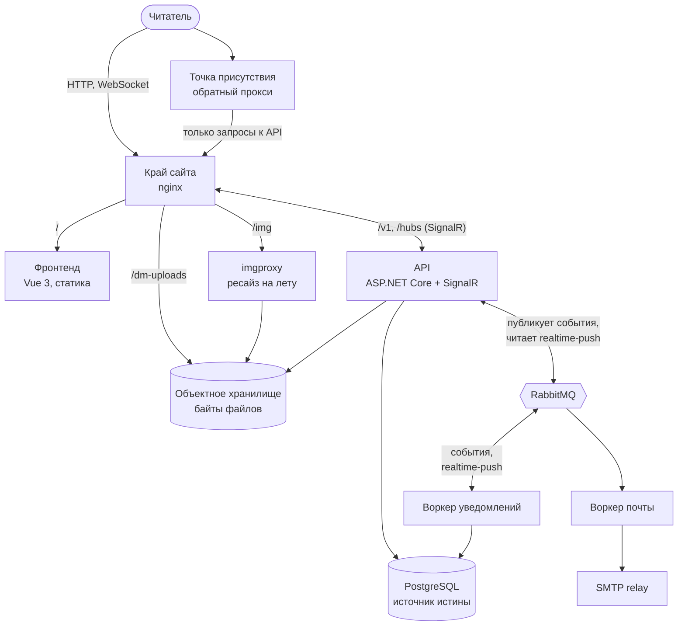
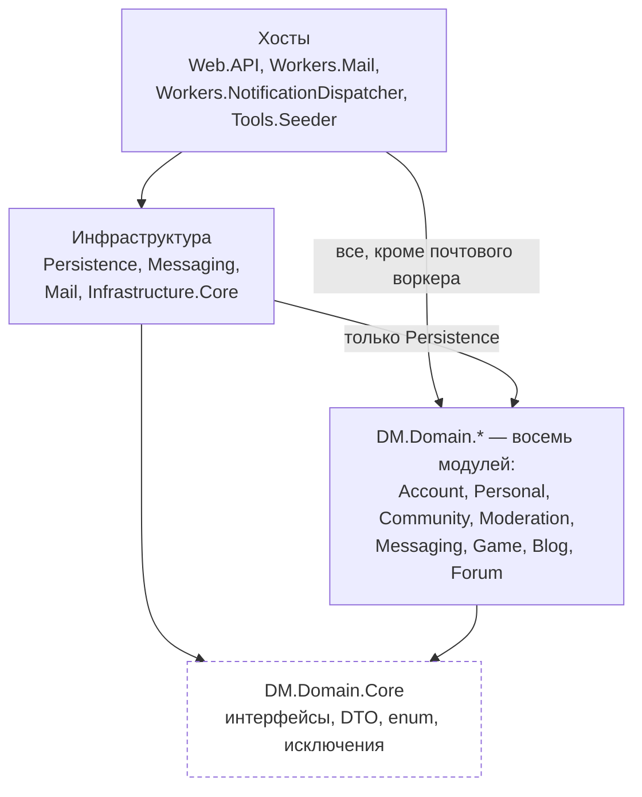
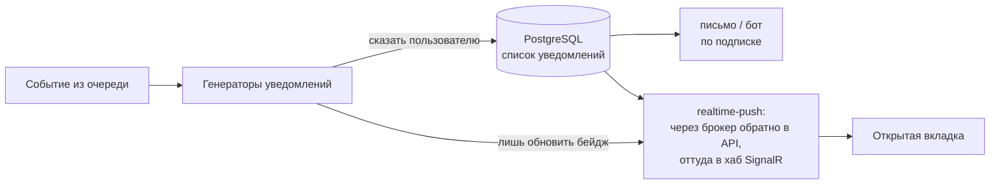

# Система DM3

> **User Story:** "Из чего состоит система? Какая архитектура? Как связаны компоненты?"

---

## Коротко

DM3 — платформа для текстовых ролевых игр: игры, форум, блоги, личные сообщения,
общий чат, профили, модерация. Приложение одно. Доменных модулей восемь (Account,
Personal, Community, Moderation, Messaging, Game, Blog, Forum), и работают они в
одном процессе: `src/DM.Web.API` ссылается на все восемь и он же разговаривает с
браузером по HTTP.

**Источник истины — PostgreSQL.** Второй СУБД в системе нет, схема общая, миграция
единственная (`src/DM.Infrastructure.Persistence/Migrations/`), и один `DmDbContext`
держит таблицы всех модулей сразу. В объектном хранилище лежат только байты
загруженных файлов, а все, что нужно искать, фильтровать или связывать, живет
строкой в PostgreSQL. Порядок записи в паре хранилищ и выбор между таблицей и jsonb
описаны в [DATA_STORAGE.md](../conventions/DATA_STORAGE.md). Отсутствие второй СУБД
держится не обещанием, а компиляцией: маркера документной коллекции в коде больше
нет, и попытка его поставить не соберется
(`test/DM.Infrastructure.Persistence.Tests/EntityStorageMarkerShould.cs`).

**Главное правило: событие не носитель факта.** Доменное событие сообщает о записи,
которая уже закоммичена, и потому не может быть единственным местом, где эта запись
существует. Из правила растет почти все, что ниже: почему публикация не роняет
запрос, почему потребитель обязан быть идемпотентным, почему подтверждения от
брокера просят ровно два продюсера. На это правило ссылается сам код
(`src/DM.Infrastructure.Mail/MailSender.cs`,
`src/DM.Infrastructure.Core/Tracing/MessagingMetrics.cs`), так что менять его в
документе в одиночку нельзя.

### Топология рантайма

Развернутый стенд собирает весь сайт на один origin. Перед приложением стоит край на
nginx, и он же раздает статику фронтенда, проксирует API и хаб, отдает файлы из
объектного хранилища и подписанные превью из imgproxy. Разбивка по префиксам лежит в
`docker/nginx/edge-locations.conf`, состав — в `docker/docker-compose.preview.yml`,
единственном overlay, где nginx перед API вообще появляется.



Три свойства этой картинки стоит держать в голове.

**Единый origin — свойство края, а не приложения.** Фронтенд просит `/v1`
относительно адреса, с которого загрузился, отдельного имени у API нет
(`docker/.env.example`). На локальном стенде края нет вовсе: базовый
`docker/docker-compose.yml` не поднимает ни nginx, ни контейнер фронтенда, dev-сервер
Vite ходит на API по абсолютному адресу из `VITE_API_HOST`, и работает CORS с
перечнем разрешенных источников (`src/DM.Web.API/Startup.cs`). Кросс-доменная
конфигурация проверяется, таким образом, только локально.

**imgproxy получает картинку не от API.** Приложение только подписывает URL
(`src/DM.Infrastructure.Core/Storage/ImgproxyUrlBuilder.cs`), а исходник забирает из
объектного хранилища сам imgproxy. Подпись — единственное, что стоит между ним и
произвольными преобразованиями.

**Точка присутствия — второй вход, а не вторая копия.** Она отдает фронтенд со
своего диска, запросы к API передает наверх, не хранит ни секретов, ни данных,
отказоустойчивости не дает и судьбу основного сервера разделяет
([POINT_OF_PRESENCE.md](../guides/POINT_OF_PRESENCE.md), `docker/docker-compose.pop.yml`).

Наблюдаемость в схему не вынесена, чтобы не загораживать тракт данных. Логи, трассы,
метрики и алерты описаны в [MONITORING.md](../guides/MONITORING.md), их контейнеры
перечислены в `docker/docker-compose.yml`.

### Направление зависимостей

Стрелка означает ссылку проекта: откуда она выходит, тот и зависит. Слой зависит
только от слоев ниже. Фронтенд в схему не входит, он разговаривает с API только по
HTTP и нарисован в топологии выше.



Внутри инфраструктуры зависимости идут в одну сторону: Mail ссылается на Messaging,
Persistence и Messaging ссылаются на Infrastructure.Core. Точный граф читается из
csproj, схема держит только направление между слоями.

У `Domain.Core` ссылок нет вообще, и на этом стоит вся схема: он лист графа, и любая
новая ссылка из него разворачивает направление. Почтовый воркер про домен не знает
ничего, его проект ссылается только на инфраструктуру.

Второй лист — завендоренный разбор BBCode (`src/BBCodeParser`). Это чужая библиотека,
которую держим у себя вместо пакета, и в схеме слоев она не участвует: своя сборка
без единой ссылки, а видит ее только тот слой инфраструктуры, который ее оборачивает.
Чужая по происхождению, а не по неприкосновенности: наши правки в ней есть, и каждая
подписана прямо в коде рядом с местом (`src/BBCodeParser/Tags/Tag.cs`). Откуда взяты
исходники, под какой лицензией и почему именно этот коммит, объявлено в
`src/BBCodeParser/BBCodeParser.csproj`, правила для такого кода — в
[PATTERNS.md](../conventions/PATTERNS.md).

Из направления следует правило, которое ломают чаще всего: **бизнес-интерфейсы
объявляет Domain**. Infrastructure объявляет только свои, обертки над внешними
библиотеками. Формулировка и граница живут в [PATTERNS.md](../conventions/PATTERNS.md),
там же назван архитектурный тест.

| Слой | Может зависеть от | НЕ может зависеть от |
|------|-------------------|---------------------|
| Domain.Core | Только .NET BCL | Ничего из проекта |
| Завендоренная библиотека | Только .NET BCL | Ничего из проекта |
| Domain.* | Domain.Core | Других Domain.*, Infrastructure.* |
| Infrastructure.* | Domain.Core, Domain.* | Хостов |
| Хосты: Web.API, Workers.*, Tools.Seeder | Все | — |
| Web.Client | Только HTTP API | Backend напрямую |

Доменная сборка не называет инфраструктуру ни одним именем: ни драйвер базы, ни
клиент брокера, ни библиотеку логирования, ни веб-фреймворк, ни проект Persistence.
Правило проверяется по ссылкам сборок, а не по тексту using, потому что тип, взятый
через алиас или полное имя, в тексте не виден
(`test/DM.Architecture.Tests/DomainPurityShould.cs`, `DomainBoundaryShould.cs`).

---

## Границы модулей

Модуль не ссылается на соседний модуль ни в одну сторону. Читать чужую область
синхронно можно только через контракт в ядре, а писать в нее и вызывать побочные
эффекты можно только событием. Признак нарушения механический: метод контракта,
который ничего не возвращает, зовут ради эффекта, а эффект в чужой области, которого
ждут синхронно, и есть то, что должны переносить события
(`test/DM.Architecture.Tests/CrossModuleContractShould.cs`, `DomainBoundaryShould.cs`).
Кто чем владеет, решается вопросом "чьи это данные", таблица в
[PATTERNS.md](../conventions/PATTERNS.md).

```csharp
// Правильно: публикуем событие
await _eventProducer.SendAsync(EventType.GameCreated, game.Id);

// Неправильно: прямой вызов другого модуля
await _notificationService.CreateAsync(...); // ЗАПРЕЩЕНО
```

**Изоляция кончается на доменных модулях.** Схема общая, контекст один, Persistence
ссылается сразу на все восемь модулей, и чтения через границу модуля внутри этого
слоя допущены сознательно. Поэтому вынос модуля в отдельный сервис означает
разделение схемы, а не перенос кода.

**Модуль, который забыли зарегистрировать, компилируется и стартует.** Хост собирает
контейнер по написанному руками списку маркерных типов и сканирует каждую названную
сборку. Модуль, не попавший в список, отвечает 500 из контейнера на первом же запросе
к своему эндпоинту. Список читается против дерева, и проверяются обе половины: что
модуль назван и что переменная попала в массив
(`test/DM.Architecture.Tests/ModuleCompositionShould.cs`).

**Почему встроенный контейнер, а не Autofac.** Один DSL вместо двух. Явное расширение
`AddDmX(IServiceCollection)` отдает каждый инфраструктурный проект и тот доменный
модуль, которому явная регистрация нужна, а остальное приезжает сканом сборки по
конвенции (`src/DM.Infrastructure.Core/Extensions/DefaultTypesRegistrationExtensions.cs`).
Скан только заполняет пробелы и не вытесняет явную регистрацию: сервис-тип,
зарегистрированный вне сканов, скан не трогает, поэтому класс багов "скан затенил
пул DbContext или фабрику typed HttpClient" исключен структурно. Явные регистрации
хоста и модулей обязаны идти раньше сканов, а форвардинг-фабрики хранят контракт
"один инстанс на scope при нескольких интерфейсах". Все хосты включают
`ValidateScopes` и `ValidateOnBuild`, так что недостающая регистрация и захват
scoped-зависимости синглтоном ловятся при старте, а не на первом запросе. Исключение
одно: сидер валидирует только скоупы, потому что его сканы тянут доменные сборки ради
нескольких internal-типов и приводят с собой сервисы, которых он никогда не резолвит.
Контейнеры хостов собираются под тестом теми же флагами
(`test/DM.Architecture.Tests/CompositionRootShould.cs`).

---

## Жизненный цикл запроса

```
HTTP → конвейер middleware → контроллер → API-сервис → доменный сервис → репозиторий → PostgreSQL
```

Порядок конвейера задается в `Startup.cs` веб-хоста и здесь не дублируется: копия
списка в документе расходится с кодом молча. Обязательны в этом порядке четыре
ограничения, и каждое уже стоило дефекта.

- **Разбор адреса клиента идет первым.** Партиции лимитера, журнал входов и аудит
  безопасности читают адрес пира, и он должен стать клиентским до них.
- **Заголовки безопасности стоят выше всего, что пишет ответ.** Ниже они не попадают
  на ответы, отданные более ранними обработчиками, и так сканер нашел статику Swagger
  вовсе без заголовков.
- **CORS стоит выше кеша ответов.** Иначе в кеш ложится запись, сделанная до CORS, и
  браузер роняет чужой 200 на все время жизни записи.
- **Все, что читает метаданные эндпоинта, идет после маршрутизации.** Лимитер и
  авторизация резолвят политику из метаданных, которые заполняет именно
  маршрутизация. Выше нее атрибуты политик инертны.

Аутентификация — сессионная кука HttpOnly, токена в JavaScript нет. Отсюда два
контроля от подделки межсайтового запроса, и ни один не покрывает все: `SameSite=Lax`
не пускает куку на запрос, начатый чужим сайтом, а middleware отказывает запросам,
которые называют origin, на котором сайт не отвечает
(`src/DM.Web.API/Middleware/CsrfProtectionMiddleware.cs`). Лимитер считает по
аккаунту, а имя аккаунта кладет на контекст отдельное звено, читающее только куку:
партиционер лимитера зовется синхронно и до того, как появилась личность. Поломка
этой пары молча переводит счет на адрес
(`test/DM.Architecture.Tests/RateLimitPipelineShould.cs`).

**Хост не ходит в хранилища сам, и правило шире контроллеров.** Фоновые задания
хоста, а их там больше десятка, обязаны идти через домен так же, как эндпоинты. Иначе
продуктовое правило (что считать популярностью, сколько живет токен, когда напоминать
о долге) существует только внутри работающего процесса: его нельзя позвать со стороны
и нельзя покрыть доменным тестом
(`test/DM.Architecture.Tests/HostStorageBoundaryShould.cs`). Исключения названы
поименно: композиционный корень и прогрев.

**Репозиторий, который пишет дважды, пишет оба раза или ни одного.** Две записи без
обертки — это две транзакции, и в зазоре живет состояние, у которого нет имени: хеш
пароля сменен, а погасивший его токен еще действует
(`test/DM.Architecture.Tests/DurableWritesShould.cs`).

Формат ответов, коды ошибок, пагинация и заголовки описаны в
[API_DESIGN.md](../conventions/API_DESIGN.md). Одиночный ресурс отдается в конверте
`Envelope<T>`, и клиент снимает конверт единственным помощником
(`src/DM.Web.Client/src/shared/api/envelope.ts`), а не копией в каждом потребителе.

---

## Конвейер доменных событий

События нужны затем, чтобы модули не знали друг о друге, а отправка письма не держала
HTTP-ответ.

```
доменная запись (коммит) → INSERT в OutboxEvents (второй коммит)
                                   ↓ relay в хосте API, тик 1 s
                             обмен событий
                                   ↓
                        очередь воркера уведомлений
```

**Публикация — это вставка строки.** `SendAsync` пишет строку в таблицу OutboxEvents
той же PostgreSQL вторым, отдельным коммитом сразу после доменного. Своей транзакции
продюсер не открывает и в чужую не входит
(`src/DM.Infrastructure.Persistence/RelationalStorage/OutboxEventProducer.cs`,
`test/DM.Architecture.Tests/EventOutboxShould.cs`). С момента, когда вставка
закоммичена, доставка становится at-least-once, и недоступный брокер означает
задержку, а не потерю. Окно потери остается: kill процесса между двумя соседними
коммитами и отказ самой вставки. Отсюда и правило "событие не носитель факта": то,
что обязано случиться, должно быть восстановимо из состояния базы.

**Отказ вставки не роняет вызывающего.** Из того же правила следует обратное. Раз
событие не носитель факта, отказ вставки не может превращать уже закоммиченную запись
в ошибку, иначе клиент повторит и создаст вторую. Продюсер сам логирует отказ и
считает его метрикой, поэтому в местах вызова нет ни try, ни catch: правило написано
один раз. Событие не публикуется раньше, чем состояние, о котором оно сообщает, стало
долговечным (`test/DM.Architecture.Tests/PublishAfterCommitShould.cs`).

**Relay живет в хосте API.** Outbox пишут запросы этого процесса, и публикующая
половина не должна зависеть от чужого деплоя. Тик равен секунде, и эта секунда есть
вся латентность, которую outbox добавляет: событие едет outbox, relay, обмен, воркер,
SignalR, и секунда опроса лежит в этом пути целиком. Батч берется в транзакции
запросом `FOR UPDATE SKIP LOCKED`, чтобы два релея в окне выкатки не пометили строки
друг друга. Строка помечается опубликованной только после подтверждения брокера. Батч
останавливается на первой отказавшей строке, потому что потребитель последовательный
и пропуск отдал бы младшее событие раньше старшего. Пока батч приходит полным, тик
продолжает выгребать, так что завал, накопленный за перезапуск брокера, уходит
сотнями в секунду (`src/DM.Web.API/HostedServices/OutboxRelayService.cs`,
`src/DM.Infrastructure.Persistence/RelationalStorage/OutboxRelayProcessor.cs`).

**Доставка из очереди тоже at-least-once.** Сбой воркера между записью и
подтверждением, nack или рестарт приводят то же сообщение повторно, поэтому обработка
с побочным эффектом обязана быть идемпотентной. Ключ несет само событие: EventId
проставляется в единственной точке публикации и остается тем же на всех повторах
одной строки, а воркер уведомлений пишет по паре (EventId, тип уведомления) под
уникальным индексом, так что повторная доставка не создает ни второй записи, ни
второго письма. Пустой EventId означает сообщение, опубликованное до появления ключа,
и обрабатывается без дедупликации
(`src/DM.Workers.NotificationDispatcher/Dispatching/NotificationProcessor.cs`).

**Потребление последовательное, повторов пять.** Консьюмер берет по одному сообщению
(prefetch 1, не глобальный), а конвейер повторяет обработку пять раз с удвоением
паузы (`src/DM.Infrastructure.Messaging/DmConsumer.cs`,
`src/DM.Infrastructure.Messaging/MeasuredConsumerPipeline.cs`).

**Отравленное сообщение.** Когда повторы кончились, исключение выходит из конвейера, и
сообщение отклоняется без возврата в очередь. При отсутствии dead-letter exchange
брокер его выбрасывает, поэтому каждая рабочая очередь объявляет dead-letter exchange
и терминальную очередь при нем. Терминальную потому, что DLQ с TTL и возвратом на
рабочий обмен дает бесконечный цикл повторов без потолка попыток. Исключение сделано
для очередей одноразовых пушей, где сообщение лишь копия уже сохраненного состояния
(`test/DM.Architecture.Tests/DeadLetterRoutingShould.cs`).

**Подтверждение брокера просят двое, по разным причинам.** Активация и сброс пароля
восстановимы только из письма: в состоянии базы нет ничего, из чего его можно собрать
заново, поэтому почтовый продюсер ждет подтверждения, и отказ становится ошибкой
запроса, которую читатель видит и повторяет сам. Relay ждет подтверждения потому, что
без него нельзя помечать строку опубликованной: пометка без confirm есть запись
"доставлено" про сообщение, которое брокер мог не взять. Ожидание в relay допустимо,
это фон, а не запрос. На realtime-пуше подтверждения не просят, сообщение там копия
уже сохраненного состояния. Ставить ожидание на продюсер внутри запроса значит ронять
запросы, работа которых уже сделана.

**Обмен объявляет тот, кто в него публикует.** Клиент на стороне продюсера не
объявляет ничего, поэтому обмен существовал ровно до тех пор, пока кто-нибудь его не
потреблял: на стенде, где воркер ни разу не стартовал, публикация уходила в
несуществующий обмен и молчала об этом. Каждый хост объявляет свои обмены при старте,
параметрами один в один с потребителем, а на расхождение брокер отвечает 406
(`test/DM.Architecture.Tests/PublishedExchangeShould.cs`).

Почта в конвейер outbox не входит: письмо публикуется в отдельный обмен, который
слушает только почтовый воркер. Имена обменов и очередей заданы в коде транспорта и
консьюмеров и здесь не дублируются, копия имен в документе расходится с кодом молча.

**Почему официальный RabbitMQ.Client со своим тонким слоем, а не готовая шина.**
Нужна тонкая обертка, в которой топология очереди (привязка, dead-letter exchange,
политика повторов) объявлена в коде потребителя и видна там же. Шина общего
назначения приносит свой конвейер, свои конвенции имен и свою модель повторов поверх
той же RabbitMQ: выигрыша на текущем числе воркеров нет, а цена в том, что топологию
приходится выводить из абстракций. Слой поверх клиента свой
(`src/DM.Infrastructure.Messaging`), а не чужая обертка, потому что сторонняя обертка
это либо та же шина, либо зависимость с bus-factor 1, которая отстает от клиента и
однажды блокирует обновление брокера. Пересматривать, если появится нужда в saga или
в нескольких транспортах. Довод записан там же, где версия (`Directory.Packages.props`).

---

## Уведомления



Шаг с хранением обязателен не для каждого события. Уведомление, которое пользователь
потом читает списком, сохраняется и может уйти письмом или ботом. Событие, которое
лишь просит открытую вкладку перечитать свой счетчик, идет тем же путем, но не
сохраняется и не попадает ни в письмо, ни в бота: список и почта — это решение о том,
что сказать пользователю, а не побочный эффект обновления бейджа.

Два свойства этого узла легко потерять правкой. Каналы доставки читают то, что
вернула запись, а не то, что ей передали: сервис сужает круг получателей, и рассылка
по исходному списку доставит ровно то, что фильтр отказался хранить. Доставка после
записи идет по принципу best effort, потому что исключение отсюда вернуло бы всю
обработку в повторы и переписало бы уже сохраненное
(`src/DM.Workers.NotificationDispatcher/Dispatching/NotificationProcessor.cs`).

Обратный путь до браузера идет через брокер: воркер публикует push, а хост API читает
его своей эксклюзивной очередью и отдает в хаб. Dead-letter у этой очереди нет
намеренно, push это копия уже сохраненного уведомления, и удержанный сверх своего
момента он никому ничего не дает
(`src/DM.Web.API/Realtime/RealtimeNotificationConsumer.cs`).

---

## Разметка: рендер только на сервере

Текст пользователя хранится как BBCode, а в HTML его превращает только сервер. Клиент
получает готовую разметку и никогда не собирает ее сам. Устройство разбора, набор
тегов и матрица видимости описаны в [BBCODE_RENDERING.md](./BBCODE_RENDERING.md),
здесь только то, что задает границы доверия.

**Аудитория рендера — это намерение, и клиент может назвать не всякое.** Заголовок
`X-Dm-Audience` выбирает, как рендерить каждое BbText-поле ответа, а неизвестное
значение безопасно падает в отображение. Аудитория источника цитаты в этот перечень
не входит и не должна: она отдает BBCode-исходник, то есть авторский текст, по
которому не проходила ни одна подстановка безопасности. Достижимая из заголовка, она
положила бы сырой текст в поля, которые клиент связывает через v-html
(`src/DM.Infrastructure.Core/Parsing/BbAudienceHeader.cs`,
`test/DM.Infrastructure.Core.Tests/BbAudienceHeaderShould.cs`).

**Цитата собирается на сервере и всегда одним кодом.** Каждая цитируемая поверхность
(пост, топик, четыре вида комментариев, личное сообщение) имеет ручку
`.../{id}/quote`, и все они зовут один сервис. Альтернатива в виде семи копий правила
опаснее всего там, где правило важнее всего: приватный блок вырезается безусловно, в
том числе для автора поста и для ведущего игры, потому что цитирование это повторная
публикация и снимок адресатов в новый пост не переезжает. Читать цитату вправе только
тот, кто вправе читать сам источник, и решает это чтение, а не сборка цитаты
(`src/DM.Web.API/Shared/BbRendering/QuoteSourceService.cs`,
`test/DM.Web.API.IntegrationTests/Controllers/General/QuoteSourceShould.cs`).

**Блок, скрывающий содержимое, закрывается только своим тегом.** Закрывающий тег
чужого имени раньше закрывал предка вместе со всем, что внутри, и остаток приватного
блока печатался всей комнате. Это обычная ошибка вложенности, без всякого злого
умысла. Теперь такой тег не закрывает ничего, и блок кончается там, где сказал автор.
Признак стоит на приватном блоке и не стоит на модераторском: тот публичен на чтение,
и раннее закрытие стоит читателю только форматирования
(`src/BBCodeParser/Tags/Tag.cs`, `src/DM.Infrastructure.Core/Parsing/BbParserProvider.cs`).

---

## Вход и второй фактор

Полное устройство описано в [AUTHENTICATION.md](./AUTHENTICATION.md), архитектурно
важны три вещи.

**Вход в два шага, и между шагами сессии не существует.** Фактор встает после
доказанного пароля и до создания сессии: строка сессии не создается, кука не
выдается, отметка активности не пишется. Испытание переносится короткоживущей кукой,
которая сессией не является ни в каком приближении. Так удается обойтись без пометки
"половинная сессия", а с ней и без обязанности каждой поверхности авторизации про эту
пометку помнить.

**Секрет не покидает периметр.** QR-код это кодировка otpauth-URI, а URI содержит
общий секрет целиком, поэтому рисование кода внешним сервисом отдало бы второй фактор
каждого, кто его заводит. Картинка при этом выглядит одинаково и ревьюеру замечать
нечего, поэтому правило механическое и проверяется по исходникам всех проектов,
включая клиент (`test/DM.Architecture.Tests/SecondFactorSecretShould.cs`).

**Снятие фактора идет двумя путями, и быстрый из них только один.** Почтовый путь
анонимен, лимитирован по адресу и отвечает одинаково любому адресу, потому что какие
аккаунты имеют фактор, эта ручка не разглашает. Письмо фактор не снимает: переход по
ссылке назначает снятие, завершает все сессии и запускает срок ожидания, который
отменяет любой успешный вход с фактором. Для рангов, которым фактор положен, почтовый
путь закрыт совсем: их фактор снимает второй администратор, и это единственная
причина, по которой администраторов на сайте двое. Этот второй путь действует сразу,
но снимающему не дает ничего: ни сессии чужого аккаунта, ни его прав, только
возможность войти паролем для владельца и конец всех сессий, которые у аккаунта были.
Запись делается в журнал обоих
(`src/DM.Web.API/Features/Account/TwoFactor/TwoFactorController.cs`).

---

## Адреса сайта

Сайт доступен по нескольким адресам, но экземпляр приложения один. Дополнительный
адрес обслуживает обратный прокси: фронтенд он отдает со своего диска, запросы к API
передает наверх, состояния не хранит и к базам не подключается. Копией сайта такой
адрес не является и отказоустойчивости не дает
([POINT_OF_PRESENCE.md](../guides/POINT_OF_PRESENCE.md)).

**Общий вход между адресами это решение развертывания, а не свойство кода.** Область
куки сессии берется из конфигурации, и поставляемое значение пустое: кука принадлежит
хосту, который ее выдал, и вход на каждом адресе свой. Заполненное имя регистрируемого
домена распространяет куку на все его хосты и делает вход общим, включать его можно
только тогда, когда каждый хост этого домена обслуживаем мы. Обе половины, выдача и
снятие, обязаны идти через один и тот же помощник: браузер заменяет куку только при
совпадении атрибутов, и разошедшийся Domain оставляет сессию, которую выход не гасит
(`src/DM.Web.API/Shared/Authentication/ApiCredentialsStorage.cs`,
`docker/docker-compose.yml`).

---

## Проверка

| Утверждение | Чем подтверждено |
|-------------|------------------|
| Направление ссылок между слоями | ProjectReference в csproj, `DomainPurityShould`, `DomainBoundaryShould` |
| Модуль не зовет модуль, пишет событием | `CrossModuleContractShould`, `DomainBoundaryShould` |
| Каждый модуль зарегистрирован хостом | `ModuleCompositionShould` |
| Контейнер собирается с обеими валидациями | `Program.cs` хостов, `CompositionRootShould` |
| Публикация это вставка в outbox, без своей транзакции | `OutboxEventProducer.cs`, `EventOutboxShould` |
| Событие не публикуется раньше своего коммита | `PublishAfterCommitShould` |
| Пометка строки только после подтверждения брокера | `OutboxRelayProcessor.cs`, `EventOutboxShould` |
| Дедупликация повторной доставки по EventId | `NotificationProcessor.cs`, уникальный индекс в схеме |
| У рабочей очереди есть dead-letter exchange | `DeadLetterRoutingShould` |
| Обмен объявляет публикующий хост | `PublishedExchangeShould` |
| Порядок конвейера middleware | `Startup.cs`, `RateLimitPipelineShould` |
| Хост ходит в хранилища только через домен | `HostStorageBoundaryShould` |
| Аудитория цитаты недостижима из заголовка | `BbAudienceHeaderShould`, `QuoteSourceShould` |
| Приватный блок не уезжает в цитату | `QuoteSourceShould` |
| Секрет второго фактора не уходит наружу | `SecondFactorSecretShould` |
| Хранилище структурированных данных одно | `EntityStorageMarkerShould`, маркера коллекции в коде нет |

Чего этот документ не проверяет и проверить чтением дерева не может:

- **Конфигурацию работающего стенда.** В репозитории лежат шаблоны и значения по
  умолчанию. Включена ли общая область куки, какие адреса объявлены, поднят ли overlay
  с краем на конкретной машине — это состояние развертывания, и смотреть его надо на
  самой машине.
- **Соответствие образов в реестре этому дереву.** Хосты в compose берутся из реестра
  по тегу, и совпадение содержимого гарантирует конвейер публикации, а не чтение
  исходников.
- **Живое поведение видимого человеку.** Утверждения про рендер и цитаты опираются на
  код и тесты, а то, что читатель видит на странице, закрывается только прогоном на
  стенде.

---

## Ссылки

- [AUTHENTICATION.md](./AUTHENTICATION.md) — как работает вход
- [AUTHORIZATION.md](./AUTHORIZATION.md) — как работают права
- [BBCODE_RENDERING.md](./BBCODE_RENDERING.md) — разбор разметки и видимость тегов
- [UPLOADS.md](./UPLOADS.md) — загрузка файлов и их отдача
- [PATTERNS.md](../conventions/PATTERNS.md) — правила структурирования кода
- [API_DESIGN.md](../conventions/API_DESIGN.md) — контракт HTTP API
- [DATA_STORAGE.md](../conventions/DATA_STORAGE.md) — организация хранилищ
- [POINT_OF_PRESENCE.md](../guides/POINT_OF_PRESENCE.md) — второй адрес сайта
- [MONITORING.md](../guides/MONITORING.md) — логи, трассы, метрики, алерты
