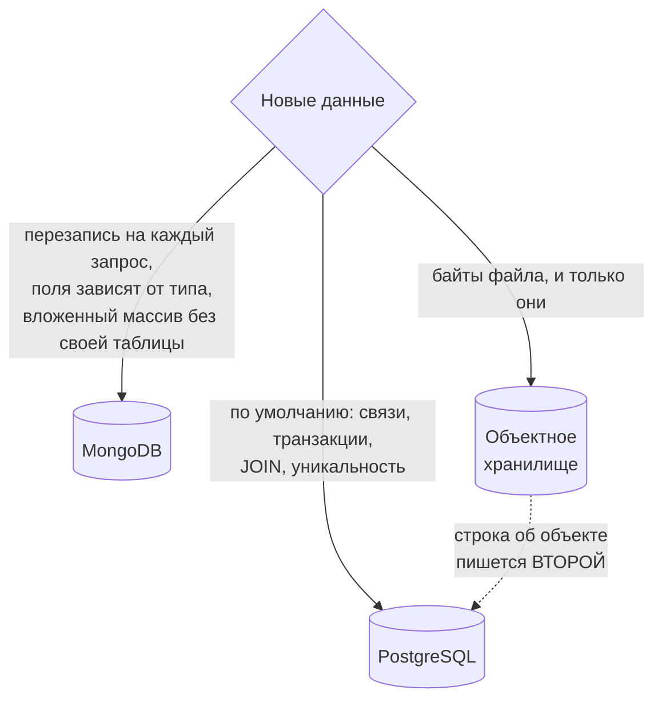

# Database Architecture

> **SSOT:** Это единственный источник истины по организации хранилищ данных DM3.

---

## Три хранилища

DM3 использует три хранилища, каждое для своих задач:

- **PostgreSQL** — реляционная БД для основных бизнес-данных
- **MongoDB** — документная БД для специфических сценариев
- **Объектное хранилище** (S3-совместимое) — байты загруженных файлов



**PostgreSQL — по умолчанию, MongoDB — обоснованное исключение.** Второе хранилище берется тогда, когда данные плохо ложатся в реляционную модель: сессии и счетчики переписываются на каждый запрос, у документа набор полей зависит от типа, вложенный массив не нуждается в собственной таблице. Цена ровно одна и она не обходится: **между хранилищами нет ни транзакции, ни JOIN'а**. Отсюда правило: одна фича живет в одном хранилище целиком. Как только часть данных фичи уезжает в другое хранилище, появляются состояния, в которых половина записана, а вторая нет, и восстановить их можно только вручную. Если для выборки нужен JOIN с реляционными данными, хранилище реляционное, независимо от формы документа.

**Где правило неприменимо, обязателен явный порядок.** У загрузки два хранилища по определению: байты в объектном, строка о них в реляционном. Такая фича не выбирает одно хранилище, она обязана задать, что пишется первым, что удаляется первым и кто убирает остаток. Второй такой случай — счетчики непрочитанного при реляционной сущности — подчиняется тому же правилу: маркеры пишутся до реляционной записи, потому что идентификаторы известны заранее, а если реляционная запись не встала, они снимаются компенсацией. Снятие — часть самого пути записи, а не привычка каждого вызывающего: порядок, оставленный на усмотрение, держался ровно в одном месте из шести. Отказ компенсации при этом глотается, потому что подменить собой исходную ошибку хранилища он права не имеет. Порядок выбран так, что несостоявшаяся запись теряет сущность, которую никто еще не видел, а не оставляет видимую сущность с недостающей половиной.

### Когда использовать PostgreSQL

| Сценарий | Почему PostgreSQL |
|----------|-------------------|
| **Связанные данные** | Нужны внешние ключи (FK) — БД сама следит за целостностью связей |
| **Транзакции** | Несколько операций должны выполниться "все или ничего" (ACID) |
| **Сложные выборки** | Нужны JOIN'ы между таблицами, фильтрация, сортировка |
| **Строгие ограничения** | Уникальность, проверки значений (UNIQUE, CHECK) |

### Когда использовать MongoDB

| Сценарий | Почему MongoDB |
|----------|----------------|
| **Вложенные массивы** | Данные удобнее хранить списком внутри документа, а не в отдельной таблице |
| **Частые записи** | Много операций записи — MongoDB не блокирует документ при обновлении |
| **Гибкая структура** | Поля могут появляться/исчезать без миграций (schemaless) |
| **Разные поля для разных типов** | Один документ может иметь разный набор полей в зависимости от типа |

### Объектное хранилище

Там лежат только байты пользовательских файлов. Все, что нужно искать, фильтровать
или связывать, лежать там не может: запросов у хранилища нет, ссылочной целостности
тоже, а обход содержимого стоит перечисления всего бакета.

Правила, которые из кода не выводятся и потому живут здесь:

- **Порядок записи: сначала объект, потом строка.** Строка без объекта отдает битую
  картинку, объект без строки не отдает ничего и никому не мешает. Если запись строки
  не удалась, тот же запрос удаляет объект: другого шанса нет, потому что искать его
  потом будет некому.
- **Порядок удаления: сначала строка, потом объект, и не сразу.** Строка помечается
  удаленной, объект уносит фоновый сборщик после срока восстановления. Пока срок не
  вышел, удаление обратимо, поэтому стирать объект раньше не имеет права ни один
  другой путь.
- **Владелец объекта — строка.** Ключ неизменяем: замена файла означает новый ключ,
  а не перезапись старого, и на этом держится вечное кеширование. Сборщик обходит
  строки, а не бакет, поэтому объект, на который строки никогда не было, не найдет
  никто.
- **Публичность перечисляется, а не подразумевается.** Анонимно отдаются только
  явно названные префиксы. Новый тип загрузки закрыт, пока кто-то не решил обратное,
  а не открыт потому, что решения не было.

### Где лежит эта сущность — видно из ее объявления

Обе сущности выглядят как обычный C#-класс в одной и той же папке `Entities/`, и
без явного признака хранилище приходится выяснять по репозиторию. Признак —
атрибут на классе, и он обязателен для всего, у кого есть собственная единица
хранения:

| Атрибут | Хранилище |
|---------|-----------|
| `[Table("...")]` | Таблица PostgreSQL |
| `[MongoCollectionName("...")]` | Коллекция MongoDB |

Атрибута нет только у вложенного значения — куска документа или колонки-объекта,
у которого нет своей единицы хранения (`PagingSettings` внутри `UserSettings`,
`AttributeSpecification` внутри схемы атрибутов). Это и есть третье состояние:
не "неизвестно где", а "нигде самостоятельно".

Объектное хранилище в этой таблице не участвует. У объекта нет собственного класса:
его единица учета — владеющая им строка, маркер стоит на ней, и связь с байтами
задает ключ объекта в этой строке.

---

## Организация Entities

**Entity** — это класс, представляющий таблицу или коллекцию в БД.

Entities группируются **по модулям** (папкам), повторяя структуру Domain-слоя. Если entity используется несколькими модулями — она идет в **Shared Kernel**.

```
Infrastructure.Persistence/
├── Entities/
│   ├── {Module}/         # Entities, принадлежащие одному модулю
│   ├── Shared/           # Shared Kernel — общие для нескольких модулей
│   └── Contracts/        # Интерфейсы (IRemovable, IEditable...)
├── Repositories/         # Классы доступа к данным (зеркалит Entities/)
└── Shared/               # Общие реализации репозиториев
```

### Shared Kernel (DDD)

**Shared Kernel** — паттерн из Domain-Driven Design. Это небольшой набор сущностей, которые используются несколькими модулями (bounded contexts).

В идеале каждый модуль должен иметь свои данные без пересечений. Но иногда это приводит к дублированию таблиц — например, если и блог, и форум, и игры имеют комментарии.

**Решение:** общая таблица с полиморфной ссылкой на владельца. Каждый модуль работает с ней через свой интерфейс репозитория, но физически это одна таблица. Форму ссылки выбирают по правилу из раздела [Polymorphic References](#polymorphic-references-полиморфные-ссылки).

### Как понять, куда положить Entity

**Смотрим на интерфейс репозитория в Domain-слое:**

```
1. Интерфейс лежит в Domain.Core (общее ядро)?
   → Entity идет в Entities/Shared/

2. Интерфейсы лежат в РАЗНЫХ модулях (Domain.Blog, Domain.Game...)?
   → Entity идет в Entities/Shared/

3. Интерфейс лежит в ОДНОМ модуле?
   → Entity идет в Entities/{этот модуль}/

4. Это интерфейс-контракт (IRemovable...)?
   → Entities/Contracts/
```

---

## Паттерны хранения

### Soft Delete (мягкое удаление)

Данные не удаляются физически — вместо этого ставится флаг `IsRemoved = true`. Это позволяет восстанавливать данные и сохранять историю.

```csharp
public interface IRemovable
{
    bool IsRemoved { get; set; }
}

// EF Core автоматически фильтрует "удаленные" записи
.HasQueryFilter(e => !e.IsRemoved)
```

Расширенный вариант (`ISoftDeletable`) также сохраняет кто и когда удалил.

### Audit Trail (история изменений)

Для отслеживания кто и когда менял данные:

| Поле | Что хранит |
|------|------------|
| `CreatedUtc` | Когда создана запись |
| `ModifiedUtc` | Когда последний раз менялась |
| `ModifiedByUserId` | Кто последний менял |
| `*EditHistory` | Полная история всех редактирований (отдельная таблица) |

### Polymorphic References (полиморфные ссылки)

Когда одна сущность может ссылаться на разные типы других сущностей, это позволяет иметь одну таблицу вместо нескольких похожих. Внешнего ключа за такой колонкой не стоит ни в одной из форм: целостность обеспечивает приложение.

**С дискриминатором** — колонка-перечисление рядом с идентификатором:

```csharp
public SubscriptionTargetType TargetType { get; set; }
public Guid TargetId { get; set; }
```

Нужен, когда строки разных типов владельца читаются одним запросом или когда тип владельца меняет смысл самой строки. Перечисление именуется по своей таблице, а не общим словом: `TargetType` без префикса в модели, где полиморфны несколько таблиц, столкнется с соседним.

**Без дискриминатора** — только идентификатор владельца:

```csharp
public Guid EntityId { get; set; }
```

Допустимо, когда каждый читающий запрос и так знает тип владельца и присоединяет его таблицу — join и выполняет разграничение. Дешевле на колонку и снимает целый класс расхождений, когда дискриминатор противоречит фактическому владельцу, но делает вопрос "все строки этой таблицы" неотвечаемым без join'а, а миграцию к дискриминатору — дорогой.

Умолчание — вторая форма: дискриминатор заводится под доказанную нужду в смешанном чтении, а не на случай.

### Denormalization (денормализация)

Дублирование данных для ускорения чтения. Например, `LastCommentDate` в родительской сущности — чтобы не делать JOIN при выводе списка.

### Срок хранения

Коллекция, в которую пишется поток (запись на каждое действие пользователя),
объявляет срок хранения там же, где объявляются ее индексы: TTL по отметке
времени. Коллекция состояния (документ на пользователя, на сессию, на сущность)
срока не объявляет, ее размер ограничен тем, чему она принадлежит.

Молчание тут неотличимо от недосмотра, поэтому "хранится вечно" это тоже
решение и записывается явно, а не подразумевается отсутствием индекса.

### Full-text search

Полнотекстовый поиск — на Postgres tsvector, отдельного поискового хранилища нет: права доступа меняются динамически, а индекс обязан быть live-consistent с ними. Доступ обеспечивается переиспользованием существующих предикатов доступа домена (не изобретать новые), приватный BBCode вырезается до индексации (в generated-колонке), доступ ревалидируется на каждой странице по текущей личности.

**Индекс и превью читают одну плоскую проекцию.** Рядом с телом хранится его видимый текст — с разметкой, снятой парсером того сюрфейса, на котором тело показывается. Из него считается и вектор, и превью. Иначе расходятся две вещи: индекс токенизирует разметку, и имя тега становится словом, которое можно найти, а превью, нарезанное из того же сырого тела, показывает читателю обрывки разметки. Приватный блок вырезается и в проекции, и в самой generated-колонке: колонка отказать не может, а процесс может.

**Превью — окно вокруг совпадения, а не начало текста.** Совпадение ищется по лексемам, поэтому найти его в тексте перебором подстрок нельзя: запрос по одной форме слова совпадает с другой. Окно и отметку дает база, тем же запросом, который строку и нашел, и считается оно только для той страницы, которую увидит читатель. Наружу превью уходит перечнем отрезков с признаком совпадения, а не строкой с разметкой: иначе единственное поле контракта пришлось бы рисовать как html, и рисовать его из документа, который никто не экранировал.

Индексируемое выражение живет в generated-колонке, а не в приложении: колонка не может отстать от строки, которую описывает. Отсюда же граница возможного — выражение видит только собственную строку, поэтому разграничение по типу владельца (полиморфный комментарий) обязано жить в запросе, а не в индексе.

---

## Миграции

**Правило:** существует только одна миграция `InitialCreate`. Все изменения схемы вносятся в нее, новые миграции не создаются.

Команды пересоздания живут в [LOCAL_SETUP.md](../guides/LOCAL_SETUP.md): конвенция формулирует правило, руководство дает команду.

**Что должно быть в модели, а не в миграции.** Пересоздание собирает миграцию заново, поэтому
все, о чем генератор не знает, при этом исчезает молча. Значит в миграции не место ничему
рукописному:

| Что | Где живет |
|-----|-----------|
| Стартовые данные (доски, теги, системный пользователь, глобальный чат) | `HasData` в модели |
| Расширения PostgreSQL | `HasPostgresExtension` в модели |
| Индексы по выражению, которые EF выразить не умеет | Утверждаются приложением при старте, как индексы Mongo |

**Единственное исключение — полиморфные ссылки.** Колонка, указывающая на разные таблицы в
зависимости от типа записи, не может нести внешний ключ: EF выводит его из навигаций, а
проверка требовала бы, чтобы значение существовало сразу во всех таблицах. Такие ключи
удаляются из свежесозданной миграции руками, и это единственное, что при пересоздании нужно
сделать. Забыть нельзя: интеграционный тест падает, если ключ вернулся.

**Почему.** Боевой базы не существует: схема накатывается полным ресетом, и история миграций
не защищает никаких данных, а только требует поддержки. Отсюда же запрет на ручной DDL и
на бэкфилы — воспроизводимость дает ресет, а не набор разовых команд.

**Когда правило заканчивается.** Триггер — первый деплой, несущий реальные данные (импорт
базы DM2). С этого момента `InitialCreate` замораживается, и каждое изменение схемы становится
отдельной инкрементальной миграцией: `remove` перестает быть допустимым, потому что удаляет
примененную к боевой базе миграцию. Правило до триггера и правило после него —
взаимоисключающие; действует ровно одно.

---

## Ссылки

- [Паттерны](./PATTERNS.md) — архитектура, структура проектов
- [Аутентификация](../architecture/AUTHENTICATION.md) — как работает вход
- [Установка](../guides/LOCAL_SETUP.md) — настройка БД, команды
