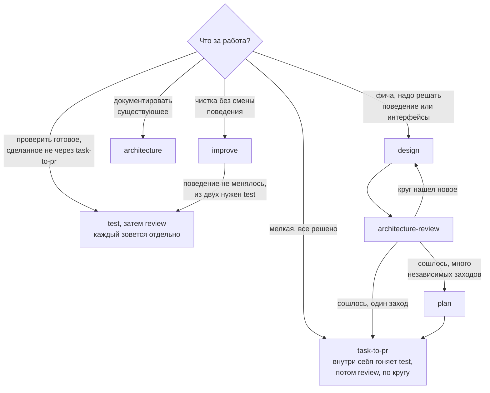

# Процесс разработки

> **User Story:** "Как устроена работа над изменением? Какой скилл когда зовется?
> Что должно случиться до того, как изменение считается готовым?"

Процесс собран из десяти скиллов [owainlewis/blueprint](https://github.com/owainlewis/blueprint)
плюс наши дополнения. Скиллы лежат в `.claude/skills/`, источник и хеш каждого —
в `skills-lock.json`. Агент вызывает их сам, когда задача совпадает с описанием;
ручной вызов `/имя` нужен только чтобы заставить.

---

## Выбор пути



`test` и `review` — внутренние шаги task-to-pr (шаги 3 и 7 его первой фазы),
а не отдельные стадии после него: их круги отрабатывают внутри и повторяются
там же, пока очередной находит новое (шаг 8), поэтому поверх завершенного
task-to-pr прогонять их заново не нужно. Отдельно они зовутся для работы,
которая шла не через task-to-pr — готовой ветки, чужого диффа, ручной правки.

У каждого скилла есть точка, где он останавливается — чтобы одна фаза не
принимала решений, принадлежащих другой. `design` не пишет код,
`architecture-review` не правит дизайн, `review` не редактирует файлы.

## Скиллы

| Скилл | Что делает | Где останавливается |
|-------|-----------|---------------------|
| `architecture` | Пересобирает архитектурную доку из проверенного кода: каждое утверждение сверяется с кодом, конфигом, схемой или тестом; mermaid-схемы топологии и зависимостей | Документ готов к чтению человеком; будущее поведение не предлагает |
| `design` | Дизайн фичи до кода: поведение, интерфейсы, отказы, риски, критерии приемки `AC-n`, инварианты `INV-n` | Утверждение дизайна — за владельцем |
| `architecture-review` | Разбор предложения до реализации: неоднозначности и дыры по корректности, масштабу, безопасности, эксплуатации | Вердикт по дизайну; сам дизайн не правит |
| `plan` | Утвержденный дизайн в упорядоченные задачи под отдельные заходы | Список задач; не реализует |
| `task-to-pr` | Задача целиком: реализация, тесты, ревью | См. адаптацию ниже |
| `test` | Каждый критерий приемки и инвариант — к доказательству по ID: точечные тесты плюс живой браузер для видимого | Отчет pass/fail/unverified по каждому критерию |
| `review` | Свежий агент, который изменение не писал, читает дифф: поведение, безопасность, регрессии, тесты, доказательства | Находки Must/Should/Could с уверенностью 0-5; файлы не правит |
| `improve` | Упростить код, не меняя поведения: структура, дубли, мертвый код, имена | Поведение не меняется; для смены поведения — task-to-pr |
| `codex-issue-coordinator` | Партия GitHub-issues через отдельные воркеры | Спит до появления команды и потока issues |
| `html-doc` | Markdown-дизайн в статичную HTML-страницу (pandoc установлен) | Одна страница из одного документа |

## Адаптация task-to-pr

Пока разработчик один и работа идет на ветке dev, отключены конкретные шаги
скилла, и у каждого есть замена:

- Шаги 4-5 первой фазы (commit, push, открытие PR) — изменение остается в
  рабочем дереве; коммит и пуш — решение владельца, всегда.
- Шаг 8 (закоммитить и запушить каждую правку по ревью) — правка вносится в
  дерево, `test` и `review` прогоняются повторно, без коммита.
- Вся вторая фаза (ожидание CI по PR, ответы на automated review) — ее роль
  играют локальные гейты `scripts/hooks/pre-push`.
- Условие старта зависимой задачи ("у предпосылки открыт PR") — вердикт
  Approve по предыдущей задаче.

Следствие, а не мелочь: без веток две параллельные задачи смешиваются в одном
рабочем дереве в один дифф, и ревью обязано браковать его как два исхода в
одном изменении. Разводит их не очередь, а разделимость. Пока задачи не
пересекаются по файлам, дифф режется на коммиты по именам файлов, и каждая
задача остается отдельным изменением; пересеклись по файлам — идут по очереди:
одна задача, один цикл test/review, передача владельцу, и только потом
следующая.

Все остальное — порядок реализации, тесты, ревью — применяется как написано.
Когда появятся другие разработчики, отключенные шаги включаются без переделки
процесса: они уже описаны в самом скилле. Одна поправка на нашу защиту от
потери данных: `git checkout -b` заблокирован хуками, ветка создается через
`git switch -c` или `git worktree add`.

## Как review сочетается с агентом code-reviewer

Не дубль, а две половины одного ревью. Скилл `review` — это процесс: свежий
агент, не писавший изменение, порядок чтения, формат находок, ревью
доказательств. Агент [code-reviewer](../../.claude/agents/code-reviewer.md) —
это знание предмета: RBAC, паттерн Intention, границы модулей, стандарты API и
накопленный список разобранных ложных срабатываний. Скилл говорит КАК смотреть,
агент — ЧТО искать. Запуск ревью означает: свежий агент code-reviewer, находки
в формате скилла.

## Сколько кругов ревью

Один круг — исключение, а не норма. Проектный документ, который что-то решает,
проходит несколько кругов, и каждый ведет свежий агент, не видевший ни прошлых
кругов, ни ответов на них.

Круги дают разное, и порядок здесь не случайный. Первый читает замысел: то ли
решается, тем ли способом, снимает ли решение ограничение или переставляет его
на новое место. Второй и следующие читают формулировки и находят каждый раз
новое, потому что закрытая дыра рождает соседнюю: правило, дописанное заплаткой,
переносит неоднозначность на границу заплатки, и следующий круг читает уже эту
границу.

Прекращаются круги по признаку сходимости, а не по счету. Признак: очередной
круг возвращает не новые дыры, а следствия уже названного принципа, то есть спор
идет о применении правила, а не о его отсутствии. В самом тексте это видно как
переход от перечня случаев к принципу, из которого случаи выводятся: пока раздел
растет списком "а еще вот так", он не сошелся, сколько бы кругов ни прошло.

Одного круга хватает документу, который ничего не решает: пересказ проверенного
кода, каталог видимых изменений на аппрув, записка о решении, уже принятом
владельцем. Признак простой — у такого документа нет разделов "почему так, а не
иначе".

## Ревью в двух рамках

Документ смотрят двумя рамками, и это два прохода, а не один внимательный.
Первая рамка — безопасность и корректность: что сломается, что утечет, где
решение просто неверно. Вторая — соразмерность и цена: сколько стоит
предложенное, что оно ломает из работающего, есть ли результат дешевле.

Рамка задает не только предмет, но и то, что вообще считается находкой. Ревьюер
корректности честно отвечает "дыры нет" на конструкцию, которая закрывает щель
ценой втрое большей работы; ревьюер цены столь же честно предлагает дешевый
вариант, оставляющий щель открытой. Ревьюер, которому дали обе рамки сразу,
выдает усредненный ответ, по которому не видно ни одной из двух оценок.

Поэтому рамки разводятся по отдельным агентам, результаты сводит автор
документа, а разошедшиеся оценки остаются в тексте названным выбором, а не
усредняются до общего места.

## Проверенное и правдоподобное

Утверждение документа принадлежит одному из двух классов, и класс обязан быть
виден читателю без раскопок.

Проверенное несет доказательство на месте: файл со строкой, вывод команды,
замер. Цена правила близка к нулю, потому что назвать место дешевле, чем
пересказать его содержимое.

Правдоподобное — то, что проверить нечем. У него ровно два законных исхода:
пометка прямо в пункте, называющая, каких именно данных не хватает, или удаление
вместе с доводом, который на нем стоял. Третьего нет: довод, стоящий на
непроверяемом, оговоркой не спасается — он либо уходит, либо перестает быть
доводом и остается наблюдением, из которого ничего не следует.

Отдельно про данные, которых у нас нет. Оценка объема, частоты или распределения
в чужом или будущем источнике — догадка, даже когда звучит безобидно, и решение,
принятое по ней, нечем ни подтвердить, ни опровергнуть. Такая фраза удаляется
целиком, а не смягчается наречием.

## Доказательства: гейты, тесты, живой стенд

Три разных вопроса, и ни один из ответов не заменяет два других. Гейты
(`scripts/hooks/pre-push`, они же по своей воле `scripts/gates.sh`) отвечают
"ничего не сломано": сборка, все сюиты, линт — одинаково для любого изменения.
Скилл `test` отвечает "сделано именно то, что просили": каждый критерий приемки
сопоставлен доказательству по ID. Живой стенд отвечает "это видно человеку", и
отвечает единственный. Изменение готово, когда ответ "да" на все три.

### Тест обязан падать на сломанном коде

Свойство "упадет, если поведение сломать" проверяется фактически, а не
предполагается. Способ: прежняя версия файла достается из истории командой
`git show <ревизия>:<путь> > <путь>`, прогон повторяется, и тест обязан упасть
именно на том утверждении, ради которого написан; после этого возвращается
исправленная версия. Восстанавливается файл, а не состояние дерева, поэтому
соседние правки такая проверка не задевает.

Тест, оставшийся зеленым на сломанном коде, доказывает не поведение, а
собственную настройку. Родственный случай — тест, единственная проверка
которого в том, что дубль вернул подготовленное значение, — разобран в
[TESTING.md](../guides/TESTING.md).

### Вердикт гейта — код возврата

Гейт пройден или нет по коду возврата команды, а не по последним строкам
вывода. Хвост показывает то, что печатала последняя дошедшая до печати команда,
и выглядеть он может совершенно спокойно и у прогона, который упал.

Обратная ошибка того же корня встречается чаще. Команда, считающая совпадения,
при нуле совпадений сообщает об этом ненулевым кодом: для нее это обычный ответ,
а для обертки, которая падает на первой же неудаче, — падение. Прогон краснеет
при нормальном выводе, и никакого дефекта за этим нет. Отсюда две части правила:
ненулевой код читается до вердикта — какая команда его вернула и о чем она
вообще отвечает, — а счет совпадений не ставится последней командой шага.

### Живая проверка там, где дефект виден только на стенде

Тест видит ровно то, что ему подали, и класс дефектов "подали не то" им не
ловится по построению: проекция, забывшая заполнить поле; фикстура, не сеявшая
такой случай; проход, унесший текст раньше, чем до него добрался разбор. Такой
дефект живет не в ветке правила, а в наборе входов, и в наборе входов теста его
нет ровно потому, что о нем не знали. Утечки приватного текста и отказы страниц
находились именно так, при зеленых тестах на тех же путях.

Отсюда правило: изменение, затрагивающее то, что человек видит на странице,
закрывается прогоном по живому стенду от роли, которой это видно, гостя включая.
В отчете называется, что открывали и что увидели, а не вывод о том, что должно
было получиться.

## Многозонная работа: оркестрация вместо одной задачи

`task-to-pr` ведет одну задачу от начала до конца, и это верный путь, пока
задача одна. Волна, которая одновременно правит бэкенд, клиент и документ или
закрывает десяток независимых находок, в него не помещается: последовательный
проход по ним стоит дней, а параллельный не выражается скиллом, который знает
про одну задачу.

Такая работа ведется оркестрацией воркфлоу, и это не повод обойти процесс.
Обязательные фазы те же, что у `task-to-pr`, и пропускать их нельзя:

1. **Разбор рисков до кода.** Что затрагивается, какие права и границы
   меняются, что может сломаться у соседей. Роль `architecture-review`.
2. **Реализация с тестами** — по зонам, которые не пересекаются по файлам.
3. **Ревью свежим агентом**, который этот код не писал. Роль `review`. Для
   всего, что меняет доступ, ревью обязано строить таблицу "что обещает
   клиент против того, что разрешает сервер".
4. **Доказательства** по каждому измененному поведению. Роль `test`.

Цена пропуска первой фазы известна по опыту и оплачена дважды за один день.
Премодерацию перестроили без разбора рисков, и она вышла нерабочей: игра
рождалась на премодерации без куратора, а видеть такую игру мог только
назначенный куратор, то есть кнопку одобрения некому было нажать. Там же с
ручки премодерации блога сняли ролевой замок ради авторского хода, и она стала
оракулом: посторонний перебором адресов отличал несуществующий блог от
приватного черновика. Обе вещи ловятся разбором предложения до кода и не
ловятся ревью после: ревью смотрит на то, что написано, а не на то, что
следовало решить иначе.

Запросов на слияние в проекте нет и не будет до тех пор, пока владелец не
объявит разработку законченной: он ведет ее один, а PR — это механизм передачи
изменения другому человеку. Результат любой работы — коммит в рабочем дереве и
отчет владельцу; решение о коммите и пуше принимает он. Шаги скиллов, которые
открывают PR и ждут по нему CI, отключены (см. адаптацию выше) и включатся
вместе с появлением второго разработчика.

### Зоны, прогоны, коммиты

Зона — набор файлов, а не тема. Агент правит свою зону и не трогает файл чужой
ни одной строкой, даже когда правка очевидна и стоит секунды: чужой файл прямо
сейчас редактируют, и правка либо пропадет под чужой записью, либо приедет в
чужой коммит. Нужное соседу возвращается оркестратору словами, а не правкой.

Сборка и тестовая база — общий ресурс, а не зона. Два прогона в одном рабочем
дереве дерутся за выходные файлы сборки и за общую базу, и отказ при этом
выглядит как настоящий дефект: падает массово и в разных местах. Поэтому
прогоны разводятся по времени, а не по проектам, а массовое падение читается
как дефект только после проверки, что рядом не шел второй прогон
([TESTING.md](../guides/TESTING.md)).

Коммитит оркестратор, и собирает коммит по именам файлов: одна зона — один
коммит. Это то же "один коммит — одна тема", просто тема здесь названа списком
файлов, который агент вернул в отчете.

## Видимые изменения идут через аппрув

Видимое изменение предлагается владельцу до реализации нумерованным каталогом,
по пункту на изменение, и делается ровно то, что он выбрал. Функциональное и
невидимое делается без каталога.

Граница проверяется одним вопросом: нужно ли открыть страницу, чтобы увидеть
результат правки. Если да, изменение видимое. Сюда попадает не только цвет и
отступ, но и порядок и состав элементов, формулировка надписи, появление или
исчезновение контрола, отклик на наведение и ввод, и то, как выглядит на
странице уже сохраненный чужой текст.

Починка — не исключение, и это главная ловушка правила. Правка, возвращающая
правильное поведение, меняет увиденное человеком ровно так же, как правка
замысла, а неправильное поведение к этому дню могло стать привычным или
единственным известным. "Это же просто починка" аппрув не отменяет.

Пункт каталога отвечает на три вопроса: как сегодня, как станет, чем платим.
Третий обязателен и там, где цена нулевая: пункт без названной цены читается
как реклама, а владелец утверждает выбор, а не рекламу. Утверждения о нынешнем
поведении в каталоге сверяются с кодом, а не пересказываются по памяти или по
прежним описаниям, и расхождение называется прямо в пункте.

Единичные исключения владелец дает поименно, и записываются они там, где живет
само правило, которое исключение сужает.

## Документ разработки

Спека игрового модуля живет в docx рядом с этими конвенциями, и правится он с
сохранением формата: шрифты, стили заголовков, таблицы, цвета и отступы
остаются как есть, новый раздел пишется тем же скелетом, что и соседние. Текст
новых разделов берется из кода живых страниц, а не из головы и не из старого
сайта. Причина простая: документ читает человек вне репозитория, и
разъехавшееся оформление он читает как поломку, а не как правку.

Перечень предлагаемых правок документа - это каталог на аппрув, а не артефакт
проекта: он живет ровно до того, как правки внесены, и уходит вместе с ними.
История остается в гите.

## Наши скиллы вне блюпринта

`requirement-ledger` — персональный журнал указаний и аппрувов владельца.
Живет в памяти агента, не в репозитории — решением владельца: это журнал
поручений одному исполнителю, а не артефакт продукта. Компакт стирает рабочую
память разговора; реестр — то, что ее переживает.

Бывший `skeleton-parity` расформирован: его правило и процедура проверки
перенесены в [UI_STANDARDS.md](UI_STANDARDS.md), раздел "Геометрический
паритет". Правило про верстку — это конвенция, и место ему в конвенциях.

## Как смотреть mermaid-схемы

Схемы в `docs/**/*.md` — это блоки ` ```mermaid `. Терминал и чат Claude Code
их не рендерят, это ожидаемо. Рендерят: GitHub и GitLab (сразу при просмотре
файла), VS Code (превью по `Ctrl+Shift+V`, нужно расширение "Markdown Preview
Mermaid Support"), JetBrains Rider (встроенно). Быстрая проверка без пуша:
попросить агента собрать страницу-артефакт — артефакты рендерят mermaid
нативно.

## Тексты скиллов не правятся

Инвариант: файлы в `.claude/skills/` остаются байт-в-байт апстримными. Вся
наша специфика — адаптация task-to-pr, связка review с агентом code-reviewer,
маппинг вердиктов — живет в обвязке: этом файле, `CLAUDE.md` и
`.claude/agents/*`. Так задуман сам блюпринт (политика репозитория — в
инструкциях агента, скиллы — общие), и так обновление сводится к перезаписи:
правленый скилл пришлось бы сливать с апстримом руками при каждом
`npx skills add`, а забытое слияние молча откатывало бы нашу правку. Если
когда-нибудь понадобится поведение, которое обвязкой не выразить, — это
осознанный форк с записью здесь, а не тихая правка файла.

## Обновление скиллов

```bash
npx skills add owainlewis/blueprint
```

Затем перенести содержимое `.agents/skills/` в `.claude/skills/` обычными
файлами и удалить `.agents/`: установщик кладет симлинки с абсолютным путем
машины, им в репозитории не место. Хеши в `skills-lock.json` считает сам CLI
`skills` по своему алгоритму — наивный sha256 файла с ними не совпадает, так
что расхождение с апстримом проверяется повторным `npx skills add` (совпало —
перезапишет тем же), а не сверкой хеша вручную.

Выключить скилл, не удаляя: `skillOverrides` в `.claude/settings.local.json`,
значение `off`. Выключенный скилл агент не видит и вызвать не может.
