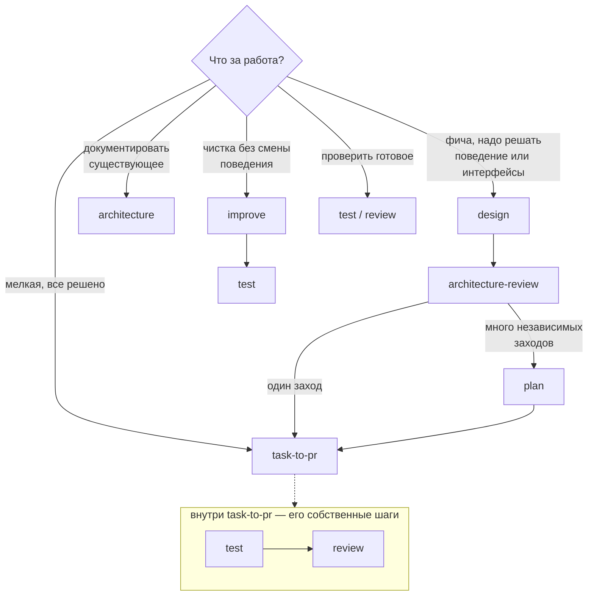

# Процесс разработки

> **User Story:** "Как устроена работа над изменением? Какой скилл когда зовется?
> Что должно случиться до того, как изменение считается готовым?"

Процесс собран из десяти скиллов [owainlewis/blueprint](https://github.com/owainlewis/blueprint)
плюс наши дополнения. Скиллы лежат в `.claude/skills/`, источник и хеш каждого —
в `skills-lock.json`. Агент вызывает их сам, когда задача совпадает с описанием;
ручной вызов `/имя` нужен только чтобы заставить.

---

## Выбор пути



`test` и `review` — внутренние шаги task-to-pr (шаги 3 и 7 его первой фазы),
а не отдельные стадии после него: прогонять их повторно поверх завершенного
task-to-pr не нужно. Отдельно они зовутся для работы, которая шла не через
task-to-pr — готовой ветки, чужого диффа, ручной правки.

У каждого скилла есть точка, где он останавливается — чтобы одна фаза не
принимала решений, принадлежащих другой. `design` не пишет код,
`architecture-review` не правит дизайн, `review` не редактирует файлы.

## Скиллы

| Скилл | Что делает | Где останавливается |
|-------|-----------|---------------------|
| `architecture` | Пересобирает архитектурную доку из проверенного кода: каждое утверждение сверяется с кодом, конфигом, схемой или тестом; mermaid-схемы топологии и зависимостей | Документ готов к чтению человеком; будущее поведение не предлагает |
| `design` | Дизайн фичи до кода: поведение, интерфейсы, отказы, риски, критерии приемки `AC-n`, инварианты `INV-n` | Утверждение дизайна — за владельцем |
| `architecture-review` | Разбор предложения до реализации: неоднозначности и дыры по корректности, масштабу, безопасности, эксплуатации | Вердикт по дизайну; сам дизайн не правит |
| `plan` | Утвержденный дизайн в упорядоченные задачи под отдельные заходы | Список задач; не реализует |
| `task-to-pr` | Задача целиком: реализация, тесты, ревью | См. адаптацию ниже |
| `test` | Каждый критерий приемки и инвариант — к доказательству по ID: точечные тесты плюс живой браузер для видимого | Отчет pass/fail/unverified по каждому критерию |
| `review` | Свежий агент, который изменение не писал, читает дифф: поведение, безопасность, регрессии, тесты, доказательства | Находки Must/Should/Could с уверенностью 0-5; файлы не правит |
| `improve` | Упростить код, не меняя поведения: структура, дубли, мертвый код, имена | Поведение не меняется; для смены поведения — task-to-pr |
| `codex-issue-coordinator` | Партия GitHub-issues через отдельные воркеры | Спит до появления команды и потока issues |
| `html-doc` | Markdown-дизайн в статичную HTML-страницу (pandoc установлен) | Одна страница из одного документа |

## Адаптация task-to-pr

Пока разработчик один и работа идет на ветке dev, отключены конкретные шаги
скилла, и у каждого есть замена:

- Шаги 4-5 первой фазы (commit, push, открытие PR) — изменение остается в
  рабочем дереве; коммит и пуш — решение владельца, всегда.
- Шаг 8 (закоммитить и запушить каждую правку по ревью) — правка вносится в
  дерево, `test` и `review` прогоняются повторно, без коммита.
- Вся вторая фаза (ожидание CI по PR, ответы на automated review) — ее роль
  играют локальные гейты `scripts/hooks/pre-push`.
- Условие старта зависимой задачи ("у предпосылки открыт PR") — вердикт
  Approve по предыдущей задаче.

Следствие, а не мелочь: без веток две параллельные задачи смешиваются в одном
рабочем дереве в один дифф, и ревью обязано браковать его как два исхода в
одном изменении. Поэтому задачи идут строго последовательно: одна задача —
один цикл test/review — передача владельцу, и только потом следующая.

Все остальное — порядок реализации, тесты, ревью — применяется как написано.
Когда появятся другие разработчики, отключенные шаги включаются без переделки
процесса: они уже описаны в самом скилле. Одна поправка на нашу защиту от
потери данных: `git checkout -b` заблокирован хуками, ветка создается через
`git switch -c` или `git worktree add`.

## Как review сочетается с агентом code-reviewer

Не дубль, а две половины одного ревью. Скилл `review` — это процесс: свежий
агент, не писавший изменение, порядок чтения, формат находок, ревью
доказательств. Агент [code-reviewer](../../.claude/agents/code-reviewer.md) —
это знание предмета: RBAC, паттерн Intention, границы модулей, стандарты API и
накопленный список разобранных ложных срабатываний. Скилл говорит КАК смотреть,
агент — ЧТО искать. Запуск ревью означает: свежий агент code-reviewer, находки
в формате скилла.

## Как test сочетается с гейтами pre-push

Разные вопросы. Гейты (`scripts/hooks/pre-push`) отвечают "ничего не сломано":
сборка, все сюиты, линт — одинаково для любого изменения. Скилл `test` отвечает
"сделано именно то, что просили": каждый критерий приемки сопоставлен
доказательству, и видимое поведение проверено в живом браузере, а не выведено
из исходников. Изменение готово, когда ответ "да" на оба вопроса.

## Многозонная работа: оркестрация вместо одной задачи

`task-to-pr` ведет одну задачу от начала до конца, и это верный путь, пока
задача одна. Волна, которая одновременно правит бэкенд, клиент и документ или
закрывает десяток независимых находок, в него не помещается: последовательный
проход по ним стоит дней, а параллельный не выражается скиллом, который знает
про одну задачу.

Такая работа ведется оркестрацией воркфлоу, и это не повод обойти процесс.
Обязательные фазы те же, что у `task-to-pr`, и пропускать их нельзя:

1. **Разбор рисков до кода.** Что затрагивается, какие права и границы
   меняются, что может сломаться у соседей. Роль `architecture-review`.
2. **Реализация с тестами** — по зонам, которые не пересекаются по файлам.
3. **Ревью свежим агентом**, который этот код не писал. Роль `review`. Для
   всего, что меняет доступ, ревью обязано строить таблицу "что обещает
   клиент против того, что разрешает сервер".
4. **Доказательства** по каждому измененному поведению. Роль `test`.

Цена пропуска первой фазы измерена на волне 19 августа 2026 года, дважды за
один день. Премодерацию перестроили без разбора рисков — и она вышла
нерабочей: игра рождалась на премодерации без куратора, а видеть такую игру
мог только назначенный куратор, то есть кнопку одобрения некому было нажать.
Там же с ручки премодерации блога сняли ролевой замок ради авторского хода — и
она стала оракулом: посторонний перебором адресов отличал несуществующий блог
от приватного черновика. Обе вещи ловятся разбором предложения до кода и не
ловятся ревью после: ревью смотрит на то, что написано, а не на то, что
следовало решить иначе.

Запросов на слияние в проекте нет и не будет до тех пор, пока владелец не
объявит разработку законченной: он ведет ее один, а PR — это механизм передачи
изменения другому человеку. Результат любой работы — коммит в рабочем дереве и
отчет владельцу; решение о коммите и пуше принимает он. Шаги скиллов, которые
открывают PR и ждут по нему CI, отключены (см. адаптацию выше) и включатся
вместе с появлением второго разработчика.

## Наши скиллы вне блюпринта

`requirement-ledger` — персональный журнал указаний и аппрувов владельца.
Живет в памяти агента, не в репозитории — решением владельца: это журнал
поручений одному исполнителю, а не артефакт продукта. Компакт стирает рабочую
память разговора; реестр — то, что ее переживает.

Бывший `skeleton-parity` расформирован: его правило и процедура проверки
перенесены в [UI_STANDARDS.md](UI_STANDARDS.md), раздел "Геометрический
паритет". Правило про верстку — это конвенция, и место ему в конвенциях.

## Как смотреть mermaid-схемы

Схемы в `docs/**/*.md` — это блоки ` ```mermaid `. Терминал и чат Claude Code
их не рендерят, это ожидаемо. Рендерят: GitHub и GitLab (сразу при просмотре
файла), VS Code (превью по `Ctrl+Shift+V`, нужно расширение "Markdown Preview
Mermaid Support"), JetBrains Rider (встроенно). Быстрая проверка без пуша:
попросить агента собрать страницу-артефакт — артефакты рендерят mermaid
нативно.

## Тексты скиллов не правятся

Инвариант: файлы в `.claude/skills/` остаются байт-в-байт апстримными. Вся
наша специфика — адаптация task-to-pr, связка review с агентом code-reviewer,
маппинг вердиктов — живет в обвязке: этом файле, `CLAUDE.md` и
`.claude/agents/*`. Так задуман сам блюпринт (политика репозитория — в
инструкциях агента, скиллы — общие), и так обновление сводится к перезаписи:
правленый скилл пришлось бы сливать с апстримом руками при каждом
`npx skills add`, а забытое слияние молча откатывало бы нашу правку. Если
когда-нибудь понадобится поведение, которое обвязкой не выразить, — это
осознанный форк с записью здесь, а не тихая правка файла.

## Обновление скиллов

```bash
npx skills add owainlewis/blueprint
```

Затем перенести содержимое `.agents/skills/` в `.claude/skills/` обычными
файлами и удалить `.agents/`: установщик кладет симлинки с абсолютным путем
машины, им в репозитории не место. Хеши в `skills-lock.json` считает сам CLI
`skills` по своему алгоритму — наивный sha256 файла с ними не совпадает, так
что расхождение с апстримом проверяется повторным `npx skills add` (совпало —
перезапишет тем же), а не сверкой хеша вручную.

Выключить скилл, не удаляя: `skillOverrides` в `.claude/settings.local.json`,
значение `off`. Выключенный скилл агент не видит и вызвать не может.
