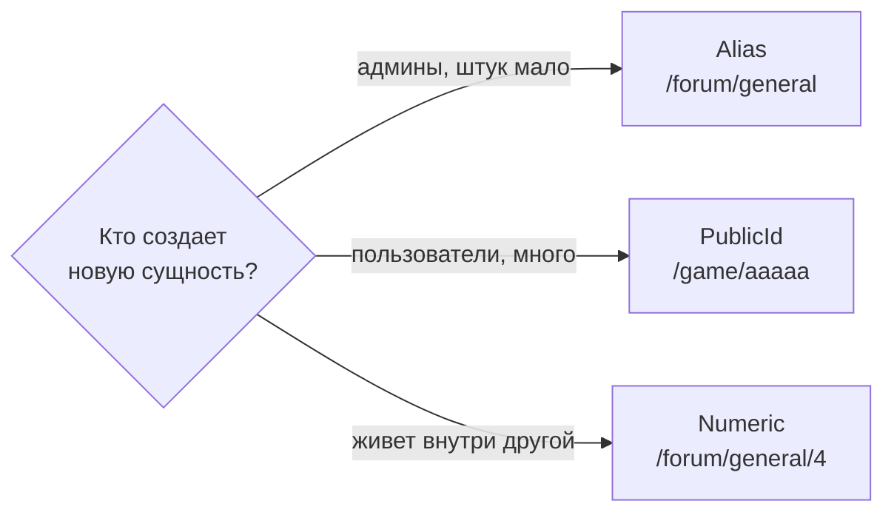

# Конвенции URL

## Быстрый выбор



---

## Статические страницы

Страницы без динамического контента используют фиксированные пути без идентификаторов:

```
/rules           ← правила
/about           ← о проекте
/support         ← поддержка
/complaint       ← жалоба
/donate          ← помочь проекту
/global-chat     ← глобальный чат
/community       ← список пользователей
```

**Характеристики:**
- Путь = название страницы (lowercase, латиница)
- Без идентификаторов — один URL на страницу
- Могут использовать query parameters для фильтрации (`/community?role=Mentor`)

---

## Типы идентификаторов

### Username

**Для:** Пользователи

| Свойство | Значение |
|----------|----------|
| Формат | См. [USERNAME_POLICY.md](USERNAME_POLICY.md) |
| Case | Case-insensitive lookup |
| Encoding | URL-encoded (`Adam Advena` → `Adam%20Advena`) |
| Уникальность | Глобальная |

```
/users/{username}
/messenger/user/{username}
```

### Alias

**Для:** Административный контент с ограниченным количеством (разделы форума, системные категории)

| Свойство | Значение |
|----------|----------|
| Формат | `[a-z][a-z0-9\-]*` (lowercase, латиница, цифры, дефис) |
| Назначение | Ручное (администратором) |
| Case | Case-sensitive |
| Уникальность | Глобальная в рамках типа |
| Изменяемость | Редко, с редиректом |

```
/forum/{alias}
/forum/{alias}/{num}
```

**Когда использовать:**
- Контент создается администраторами
- Количество ограничено (десятки, не тысячи)
- Важна читаемость URL для SEO/UX
- Названия стабильны

### PublicId

**Для:** Пользовательский контент (игры, блоги, чаты)

| Свойство | Значение |
|----------|----------|
| Формат | Минимум 5 строчных букв из 23-буквенного алфавита (без i/l/o) |
| Генерация | Автоматическая из SerialNumber |
| Case | Case-sensitive |
| Уникальность | Глобальная в рамках типа |
| Изменяемость | Никогда |

```
/game/{publicId}
/blogs/{publicId}
/messenger/c/{publicId}
```

**Когда использовать:**
- Контент создается пользователями
- Количество неограничено
- ID должен быть коротким и непредсказуемым
- Не нужна семантика в URL

**Почему минимум 5 букв:**
- 23^5 = 6,436,343 комбинаций (при росте SerialNumber идентификатор становится длиннее)
- Достаточно для большинства платформ
- Средняя длина английского слова — шанс на читаемое слово (xexex)

### Numeric (порядковый номер)

**Для:** Контент внутри родителя (топики в разделе, комнаты в игре)

| Свойство | Значение |
|----------|----------|
| Формат | Натуральное число (1, 2, 3...) |
| Генерация | Автоинкремент в рамках родителя |
| Уникальность | В рамках родителя |
| Изменяемость | Никогда |

```
/forum/{alias}/{num}           ← топик #42 в разделе
/game/{publicId}/rooms/{num}   ← комната #3 в игре
```

**Когда использовать:**
- Контент принадлежит родительской сущности
- Перенос между родителями не предполагается
- Нумерация интуитивна пользователю (#1, #2, #3...)

**Numeric vs порядок отображения:**

| Поле | Назначение | Изменяемость |
|------|-----------|--------------|
| `{Entity}Number` | Идентификатор в URL | Никогда |
| `SortOrder` / `OrderNumber` | Позиция в списке UI | Да |

Комната создана третьей → `/rooms/3` навсегда, даже если ее переместили в начало списка.

**Важно:** Numeric — техническая деталь для URL, не отображается в UI. Пользователь видит название ("Таверна"), а не "Комната #3".

### Token (UUID)

**Для:** Одноразовые security-операции

| Свойство | Значение |
|----------|----------|
| Формат | UUID v4 или криптографически случайная строка |
| Время жизни | Ограничено |
| Уникальность | Глобальная |

```
/activate#token={token}
/confirm-email#token={token}
/reset-password#token={token}
/change-username#token={token}
```

Значение живет во фрагменте URL, а не в пути: фрагмент не уходит на сервер
и не попадает в логи доступа и Referer ([SECURITY.md](SECURITY.md)).

**Когда использовать:**
- Операции требуют непредсказуемости
- Токен одноразовый или с ограниченным TTL
- Безопасность важнее читаемости

---

## Структура URL

### Иерархия

Вложенный контент отражается в пути:

```
/{parent}/{parentId}/{child}
/{parent}/{parentId}/{child}/{childNum}
```

Примеры:
```
/game/kxmnt/rooms           ← список комнат
/game/kxmnt/rooms/3         ← комната #3
/forum/general/42           ← топик #42 в разделе
/blogs/prnvw/feed           ← лента публикаций
```

### Пагинация

**Всегда query parameter `?number=N`**

```
/forum/general?number=2
/game/kxmnt/comments?number=3
/community?number=5
```

- `number=1` — первая страница (можно опустить)
- Номер страницы, не номер элемента

### Фильтрация и сортировка

Query parameters для фильтров:

```
/games?status=Active&sort=created
/community?role=Mentor&activity=online
/blogs/kxmnt/feed?rubric=humor
```

---

## Правила именования

### Пути (path segments)

| Правило | Пример |
|---------|--------|
| Lowercase | `/games`, не `/Games` |
| Множественное число для списков | `/games`, `/users`, `/polls` |
| Единственное число для элемента | `/game/{id}` |
| Дефис для составных слов | `/global-chat`, `/post-reviews` |

**Записанные исключения:** `/users/{username}` и `/blogs/{publicId}` используют
множественное число и для элемента — путь элемента продолжает путь списка.

### Query parameters

| Правило | Пример |
|---------|--------|
| camelCase | `?sortBy=created`, `?recruitmentFilter=open` |
| Булевы как присутствие/значение | `?isOpen=true` |

---

## Добавление новых сущностей

При добавлении нового типа контента:

1. **Определить владельца:**
   - Системный/админский → Alias
   - Пользовательский top-level → PublicId
   - Вложенный в родителя → Numeric

2. **Определить иерархию:**
   - Top-level: `/{entity}/{id}`
   - Вложенный: `/{parent}/{parentId}/{entity}/{num}`

3. **Пагинация:**
   - Всегда `?number=N`

4. **Фильтры:**
   - Query parameters

---

## Примеры применения

### Новая сущность: Турниры (гипотетически)

**Вопросы:**
1. Кто создает? → Пользователи
2. Top-level или вложенный? → Top-level
3. Есть вложенный контент? → Да, раунды

**Решение:**
```
/tournaments                      ← список
/tournament/{publicId}            ← турнир (5 букв)
/tournament/{publicId}/rounds     ← раунды
/tournament/{publicId}/rounds/3   ← раунд #3
```

### Новая сущность: Достижения (гипотетически)

**Вопросы:**
1. Кто создает типы? → Админы
2. Количество типов? → Ограничено (~20-30)
3. Достижения пользователей? → Вложены в профиль

**Решение:**
```
/users/{username}/achievements    ← список достижений пользователя
/achievements/{alias}             ← описание типа достижения (alias: veteran, first-game, writer)
```

---

## Ссылки

- [USERNAME_POLICY.md](USERNAME_POLICY.md) — правила username
- [API_DESIGN.md](API_DESIGN.md) — конвенции API endpoints
