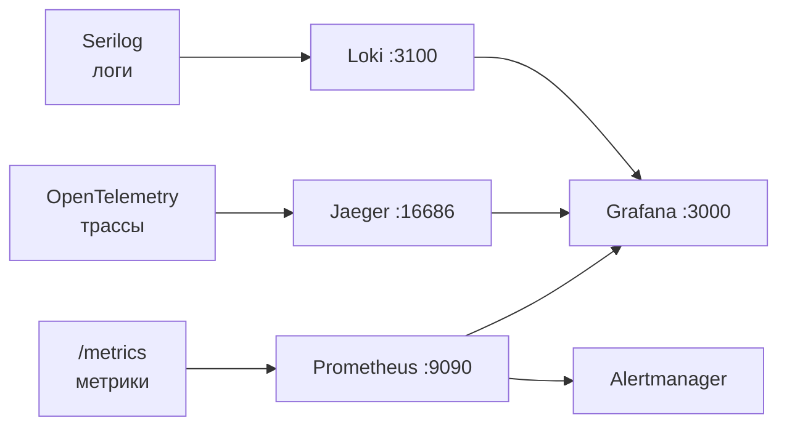

# Мониторинг DM3

> **User Story:** "Где смотреть логи? Как настроить алерты?"

---

## Обзор стека



---

## Логирование (Serilog)

### Конфигурация

```
Sinks: Loki (push напрямую из приложения), Console
Enrichers: Application, Environment, Release, LogContext
```

**Метки против содержимого.** Loki индексирует метки, а не текст строки, поэтому
меток три: `app` и `env` объявлены при настройке, а `level` синк добавляет сам, в
словаре Grafana (`error`, `warning`, `info` — строчными). Все остальное
(пользователь, корреляционный токен, длительность) остается в теле строки и
отбирается фильтром LogQL. Метка на величину с большим числом значений размножает
потоки без предела — это единственный способ сделать Loki медленным, и правило
это, а не деталь настройки.

Уровня в теле строки нет. Отбирать его через `| json` бесполезно — тело несет
`Message`, `MessageTemplate`, `Exception`, `TraceId`, `SpanId` и свойства события,
но не уровень; он живет только меткой.

Агента-сборщика нет: Serilog отправляет пакеты по HTTP сам. Вторая копия все
равно лежит на диске — ее держит докер под собственным потолком с ротацией, и
это единственная копия, которая переживает отказ хранилища. Поэтому вне
Development консоль пишется машинным форматом: тем же шаблоном, что и для
человека, копия несла бы сообщение и теряла все свойства события — ни
пользователя, ни токена, ни трассы.

### Уровень

Уровень один на оба синка и задается переменной `LOG_MINIMUM_LEVEL`. Пусто —
Debug в Development и Information в остальных окружениях. Разбор инцидента, для
которого нужны Debug-строки, ведется этой переменной и только ей: `Development`
логическим переключателем не является — тот же флаг публикует Swagger,
разрешает inline-скрипты и снимает HSTS. Применяется рестартом; значение вне
перечня Serilog останавливает старт, а не откатывается к умолчанию молча.

### Где смотреть

Grafana → Explore → датасорс Loki. Отдельного UI у логов нет намеренно: метрики,
трейсы и логи смотрятся из одного места, а `TraceId` в строке лога — кликабельная
ссылка в трейс Jaeger (derived field датасорса).

Идентификаторы трассы пишет сам синк, из события. Энричер их писать не должен:
имена `TraceId` и `SpanId` у синка зарезервированы, и свойство с таким именем он
переименует — строка увезет идентификатор, а ссылка не соберется ни разу.

### Полезные запросы (LogQL)

```
# Ошибки API за последний час (интервал задается в UI). Fatal включен явно:
# отбор по одному "error" пропускает ровно тот случай, ради которого сюда идут
{app="DM.API", level=~"error|fatal"}

# Все, что писалось про конкретный корреляционный токен. Только API: токен
# ограничен HTTP-запросом и через очередь не передается, поэтому строк
# воркеров по нему не будет
{app="DM.API"} |= "1b2c3d4e"

# Сквозной поиск по всем приложениям — по TraceId: контекст трейса едет в
# заголовках сообщения. TraceId лежит в той же строке лога, что и токен,
# поэтому переход от токена к TraceId делается запросом выше
{app=~"DM.+"} |= "4bf92f3577b34da6a3ce929d0e0e4736"

# Поток одного воркера
{app="DM.Notifications.Consumer"}
```

Ретеншен — 30 дней, задан в `docker/loki/loki.yaml` и применяется компактором.

---

## Tracing (OpenTelemetry)

### Инструментация

- ASP.NET Core
- HTTP client
- EF Core
- MongoDB
- RabbitMQ

### Где смотреть

| Что | URL |
|-----|-----|
| Jaeger UI | http://localhost:16686 |
| Протокол | OTLP gRPC (порт 4317) |

### Поиск trace

1. Выбрать Service: `DM.API` — имя приложения, а не имя контейнера
2. Найти по TraceId из логов
3. Просмотреть spans и зависимости

**Трейсы живут в памяти процесса.** Тома у хранилища нет: перезапуск контейнера
обнуляет его, а глубина ограничена потолком из compose — без потолка сборщик
съедает свой лимит памяти и его убивают, теряя разом все, что он держал. За
пределами этого окна разбор идет по логам: `TraceId` лежит в строке.

---

## Metrics (Prometheus)

### Endpoint

`/metrics` и `/_health` — на каждом .NET сервисе, на том же порту, что и
основной трафик.

### Scrape targets

**Источник истины:** [`docker/prometheus.yml`](../../docker/prometheus.yml).
Хост в `targets` обязан совпадать с `container_name` из compose: при расхождении
target остается в списке, но дает `up == 0`, и это ловят алерты вида
`ConsumerDown`. Имя job обязано совпадать с job-селекторами правил алертов и
панелей: у переименованной или удаленной job серии `up` нет вовсе, алерт на
`up == 0` молчит, и именно этот случай закрывает `ConsumerScrapeTargetMissing`
на `absent()`.

### Где смотреть

| Что | URL |
|-----|-----|
| Prometheus | http://localhost:9090 |
| Targets | http://localhost:9090/targets |

> **Доступ только с самой машины.** Все служебные интерфейсы — Prometheus,
> Alertmanager, Grafana, Loki, Jaeger, консоль MinIO, порты воркеров —
> публикуются на `127.0.0.1`, а не наружу. Правила брандмауэра тут не помощник:
> опубликованный докером порт идет через цепочки nat/DOCKER и FORWARD, минуя
> INPUT, поэтому единственная надежная граница — сам адрес привязки. С удаленной
> машины смотреть через SSH-туннель:
>
> ```bash
> ssh -N -L 3000:127.0.0.1:3000 -L 9090:127.0.0.1:9090 user@server
> ```

### Полезные запросы PromQL

```promql
# Запросов в секунду по маршрутам
sum(rate(http_server_request_duration_seconds_count{job="dm-api"}[5m])) by (http_route)

# p95 latency
histogram_quantile(0.95, sum(rate(http_server_request_duration_seconds_bucket{job="dm-api"}[5m])) by (le))

# Ошибки 5xx в секунду
sum(rate(http_server_request_duration_seconds_count{job="dm-api",http_response_status_code=~"5.."}[5m]))
```

Имена серий задает инструментация OpenTelemetry, а не старая схема
`http_requests_total`. Готовые выражения проще копировать из панелей в
[`docker/grafana/dashboards/`](../../docker/grafana/dashboards/), чем писать
заново.

---

## Dashboards (Grafana)

### Доступ

| Что | URL | Credentials |
|-----|-----|-------------|
| Grafana | http://localhost:3000 | из `docker/.env` |

### Доступные dashboards

| Dashboard | Что показывает |
|-----------|----------------|
| API Overview | Requests, latency, errors |
| Infrastructure | CPU, memory, disk |
| Consumers | Очереди: глубина, dead-letter, наличие потребителя; пропускная способность и задержка обработки |

Dashboards настроены автоматически (auto-provisioned).

---

## Alerting

### Правила

**Источник истины:** [`docker/prometheus/alerts.yml`](../../docker/prometheus/alerts.yml).

Пороги и окна `for` живут только там. Продублированные здесь, они расходятся с
файлом молча, и тот, кто сверялся с документом, узнает настоящий порог в момент
инцидента. У каждого правила есть `summary` и `description` — читать их в файле.

### Получатель

Правила вычисляет Prometheus, а не Grafana: канал уведомлений, привязанный к ним из
интерфейса Grafana, там не заводится — этих правил в Grafana нет. Сработавшее правило
уходит в alertmanager (секция `alerting` в `docker/prometheus.yml`), а куда дальше,
решает [`docker/prometheus/alertmanager.yml`](../../docker/prometheus/alertmanager.yml):
маршрут, группировка и получатель живут только там.

Транспорт — почта, тот же relay, что и у писем приложения: `MAIL_HOST` и `MAIL_PORT`.
Отдельного секрета у алертов нет, поэтому доставка работает сразу, без разового шага
настройки. На стенде relay это MailHog, и письмо видно на http://localhost:8025.

Что задает развертывание, файлом окружения рядом с compose (список с дефолтами — в
`docker/.env.example`): адрес получателя и отправителя, логин с паролем relay, если
он их спрашивает, и требование STARTTLS. Alertmanager не подставляет переменные
окружения сам, поэтому конфигурация собирается из шаблона при старте контейнера
(`docker/alertmanager-init.sh`) — значения в самом файле не пишутся.

На сервере `MAIL_HOST` — обязательный ответ, а не значение по умолчанию: установка
без него останавливается. Дефолт compose это MailHog, слушающий петлю стенда, и
сервер, поставленный документированной командой, доставлял бы в тупик и письма
сайта, и все алерты сразу — при полностью исправном на вид контуре.

**Правило живости.** `Watchdog` срабатывает всегда и приходит своим маршрутом раз в
двенадцать часов. Его приход — доказательство, что правила вычисляются, маршрут
работает и почта уходит; его отсутствие — инцидент. Все остальные правила говорят,
когда сайту плохо, и молчат, когда сломан сам контур: молчание тогда неотличимо от
здоровья.

Следить за отсутствием обязан кто-то снаружи машины — фильтр в почте, напоминание в
телефоне, внешний сервис heartbeat. Наблюдатель, живущий на наблюдаемой машине, о
собственной смерти не сообщит.

| Что | URL |
|-----|-----|
| Alertmanager | http://localhost:9093 |
| MailHog (стенд) | http://localhost:8025 |

---

## Troubleshooting

### Логи не появляются в Loki

1. Проверить что Loki запущен и готов: `curl http://localhost:3100/ready`
2. Проверить, что поток вообще создан: `curl -s http://localhost:3100/loki/api/v1/label/app/values`
3. Если потока нет — смотреть консольный sink (`docker logs dm-api`). Он пишет
   всегда, поэтому содержимое логов при мертвом Loki не теряется, теряется
   поисковая копия. Там же диагностика самого синка: строки `SelfLog` печатаются
   в stderr на каждую отклоненную пачку и называют код ответа Loki
4. Отказ хранилища виден и без чтения логов: цель `loki` в Prometheus и правило
   `LogStorageDown`. Отклоненная пачка при живом хранилище (просроченный сэмпл,
   переполненная очередь синка) — только через `SelfLog`

### Jaeger не показывает traces

1. Проверить что Jaeger запущен: `docker ps | grep jaeger`
2. Проверить OTLP endpoint: `curl http://localhost:4317`
3. Проверить переменную окружения: `DM_ConnectionStrings__TracingEndpoint`

### Grafana dashboards пустые

1. Проверить Prometheus targets: http://localhost:9090/targets
2. Проверить data source в Grafana
3. Проверить временной диапазон (Last 5 minutes)

---

## Production

### Наблюдение снаружи машины

Наблюдатель, живущий на наблюдаемой машине, о собственной смерти не сообщит.
Отсюда два обязательства внешнего сервиса, и оба он берет на себя сам:

1. **Опрашивать `https://<адрес>/_ready`**, а не `/_health`. Живость отвечает
   зеленым у процесса, который не дотягивается ни до одной базы; готовность
   спрашивает Postgres и Mongo. Порог — две-три неудачные пробы подряд, иначе
   каждая выкладка читается как авария. Честная граница: релиз, отвечающий 500 на
   содержательных маршрутах, готовностью не ловится.
2. **Замечать молчание `Watchdog`.** Правило приходит раз в двенадцать часов и
   доказывает, что правила вычисляются, маршрут работает и почта уходит. Его
   отсутствие — инцидент, и заметить отсутствие может только тот, кто ждал
   прихода.

На 80 порту у доменного имени остаются три вещи: собственная проба, челлендж
центра сертификации и редирект на домен; все остальное для домена отвечает по
https. По голому IP дефолтный сервер края продолжает отвечать по http, как и до
выпуска сертификата: это намеренно и описано в [DEPLOYMENT.md](./DEPLOYMENT.md).

---

## Ссылки

- [DEPLOYMENT.md](./DEPLOYMENT.md) — production setup
- [CONFIGURATION.md](../references/CONFIGURATION.md) — все порты и настройки
- [LOCAL_SETUP.md](./LOCAL_SETUP.md) — локальный запуск
